# Исследование объявлений о продаже квартир

В вашем распоряжении данные сервиса Яндекс.Недвижимость — архив объявлений о продаже квартир в Санкт-Петербурге и соседних населённых пунктах за несколько лет. Нужно научиться определять рыночную стоимость объектов недвижимости. Ваша задача — установить параметры. Это позволит построить автоматизированную систему: она отследит аномалии и мошенническую деятельность. 

По каждой квартире на продажу доступны два вида данных. Первые вписаны пользователем, вторые — получены автоматически на основе картографических данных. Например, расстояние до центра, аэропорта, ближайшего парка и водоёма. 

**Импорт необходимых библиотек**


```python
# попробовать изображение в ячейке с кодом
!pip install ipython 
```

    Defaulting to user installation because normal site-packages is not writeable
    Requirement already satisfied: ipython in e:\anaconda\envs\da_practicum_env\lib\site-packages (8.8.0)
    Requirement already satisfied: prompt-toolkit<3.1.0,>=3.0.11 in e:\anaconda\envs\da_practicum_env\lib\site-packages (from ipython) (3.0.36)
    Requirement already satisfied: jedi>=0.16 in e:\anaconda\envs\da_practicum_env\lib\site-packages (from ipython) (0.18.2)
    Requirement already satisfied: stack-data in e:\anaconda\envs\da_practicum_env\lib\site-packages (from ipython) (0.6.2)
    Requirement already satisfied: matplotlib-inline in e:\anaconda\envs\da_practicum_env\lib\site-packages (from ipython) (0.1.6)
    Requirement already satisfied: pygments>=2.4.0 in e:\anaconda\envs\da_practicum_env\lib\site-packages (from ipython) (2.14.0)
    Requirement already satisfied: traitlets>=5 in e:\anaconda\envs\da_practicum_env\lib\site-packages (from ipython) (5.8.0)
    Requirement already satisfied: pickleshare in e:\anaconda\envs\da_practicum_env\lib\site-packages (from ipython) (0.7.5)
    Requirement already satisfied: colorama in e:\anaconda\envs\da_practicum_env\lib\site-packages (from ipython) (0.4.6)
    Requirement already satisfied: decorator in e:\anaconda\envs\da_practicum_env\lib\site-packages (from ipython) (5.1.1)
    Requirement already satisfied: backcall in e:\anaconda\envs\da_practicum_env\lib\site-packages (from ipython) (0.2.0)
    Requirement already satisfied: parso<0.9.0,>=0.8.0 in e:\anaconda\envs\da_practicum_env\lib\site-packages (from jedi>=0.16->ipython) (0.8.3)
    Requirement already satisfied: wcwidth in e:\anaconda\envs\da_practicum_env\lib\site-packages (from prompt-toolkit<3.1.0,>=3.0.11->ipython) (0.2.5)
    Requirement already satisfied: executing>=1.2.0 in e:\anaconda\envs\da_practicum_env\lib\site-packages (from stack-data->ipython) (1.2.0)
    Requirement already satisfied: pure-eval in e:\anaconda\envs\da_practicum_env\lib\site-packages (from stack-data->ipython) (0.2.2)
    Requirement already satisfied: asttokens>=2.1.0 in e:\anaconda\envs\da_practicum_env\lib\site-packages (from stack-data->ipython) (2.2.1)
    Requirement already satisfied: six in e:\anaconda\envs\da_practicum_env\lib\site-packages (from asttokens>=2.1.0->stack-data->ipython) (1.16.0)
    


```python
# импортируем библиотеки 
import numpy as np
import pandas as pd
import seaborn as sns
import re
import matplotlib
from IPython.display import Image
import matplotlib.pyplot as plt
```

**Функция для проверки оставшихся пропусков после предобработки пропусков**


```python
def check_null(dataframe, column):
    print(f'Количество пропусков в столбце "{column}": ' + str(dataframe[column].isna().sum()))
```

**Функция для графиков по пропускам**


```python
# построим два графика в две строки
def plot_null(dataframe):
    plt.figure(figsize=(15, 17))

    # subplot № 1 (количество пропусков)
    plt.subplot(2, 1, 1)
    df_isna = dataframe.isna().sum().sort_values(ascending=True)
    dict_isna = dict(df_isna) # создадим словарь: ключ - наименования столбцов; значение - количество пропусков
    bar_isna_count = df_isna.plot(kind='barh', title='Количество пропусков в каждом столбце', color='blue')
    k_1 = 0
    for index_1 in dict_isna:
        bar_isna_count.text(dict_isna[index_1], k_1 + 0.16, str(dict_isna[index_1]), color='red')
        k_1 += 0.98

    # subplot № 2 (процент пропусков)
    plt.subplot(2, 1, 2)
    isna_percent = ((dataframe.isna().sum() / len(dataframe)) * 100).sort_values().round(2)
    dict_isna_percent = dict(isna_percent)
    bar_isna_percent = isna_percent.plot(kind='barh', title='Процент пропусков по каждому столбцу', color='blue')
    k_2 = 0
    for index_2 in dict_isna_percent:
        bar_isna_percent.text(dict_isna_percent[index_2], k_2 + 0.16, str(dict_isna_percent[index_2]) + '%', color='red')
        k_2 += 0.98 
```

**Функция для нахождения границ диаргаммы размаха**


```python
def boxplot_limits(df, column):
    describe_column = df[column].describe()
    IQR = describe_column[6] - describe_column[4]
    if describe_column[3] - (1.5 * IQR) < 0:
        left = describe_column[3]
    else: 
        left = describe_column[3] - (1.5 * IQR)
    if describe_column[6] + (1.5 * IQR) > describe_column[7]:
        right = describe_column[7]
    else:
        right = describe_column[6] + (1.5 * IQR)
    return left, right 
```

**Функция для прописывания границ диаграммы размаха**


```python
def print_boxplot_limits(df, column):
    left_limit, right_limit = boxplot_limits(df, column)
    print('Минимальное значение по диаграмме размаха: ' + str(left_limit) + '\nМаксимальное значение по диаграмме размаха: ' + str(right_limit))
```

**Функция для вывода датафрейма с аномальными значениями в столбце**


```python
def df_anomaly(df, column):
    left_limit, right_limit = boxplot_limits(df, column)
    return df[(df[column] >= right_limit) | (df[column] <= left_limit)].sort_values(column, ascending = False)
```

**Функция для построения гисторгамм по столбцам**


```python
def print_hist(df, column, bins):
    try:
        left_limit, right_limit = boxplot_limits(df, column)
        if column == 'ceiling_height':
            df[column].plot(
            kind='hist',
            bins=bins, 
            range=(2.2, right_limit),
            title=column, 
            grid=False, 
            edgecolor='black'
            )
            ax = plt.gca()
            ax.set_ylabel('Количество объявлений')
        elif column == 'last_price':
            formatter = matplotlib.ticker.FormatStrFormatter ("%.f")
            df[column].plot(bins=bins, kind='hist', range=(left_limit, right_limit), edgecolor='black', grid=False).xaxis.set_major_formatter(formatter)
            ax = plt.gca()
            ax.set_ylabel('Количество объявлений')
        else:
            df[column].plot(
            kind='hist',
            bins=bins,
            range=(left_limit, right_limit),
            title=column,
            grid=False, 
            edgecolor='black'
            )
            ax = plt.gca()
            ax.set_ylabel('Количество объявлений')
    except:
        df[column].hist(align='mid', edgecolor='black', grid=False)
    
        
        

# сомнительной пользы функция, если в ней есть 2 проблемных места, которые пришлось отдельно описывать, 
# но при попытке поменять что-то я начал делать еще хуже, так что оставлю так
```

**Функция для построения диаграммы рассеяния**


```python
def print_scatter(df, column1, column2):
    df_pivot_table = df.pivot_table(index=column1, values=column2, aggfunc=['median']).reset_index()
    plt.figure(figsize=(10, 6))
    plt.title('Диаграмма рассеяния: ' + column1 + ' VS ' + column2)
    plt.ticklabel_format(style='plain', axis='y')
    plt.gca().set(xlim=boxplot_limits(df, column2), ylim=boxplot_limits(df, column1),
          xlabel=column2, ylabel=column1)
    plt.scatter(df_pivot_table['median'][column2], df_pivot_table[column1], edgecolor='black')
```

**Функция для построение столбчатой диаграммы** 


```python
def print_bar(df, column1, column2):
    df_pivot_table = df.pivot_table(index=column2, values=column1, aggfunc=['median']).reset_index()
    left, right = boxplot_limits(df, column2)
    plt.figure(figsize=(10, 6))
    plt.title('Столбчатая диаграмма: ' + column1 + ' VS ' + column2)
    plt.gca().set(xlim=(left, right), ylim=(df_pivot_table.loc[(df_pivot_table[column2] >= left) \
                                         & (df_pivot_table[column2] <= right)]['median'][column1].min(), \
                                            df_pivot_table.loc[(df_pivot_table[column2] >= left) \
                                         & (df_pivot_table[column2] <= right)]['median'][column1].max()), \
                                                                 xlabel=column2, ylabel=column1)
    plt.ticklabel_format(style='plain', axis='y')
    plt.bar(df_pivot_table[column2], df_pivot_table['median'][column1], edgecolor='black')
```

## Откройте файл с данными и изучите общую информацию. 

###  Считаем данные из csv-файла в датафрейм и сохраним в переменную `df`


```python
# открываем csv-файл 
try:
    df = pd.read_csv('real_estate_data.csv', sep='\t')
except:
    df = pd.read_csv('https://***/***/***.csv', sep='\t')
```

#### Выведем первые 15 строк датафрейма `df` на экран


```python
# выводим первые 15 строк датафрейма
pd.set_option('display.max_columns', None)
df.head(15)
```


<div>
<style scoped>
    .dataframe tbody tr th:only-of-type {
        vertical-align: middle;
    }

    .dataframe tbody tr th {
        vertical-align: top;
    }

    .dataframe thead th {
        text-align: right;
    }
</style>
<table border="1" class="dataframe">
  <thead>
    <tr style="text-align: right;">
      <th></th>
      <th>total_images</th>
      <th>last_price</th>
      <th>total_area</th>
      <th>first_day_exposition</th>
      <th>rooms</th>
      <th>ceiling_height</th>
      <th>floors_total</th>
      <th>living_area</th>
      <th>floor</th>
      <th>is_apartment</th>
      <th>studio</th>
      <th>open_plan</th>
      <th>kitchen_area</th>
      <th>balcony</th>
      <th>locality_name</th>
      <th>airports_nearest</th>
      <th>cityCenters_nearest</th>
      <th>parks_around3000</th>
      <th>parks_nearest</th>
      <th>ponds_around3000</th>
      <th>ponds_nearest</th>
      <th>days_exposition</th>
    </tr>
  </thead>
  <tbody>
    <tr>
      <th>0</th>
      <td>20</td>
      <td>13000000.0</td>
      <td>108.00</td>
      <td>2019-03-07T00:00:00</td>
      <td>3</td>
      <td>2.70</td>
      <td>16.0</td>
      <td>51.00</td>
      <td>8</td>
      <td>NaN</td>
      <td>False</td>
      <td>False</td>
      <td>25.00</td>
      <td>NaN</td>
      <td>Санкт-Петербург</td>
      <td>18863.0</td>
      <td>16028.0</td>
      <td>1.0</td>
      <td>482.0</td>
      <td>2.0</td>
      <td>755.0</td>
      <td>NaN</td>
    </tr>
    <tr>
      <th>1</th>
      <td>7</td>
      <td>3350000.0</td>
      <td>40.40</td>
      <td>2018-12-04T00:00:00</td>
      <td>1</td>
      <td>NaN</td>
      <td>11.0</td>
      <td>18.60</td>
      <td>1</td>
      <td>NaN</td>
      <td>False</td>
      <td>False</td>
      <td>11.00</td>
      <td>2.0</td>
      <td>посёлок Шушары</td>
      <td>12817.0</td>
      <td>18603.0</td>
      <td>0.0</td>
      <td>NaN</td>
      <td>0.0</td>
      <td>NaN</td>
      <td>81.0</td>
    </tr>
    <tr>
      <th>2</th>
      <td>10</td>
      <td>5196000.0</td>
      <td>56.00</td>
      <td>2015-08-20T00:00:00</td>
      <td>2</td>
      <td>NaN</td>
      <td>5.0</td>
      <td>34.30</td>
      <td>4</td>
      <td>NaN</td>
      <td>False</td>
      <td>False</td>
      <td>8.30</td>
      <td>0.0</td>
      <td>Санкт-Петербург</td>
      <td>21741.0</td>
      <td>13933.0</td>
      <td>1.0</td>
      <td>90.0</td>
      <td>2.0</td>
      <td>574.0</td>
      <td>558.0</td>
    </tr>
    <tr>
      <th>3</th>
      <td>0</td>
      <td>64900000.0</td>
      <td>159.00</td>
      <td>2015-07-24T00:00:00</td>
      <td>3</td>
      <td>NaN</td>
      <td>14.0</td>
      <td>NaN</td>
      <td>9</td>
      <td>NaN</td>
      <td>False</td>
      <td>False</td>
      <td>NaN</td>
      <td>0.0</td>
      <td>Санкт-Петербург</td>
      <td>28098.0</td>
      <td>6800.0</td>
      <td>2.0</td>
      <td>84.0</td>
      <td>3.0</td>
      <td>234.0</td>
      <td>424.0</td>
    </tr>
    <tr>
      <th>4</th>
      <td>2</td>
      <td>10000000.0</td>
      <td>100.00</td>
      <td>2018-06-19T00:00:00</td>
      <td>2</td>
      <td>3.03</td>
      <td>14.0</td>
      <td>32.00</td>
      <td>13</td>
      <td>NaN</td>
      <td>False</td>
      <td>False</td>
      <td>41.00</td>
      <td>NaN</td>
      <td>Санкт-Петербург</td>
      <td>31856.0</td>
      <td>8098.0</td>
      <td>2.0</td>
      <td>112.0</td>
      <td>1.0</td>
      <td>48.0</td>
      <td>121.0</td>
    </tr>
    <tr>
      <th>5</th>
      <td>10</td>
      <td>2890000.0</td>
      <td>30.40</td>
      <td>2018-09-10T00:00:00</td>
      <td>1</td>
      <td>NaN</td>
      <td>12.0</td>
      <td>14.40</td>
      <td>5</td>
      <td>NaN</td>
      <td>False</td>
      <td>False</td>
      <td>9.10</td>
      <td>NaN</td>
      <td>городской посёлок Янино-1</td>
      <td>NaN</td>
      <td>NaN</td>
      <td>NaN</td>
      <td>NaN</td>
      <td>NaN</td>
      <td>NaN</td>
      <td>55.0</td>
    </tr>
    <tr>
      <th>6</th>
      <td>6</td>
      <td>3700000.0</td>
      <td>37.30</td>
      <td>2017-11-02T00:00:00</td>
      <td>1</td>
      <td>NaN</td>
      <td>26.0</td>
      <td>10.60</td>
      <td>6</td>
      <td>NaN</td>
      <td>False</td>
      <td>False</td>
      <td>14.40</td>
      <td>1.0</td>
      <td>посёлок Парголово</td>
      <td>52996.0</td>
      <td>19143.0</td>
      <td>0.0</td>
      <td>NaN</td>
      <td>0.0</td>
      <td>NaN</td>
      <td>155.0</td>
    </tr>
    <tr>
      <th>7</th>
      <td>5</td>
      <td>7915000.0</td>
      <td>71.60</td>
      <td>2019-04-18T00:00:00</td>
      <td>2</td>
      <td>NaN</td>
      <td>24.0</td>
      <td>NaN</td>
      <td>22</td>
      <td>NaN</td>
      <td>False</td>
      <td>False</td>
      <td>18.90</td>
      <td>2.0</td>
      <td>Санкт-Петербург</td>
      <td>23982.0</td>
      <td>11634.0</td>
      <td>0.0</td>
      <td>NaN</td>
      <td>0.0</td>
      <td>NaN</td>
      <td>NaN</td>
    </tr>
    <tr>
      <th>8</th>
      <td>20</td>
      <td>2900000.0</td>
      <td>33.16</td>
      <td>2018-05-23T00:00:00</td>
      <td>1</td>
      <td>NaN</td>
      <td>27.0</td>
      <td>15.43</td>
      <td>26</td>
      <td>NaN</td>
      <td>False</td>
      <td>False</td>
      <td>8.81</td>
      <td>NaN</td>
      <td>посёлок Мурино</td>
      <td>NaN</td>
      <td>NaN</td>
      <td>NaN</td>
      <td>NaN</td>
      <td>NaN</td>
      <td>NaN</td>
      <td>189.0</td>
    </tr>
    <tr>
      <th>9</th>
      <td>18</td>
      <td>5400000.0</td>
      <td>61.00</td>
      <td>2017-02-26T00:00:00</td>
      <td>3</td>
      <td>2.50</td>
      <td>9.0</td>
      <td>43.60</td>
      <td>7</td>
      <td>NaN</td>
      <td>False</td>
      <td>False</td>
      <td>6.50</td>
      <td>2.0</td>
      <td>Санкт-Петербург</td>
      <td>50898.0</td>
      <td>15008.0</td>
      <td>0.0</td>
      <td>NaN</td>
      <td>0.0</td>
      <td>NaN</td>
      <td>289.0</td>
    </tr>
    <tr>
      <th>10</th>
      <td>5</td>
      <td>5050000.0</td>
      <td>39.60</td>
      <td>2017-11-16T00:00:00</td>
      <td>1</td>
      <td>2.67</td>
      <td>12.0</td>
      <td>20.30</td>
      <td>3</td>
      <td>NaN</td>
      <td>False</td>
      <td>False</td>
      <td>8.50</td>
      <td>NaN</td>
      <td>Санкт-Петербург</td>
      <td>38357.0</td>
      <td>13878.0</td>
      <td>1.0</td>
      <td>310.0</td>
      <td>2.0</td>
      <td>553.0</td>
      <td>137.0</td>
    </tr>
    <tr>
      <th>11</th>
      <td>9</td>
      <td>3300000.0</td>
      <td>44.00</td>
      <td>2018-08-27T00:00:00</td>
      <td>2</td>
      <td>NaN</td>
      <td>5.0</td>
      <td>31.00</td>
      <td>4</td>
      <td>False</td>
      <td>False</td>
      <td>False</td>
      <td>6.00</td>
      <td>1.0</td>
      <td>Ломоносов</td>
      <td>48252.0</td>
      <td>51677.0</td>
      <td>0.0</td>
      <td>NaN</td>
      <td>0.0</td>
      <td>NaN</td>
      <td>7.0</td>
    </tr>
    <tr>
      <th>12</th>
      <td>10</td>
      <td>3890000.0</td>
      <td>54.00</td>
      <td>2016-06-30T00:00:00</td>
      <td>2</td>
      <td>NaN</td>
      <td>5.0</td>
      <td>30.00</td>
      <td>5</td>
      <td>NaN</td>
      <td>False</td>
      <td>False</td>
      <td>9.00</td>
      <td>0.0</td>
      <td>Сертолово</td>
      <td>NaN</td>
      <td>NaN</td>
      <td>NaN</td>
      <td>NaN</td>
      <td>NaN</td>
      <td>NaN</td>
      <td>90.0</td>
    </tr>
    <tr>
      <th>13</th>
      <td>20</td>
      <td>3550000.0</td>
      <td>42.80</td>
      <td>2017-07-01T00:00:00</td>
      <td>2</td>
      <td>2.56</td>
      <td>5.0</td>
      <td>27.00</td>
      <td>5</td>
      <td>NaN</td>
      <td>False</td>
      <td>False</td>
      <td>5.20</td>
      <td>1.0</td>
      <td>Петергоф</td>
      <td>37868.0</td>
      <td>33058.0</td>
      <td>1.0</td>
      <td>294.0</td>
      <td>3.0</td>
      <td>298.0</td>
      <td>366.0</td>
    </tr>
    <tr>
      <th>14</th>
      <td>1</td>
      <td>4400000.0</td>
      <td>36.00</td>
      <td>2016-06-23T00:00:00</td>
      <td>1</td>
      <td>NaN</td>
      <td>6.0</td>
      <td>17.00</td>
      <td>1</td>
      <td>NaN</td>
      <td>False</td>
      <td>False</td>
      <td>8.00</td>
      <td>0.0</td>
      <td>Пушкин</td>
      <td>20782.0</td>
      <td>30759.0</td>
      <td>0.0</td>
      <td>NaN</td>
      <td>1.0</td>
      <td>96.0</td>
      <td>203.0</td>
    </tr>
  </tbody>
</table>
</div>


### Выведем основную информацию о датафрейме с помощью метода `info()`


```python
# выводим общую информацию о датафрейме 
df.info()
```

    <class 'pandas.core.frame.DataFrame'>
    RangeIndex: 23699 entries, 0 to 23698
    Data columns (total 22 columns):
     #   Column                Non-Null Count  Dtype  
    ---  ------                --------------  -----  
     0   total_images          23699 non-null  int64  
     1   last_price            23699 non-null  float64
     2   total_area            23699 non-null  float64
     3   first_day_exposition  23699 non-null  object 
     4   rooms                 23699 non-null  int64  
     5   ceiling_height        14504 non-null  float64
     6   floors_total          23613 non-null  float64
     7   living_area           21796 non-null  float64
     8   floor                 23699 non-null  int64  
     9   is_apartment          2775 non-null   object 
     10  studio                23699 non-null  bool   
     11  open_plan             23699 non-null  bool   
     12  kitchen_area          21421 non-null  float64
     13  balcony               12180 non-null  float64
     14  locality_name         23650 non-null  object 
     15  airports_nearest      18157 non-null  float64
     16  cityCenters_nearest   18180 non-null  float64
     17  parks_around3000      18181 non-null  float64
     18  parks_nearest         8079 non-null   float64
     19  ponds_around3000      18181 non-null  float64
     20  ponds_nearest         9110 non-null   float64
     21  days_exposition       20518 non-null  float64
    dtypes: bool(2), float64(14), int64(3), object(3)
    memory usage: 3.7+ MB
    

**⚠️В датафрейме собраны объявления о продаже 23699 квартир в Санкт-Петербурге, у каждого объявления 22 параметра.  
Как уже сейчас можно видеть: в архиве довольно много пропусков, с которыми в дальнейшем необходимо будет что-то сделать.**

#### Выведем основную информацию о числовых столбцах датафрейма с помощью метода `describe()`


```python
# выводим общую информацию о датафрейме
pd.options.display.float_format = '{:.2f}'.format # не нравится экспоненциальная запись по столбцу "last_price"
df.describe()
```


<div>
<style scoped>
    .dataframe tbody tr th:only-of-type {
        vertical-align: middle;
    }

    .dataframe tbody tr th {
        vertical-align: top;
    }

    .dataframe thead th {
        text-align: right;
    }
</style>
<table border="1" class="dataframe">
  <thead>
    <tr style="text-align: right;">
      <th></th>
      <th>total_images</th>
      <th>last_price</th>
      <th>total_area</th>
      <th>rooms</th>
      <th>ceiling_height</th>
      <th>floors_total</th>
      <th>living_area</th>
      <th>floor</th>
      <th>kitchen_area</th>
      <th>balcony</th>
      <th>airports_nearest</th>
      <th>cityCenters_nearest</th>
      <th>parks_around3000</th>
      <th>parks_nearest</th>
      <th>ponds_around3000</th>
      <th>ponds_nearest</th>
      <th>days_exposition</th>
    </tr>
  </thead>
  <tbody>
    <tr>
      <th>count</th>
      <td>23699.00</td>
      <td>23699.00</td>
      <td>23699.00</td>
      <td>23699.00</td>
      <td>14504.00</td>
      <td>23613.00</td>
      <td>21796.00</td>
      <td>23699.00</td>
      <td>21421.00</td>
      <td>12180.00</td>
      <td>18157.00</td>
      <td>18180.00</td>
      <td>18181.00</td>
      <td>8079.00</td>
      <td>18181.00</td>
      <td>9110.00</td>
      <td>20518.00</td>
    </tr>
    <tr>
      <th>mean</th>
      <td>9.86</td>
      <td>6541548.77</td>
      <td>60.35</td>
      <td>2.07</td>
      <td>2.77</td>
      <td>10.67</td>
      <td>34.46</td>
      <td>5.89</td>
      <td>10.57</td>
      <td>1.15</td>
      <td>28793.67</td>
      <td>14191.28</td>
      <td>0.61</td>
      <td>490.80</td>
      <td>0.77</td>
      <td>517.98</td>
      <td>180.89</td>
    </tr>
    <tr>
      <th>std</th>
      <td>5.68</td>
      <td>10887013.27</td>
      <td>35.65</td>
      <td>1.08</td>
      <td>1.26</td>
      <td>6.60</td>
      <td>22.03</td>
      <td>4.89</td>
      <td>5.91</td>
      <td>1.07</td>
      <td>12630.88</td>
      <td>8608.39</td>
      <td>0.80</td>
      <td>342.32</td>
      <td>0.94</td>
      <td>277.72</td>
      <td>219.73</td>
    </tr>
    <tr>
      <th>min</th>
      <td>0.00</td>
      <td>12190.00</td>
      <td>12.00</td>
      <td>0.00</td>
      <td>1.00</td>
      <td>1.00</td>
      <td>2.00</td>
      <td>1.00</td>
      <td>1.30</td>
      <td>0.00</td>
      <td>0.00</td>
      <td>181.00</td>
      <td>0.00</td>
      <td>1.00</td>
      <td>0.00</td>
      <td>13.00</td>
      <td>1.00</td>
    </tr>
    <tr>
      <th>25%</th>
      <td>6.00</td>
      <td>3400000.00</td>
      <td>40.00</td>
      <td>1.00</td>
      <td>2.52</td>
      <td>5.00</td>
      <td>18.60</td>
      <td>2.00</td>
      <td>7.00</td>
      <td>0.00</td>
      <td>18585.00</td>
      <td>9238.00</td>
      <td>0.00</td>
      <td>288.00</td>
      <td>0.00</td>
      <td>294.00</td>
      <td>45.00</td>
    </tr>
    <tr>
      <th>50%</th>
      <td>9.00</td>
      <td>4650000.00</td>
      <td>52.00</td>
      <td>2.00</td>
      <td>2.65</td>
      <td>9.00</td>
      <td>30.00</td>
      <td>4.00</td>
      <td>9.10</td>
      <td>1.00</td>
      <td>26726.00</td>
      <td>13098.50</td>
      <td>0.00</td>
      <td>455.00</td>
      <td>1.00</td>
      <td>502.00</td>
      <td>95.00</td>
    </tr>
    <tr>
      <th>75%</th>
      <td>14.00</td>
      <td>6800000.00</td>
      <td>69.90</td>
      <td>3.00</td>
      <td>2.80</td>
      <td>16.00</td>
      <td>42.30</td>
      <td>8.00</td>
      <td>12.00</td>
      <td>2.00</td>
      <td>37273.00</td>
      <td>16293.00</td>
      <td>1.00</td>
      <td>612.00</td>
      <td>1.00</td>
      <td>729.00</td>
      <td>232.00</td>
    </tr>
    <tr>
      <th>max</th>
      <td>50.00</td>
      <td>763000000.00</td>
      <td>900.00</td>
      <td>19.00</td>
      <td>100.00</td>
      <td>60.00</td>
      <td>409.70</td>
      <td>33.00</td>
      <td>112.00</td>
      <td>5.00</td>
      <td>84869.00</td>
      <td>65968.00</td>
      <td>3.00</td>
      <td>3190.00</td>
      <td>3.00</td>
      <td>1344.00</td>
      <td>1580.00</td>
    </tr>
  </tbody>
</table>
</div>


**В общем и целом данные выглядят нормально, за исключением максимальных и минимальных значений. Хочется верить, что 763 млн. - это опечатка, как и площадь в 409 $м^2$ или высота потолков в 1 м и т.п. В дальнейшем разберемся, что делать с этими значениями.**

###  Посмотрим на числовые данные датафрейма с помощью постороения гистограмм методом `hist()`.


```python
# общая гистограмма
df.hist(figsize=(15, 20), bins=15)
plt.show()
```


    
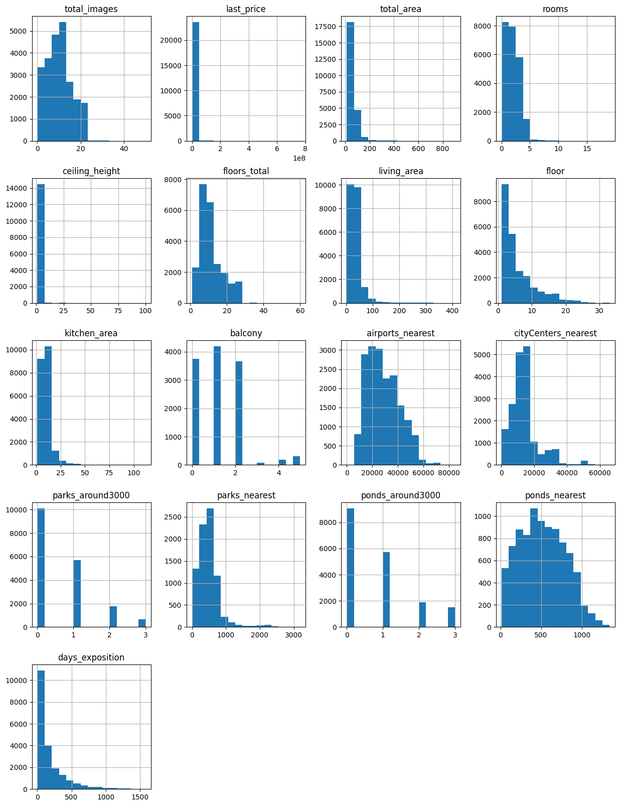
    


⚠️**На данном этапе гистограммы не очень информативны. По ним сложно сделать какие-либо выводы, поскольку предоставленне данные "сырые", для дальнейшей работы с ними необходимо провести предобработку: вычистить датафрейм от дубликатов и выбросов.**

## Предобработка данных

### Удаление пропусков 

**Выведем количество пропущенных значений для каждого столбца. Воспользуемся комбинацией двух методов: `isna()` и `sum()`.**


```python
# информация о пропусках в каждом столбце датафрейма
df.isna().sum().sort_values(ascending=True)
```


    total_images                0
    open_plan                   0
    floor                       0
    rooms                       0
    studio                      0
    total_area                  0
    last_price                  0
    first_day_exposition        0
    locality_name              49
    floors_total               86
    living_area              1903
    kitchen_area             2278
    days_exposition          3181
    ponds_around3000         5518
    parks_around3000         5518
    cityCenters_nearest      5519
    airports_nearest         5542
    ceiling_height           9195
    balcony                 11519
    ponds_nearest           14589
    parks_nearest           15620
    is_apartment            20924
    dtype: int64


```python
# посмотрим нагляднее: 
plot_null(df)
```


    
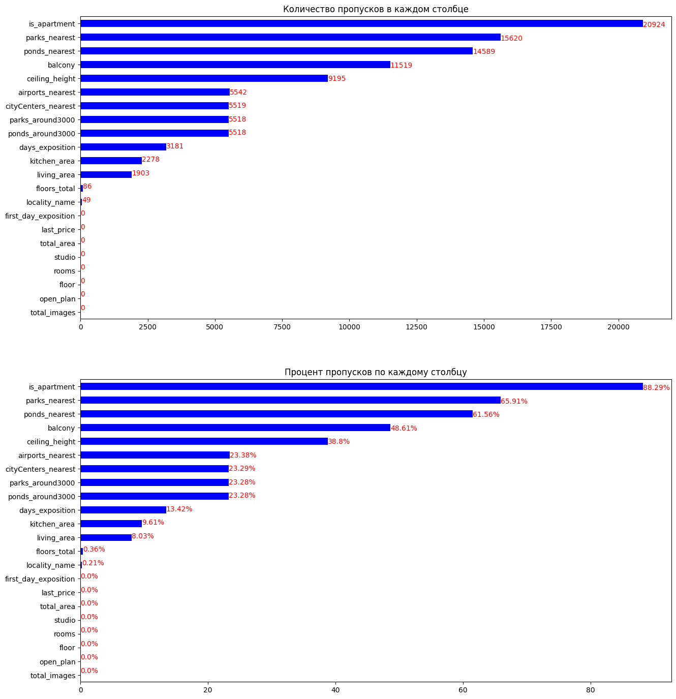
    


```python
# найдем средний процент пропусков в столбцах 
print('Средний процент пропусков в столбцах датафрейма: ' + str((df.isna().sum() / len(df) * 100).mean().round(2)) + '%')
```

    Средний процент пропусков в столбцах датафрейма: 19.46%
    

⚠️**В 14 столбцах датафрейма есть пропуски, причем в 9 из них пропусков больше 20% (а в трех вообще больше 50%). Их необходимо заполнить там, где это возможно.   
Пойдем от самого легкого к сложному.**

#### Столбец `days_exposition` (сколько дней было размещено объявление)

Природа пропусков в столбце не совсем ясна. Возможно, это "активные" объявления, по которым объекты недвижимости на момент формирования выборки еще не были проданы (тогда странно, почему они попали в "архивные"), либо данные были потеряны при заполнении или выгрузке. В любом случае заполнить пропуски мы никак не можем. Ни среднее арифметическое, ни медиана не отразят действительность, а лишь исказят результат.

#### Столбец `is_apartment` (является ли объект недвижимости апартаментами)

В столбце заполнено чуть больше 10% значений. Можно предположить, что заполняли его только тогда, когда продавались именно апартаменты. Проверим эту гипотезу:


```python
df['is_apartment'].value_counts()
```


    False    2725
    True       50
    Name: is_apartment, dtype: int64


Нельзя сказать, что гипотеза подтвердилась. Значения `False` присутствуют, и, более того, их в разы больше, чем значений `True`. Но это может быть связано с тем, что на рынке недвижимости объявлений по продаже апартаментов в принципе во много раз меньше. Однако, тот факт, является ли жилье апартаментами, играет существенную роль при его продаже (в апартаментах не регистрируют жильцов), поэтому я склонен к тому, что владельцы апартаментов точно указывали это в объявлениях, а вот владельцы обычных квартир могли упускать этот момент.  
Да, смущает всего-то 50 студий из 23,5 тысяч объявлений, но это может быть связано с описаной выше диспропорцией.   
Заменим все пропуски значением `False`.


```python
df['is_apartment'] = df['is_apartment'].fillna(False)
```


```python
# проверим, что получилось
check_null(df, 'is_apartment')
print('Распределение значений в столбце "is_apartment":')
print(df['is_apartment'].value_counts())
```

    Количество пропусков в столбце "is_apartment": 0
    Распределение значений в столбце "is_apartment":
    False    23649
    True        50
    Name: is_apartment, dtype: int64
    

#### Столбец `balcony` (количество балконов)

В столбце пропущена практически половина значений. Проверим гипотезу: продавцы ничего не указывали в столбце, если в квартире отсутствовал балкон.


```python
# проверим, есть ли среди значений столбца нули
df['balcony'].value_counts()
```


    1.00    4195
    0.00    3758
    2.00    3659
    5.00     304
    4.00     183
    3.00      81
    Name: balcony, dtype: int64


Гипотеза опять же полностью не подтвердилась, но учитывая тот факт, что из 12 тысяч объявлений, в которых прописано количество балконов, всего лишь 3 700 объявлений без балконов (что вызывает сомнения), можно предположить, что частенько люди все-таки забывали проставить нули в этой графе.  
Опять же, информация о наличии балкона существенна при продаже квартиры, поэтому продавцы, при его наличии, непременно об этом сообщали, в отличие от продавцов, в чьих квартирах балконов нет.  
На основании вышесказанного заменим все пропуски в столбце `balcony` на 0.


```python
# замена пропусков в столбце 'balcony' на 0
df['balcony'] = df['balcony'].fillna(0)
```


```python
# проверим результат 
check_null(df, 'balcony')
print('Распределение значений в столбце "balcony":')
print(df['balcony'].value_counts())
```

    Количество пропусков в столбце "balcony": 0
    Распределение значений в столбце "balcony":
    0.00    15277
    1.00     4195
    2.00     3659
    5.00      304
    4.00      183
    3.00       81
    Name: balcony, dtype: int64
    

Выглядит правдоподобнее. Все-таки квартир без балконов побольше, нежели с ними.

#### Столбец `locality_name` (название населенного пункта)

Пропусков по этому параметру мало. Можно было бы удалить эти строки. Но у нас есть возможность заполнить пропуски по объявениям, которые находятся в черте города. От центра до окраины Санкт-Петербурга в среднем около 15-17 километров. На основании этой информации и заполним все возможные пропуски в столбце.


```python
# заполняем столбец 'locality_name' значением 'Санкт-Петербург' в объявлениях, у которых расстояние до центра не более 15 км
df.loc[(df['locality_name'].isna()) & (df['cityCenters_nearest'] < 15000), 'locality_name'] = \
df.loc[(df['locality_name'].isna()) & (df['cityCenters_nearest'] < 15000), 'locality_name'].fillna('Санкт-Петербург')
```


```python
# проверим, остальсь ли пропуски 
print('Количество пропусков в столбце "locality_name" в радиусе 15км от цента: ' \
      + str(df[(df['locality_name'].isna()) & (df['cityCenters_nearest'] < 15000)]['locality_name'].count()))
```

    Количество пропусков в столбце "locality_name" в радиусе 15км от цента: 0
    


```python
# посмотрим, сколько все осталось пропусков в столбце 'locality_name' 
check_null(df, 'locality_name')
```

    Количество пропусков в столбце "locality_name": 21
    

Маленький шаг в рамках всего датафрейма, но огромный шаг в рамках одного столбца (50% все-таки =)).   
Идентифицировать оставшиеся пропуски у нас не получится: нет адресов квартир, чтобы можно было сориентироваться. Учитывая, что строк с пропусками в данном столбце осталось мало - дропним их. Это действие глобально не повлияет на результаты исследования.  


```python
# удалим оставшиеся строки с пропуском в столбце "locality_name"
df = df.dropna(subset=['locality_name'])
```


```python
# проверим результат удаления
check_null(df, 'locality_name')
```

    Количество пропусков в столбце "locality_name": 0
    


```python
print('Кронштадт: ' + str(df[df['locality_name'] == "Кронштадт"]['cityCenters_nearest'].mean()))
print('Мурино: ' + str(df[df['locality_name'] == "Мурино"]['cityCenters_nearest'].mean()))
print('Пушкино: ' + str(df[df['locality_name'] == "Пушкин"]['cityCenters_nearest'].mean()))
```

    Кронштадт: 49195.72631578947
    Мурино: nan
    Пушкино: 28745.375
    

#### Столбцы `cityCenters_nearest` (расстояние до центра города), `ponds_around3000` (количество прудов в радиусе 3км), `parks_around3000` (количество парков в радиусе 3км), `parks_nearest` (расстояние до ближайшего парка в метрах), `ponds_nearest` (расстояние до ближайшего пруда в метрах) и `airports_nearest` (расстояние до ближайшего аэропорта в метрах)

В описании проекта сказано, что часть информации заполнена продавцами, а часть информации картографическая. Учитывая практически идентичное количество пропусков в перечисленных столбцах, склонен предположить, что произошла техническая ошибка при выгрузке или обработке данных, в результате чего и появились пропуски. Возможно, продавцы не указали адреса квартир, в результате чего их не удалось идентифицировать на местности. 
- **Расстояние до центра** возможно заполнить средним арифметическим только вне самого Санкт-Петербурга, и то, если указан ПГТ/район/деревня/село (даст возможность покупателю, да и нам, хотя бы примерно представлять, на каком расстоянии от центра находится квартира). Вот только для этого в начале необходимо очистить столбец `locality_name` от дубликатов;
- **количество парков и прудов в радиусе 3 км**: можно проставить хотя бы 1, в тех строках, где указано рассояние до ближайшего парка/пруда меньше 3000м (покупателю скорее важен сам факт наличия такой инфраструктуры, нежели ее количество); 
- **расстояние до ближайшего парка/пруда:** нет возможности корректно заполнить самостолятельно эти данные. Заполнять пропуски медианой или средним арифметическим по какой-либо группировке неправильно. Оставим данные как есть. 
- **расстояние до аэропорта** возможно заполнить по аналогии с расстоянием до центра. 

В начале проверим, действительно ли пропуски в этих столбцах в одних и тех же строках:


```python
# выведем количество строк, в которых одновременно есть пропуски во всех 6 столбцах
print('Количество строк с пропусками в 6 столбцах: ' + str(len(df[(df['cityCenters_nearest'].isna()) &
  (df['ponds_around3000'].isna()) &
  (df['parks_around3000'].isna()) &
  (df['airports_nearest'].isna()) &
  (df['parks_nearest'].isna()) &
  (df['ponds_nearest'].isna()) &
  (df['airports_nearest'].isna())])))
```

    Количество строк с пропусками в 6 столбцах: 5510
    

Гипотеза подтверждена. Наименьшее число пропусков в одном из этих столбцов 5 518, пересечений с пятью остальными столбцами у нас получилось 5 510. 

Посмотрим, есть ли строки, в которых пропущено количество парков/прудов на расстоянии 3км, но при этом расстояние до ближайщего парка/пруда меньше 3км


```python
# посмотрим, есть ли строки, в которых пропущено количество парков/прудов на расстоянии 3км, 
# но при этом расстояние до ближайщего парка/пруда меньше 3км

# парки
print('Количество строк с пропусками в столбце "parks_around3000", но со значением в столбце "parks_nearest" < 3000м: ' \
      + str(df[(df['parks_around3000'].isna()) & (df['parks_nearest'] < 3000)]['parks_around3000'].count()))

# пруды
print('Количество строк с пропусками в столбце "ponds_around3000", но со значением в столбце "ponds_nearest" < 3000м: ' \
      + str(df[(df['ponds_around3000'].isna()) & (df['ponds_nearest'] < 3000)]['ponds_around3000'].count()))
```

    Количество строк с пропусками в столбце "parks_around3000", но со значением в столбце "parks_nearest" < 3000м: 0
    Количество строк с пропусками в столбце "ponds_around3000", но со значением в столбце "ponds_nearest" < 3000м: 0
    

Таких строк не оказалось, поэтому заполнить единицами мы ничего не можем. 

У нас довольно много пропусков по столбцам `parks_nearest` и `ponds_nearest` (чуть больше 60% по каждому). Поправка на 5 510 объявлений в связи с ошибкой в географических данных (скорее в выгрузке) дает нам по 10 110 и 9 079 пропусков соответственно. Однако, в тех 8 000 объявлений, где проставленны расстояния до парков и прудов, практически везде это расстояние не превышает 3 000м (подтверждение ниже). Возможно, эти данные парсились с ограничением по радиусу.


```python
print('Количество строк с заполненным столбцом "parks_nearest": ' + str(len(df[df['parks_nearest'] > 0])))
print('Количество строк с расстоянием до парка меньше 3км:' + str(len(df[df['parks_nearest'] < 3000])))
print('Оставшиеся 4 значения не далеко ушли от 3км:')
df[df['parks_nearest'] > 3000]['parks_nearest']
```

    Количество строк с заполненным столбцом "parks_nearest": 8079
    Количество строк с расстоянием до парка меньше 3км:8075
    Оставшиеся 4 значения не далеко ушли от 3км:
    


    1590    3064.00
    10959   3190.00
    19208   3013.00
    19430   3190.00
    Name: parks_nearest, dtype: float64


<a id='link_1'></a>Избавляемся от дубликатов в столбце `locality_name`

Мне в голову пришло два способа избавиться от неявных дубликатов в столбце:  
***Метод №1***
1) создать список с бан-словами, такими как "посёлок", "деревня", "село" и т.п.;
2) заменить в значениях столбца эти слова на '' (пустоту);
3) удалить пробелы  

Такой способ довольно быстрый, но он ориентирован только под данный датафрейм: если добавятся иные ненужные нам слова, например, "садовое некоммерческое товарищество", различные аббревиатуры и прочее, то либо необходимо будет расширять бан-лист (в теории этим можно будет заниматься до бесконечности), либо переписать код под второй метод 😂. Хотя он тоже не идеален.  

***Метод №2***  
По идее все названия населенных пунктов в русском языку принято писать с большой буквы. Поэтому:
1) с помощью регулярных выражений находим в каждом значении столбца подстроку, которая начинается со слова с заглавной буквы (именно подстроку, а не слово (хотя слово тоже подстрока), потому что есть названия, состоящие из более чем одного слова (Малые ..., Большие... и прочее));
2) переписываем это все в новый список;
3) "переназываем" значения столбца.  

Минус один - мы полагаемся на то, что заполнявший данные имел хотя бы школьное образование. Да и от опечатки никто не застрахован. Тут, конечно, проблема.  
Еще одна опасность - метод `lower()`, он превратит все в кусок неработающего кода. 

В прошлом проекте открыл для себя библиотеку, которая приводит слова к начальной форме. После такого чуда уверен, что есть и библиотека, которая поможет вычленять названия населенных пунктов без привязки к заглавным буквам, но я такой пока не знаю.


```python
names = df['locality_name'].str.extract(r'(\b[А-Я]\w+\W?\w+\W?\w*)') # не забываем про дефис в названии города на Неве  
print(names.head(15))                                  # и на всякий случай добавляем возможность для еще одного дефиса
# для проверки, сохранилась ли последовательность
print()
print(df['locality_name'].head(15))
```

                      0
    0   Санкт-Петербург
    1            Шушары
    2   Санкт-Петербург
    3   Санкт-Петербург
    4   Санкт-Петербург
    5           Янино-1
    6         Парголово
    7   Санкт-Петербург
    8            Мурино
    9   Санкт-Петербург
    10  Санкт-Петербург
    11        Ломоносов
    12        Сертолово
    13         Петергоф
    14           Пушкин
    
    0               Санкт-Петербург
    1                посёлок Шушары
    2               Санкт-Петербург
    3               Санкт-Петербург
    4               Санкт-Петербург
    5     городской посёлок Янино-1
    6             посёлок Парголово
    7               Санкт-Петербург
    8                посёлок Мурино
    9               Санкт-Петербург
    10              Санкт-Петербург
    11                    Ломоносов
    12                    Сертолово
    13                     Петергоф
    14                       Пушкин
    Name: locality_name, dtype: object
    


```python
# заменим названия столбца 'locality_name' на полученные значения
df['locality_name'] = names
df['locality_name'].unique()
```


    array(['Санкт-Петербург', 'Шушары', 'Янино-1', 'Парголово', 'Мурино',
           'Ломоносов', 'Сертолово', 'Петергоф', 'Пушкин', 'Кудрово',
           'Коммунар', 'Колпино', 'Красный Бор', 'Гатчина', 'Фёдоровское',
           'Выборг', 'Кронштадт', 'Кировск', 'Новое Девяткино',
           'Металлострой', 'Лебяжье', 'Сиверский', 'Молодцово',
           'Кузьмоловский', 'Новая Ропша', 'Павловск', 'Пикколово',
           'Всеволожск', 'Волхов', 'Кингисепп', 'Приозерск', 'Сестрорецк',
           'Куттузи', 'Аннино', 'Ефимовский', 'Плодовое', 'Заклинье',
           'Торковичи', 'Первомайское', 'Красное Село', 'Понтонный',
           'Сясьстрой', 'Старая', 'Лесколово', 'Новый Свет', 'Сланцы',
           'Путилово', 'Ивангород', 'Шлиссельбург', 'Никольское',
           'Зеленогорск', 'Сосновый Бор', 'Оржицы', 'Кальтино', 'Романовка',
           'Бугры', 'Рощино', 'Кириши', 'Луга', 'Волосово', 'Отрадное',
           'Павлово', 'Оредеж', 'Копорье', 'Молодёжное', 'Тихвин', 'Победа',
           'Нурма', 'Синявино', 'Тосно', 'Стрельна', 'Бокситогорск',
           'Александровская', 'Лопухинка', 'Пикалёво', 'Терволово',
           'Советский', 'Подпорожье', 'Петровское', 'Токсово', 'Сельцо',
           'Вырица', 'Кипень', 'Келози', 'Вартемяги', 'Тельмана',
           'Севастьяново', 'Большая Ижора', 'Агалатово', 'Новогорелово',
           'Лесогорский', 'Лаголово', 'Цвелодубово', 'Рахья', 'Белогорка',
           'Заводской', 'Новоселье', 'Большие Колпаны', 'Горбунки', 'Батово',
           'Заневка', 'Иссад', 'Приморск', 'Мистолово', 'Новая Ладога',
           'Зимитицы', 'Барышево', 'Разметелево', 'Свердлова', 'Пеники',
           'Рябово', 'Пудомяги', 'Корнево', 'Низино', 'Бегуницы', 'Поляны',
           'Мга', 'Елизаветино', 'Кузнечное', 'Колтуши', 'Запорожское',
           'Гостилицы', 'Малое Карлино', 'Мичуринское', 'Морозова',
           'Песочный', 'Сосново', 'Аро', 'Ильичёво', 'Тайцы', 'Малое Верево',
           'Извара', 'Вещево', 'Паша', 'Калитино', 'Ульяновка', 'Чудской Бор',
           'Дубровка', 'Мины', 'Войсковицы', 'Коркино', 'Ропша',
           'Приладожский', 'Щеглово', 'Гаврилово', 'Лодейное Поле',
           'Рабитицы', 'Никольский', 'Кузьмолово', 'Малые Колпаны',
           'Петро-Славянка', 'Назия', 'Репино', 'Углово', 'Старая Малукса',
           'Меньково', 'Старые Бегуницы', 'Сапёрный', 'Семрино', 'Глажево',
           'Кобринское', 'Гарболово', 'Юкки', 'Приветнинское', 'Мануйлово',
           'Пчева', 'Цвылёво', 'Мельниково', 'Пудость', 'Усть-Луга',
           'Светогорск', 'Любань', 'Селезнёво', 'Каменногорск', 'Кривко',
           'Глебычево', 'Парицы', 'Жилпосёлок', 'Войскорово', 'Стеклянный',
           'Важины', 'Мыза-Ивановка', 'Русско-Высоцкое', 'Форносово',
           'Старая Ладога', 'Житково', 'Виллози', 'Лампово', 'Шпаньково',
           'Лаврики', 'Сумино', 'Возрождение', 'Старосиверская', 'Кикерино',
           'Старое Хинколово', 'Пригородный', 'Торфяное', 'Будогощь',
           'Суходолье', 'Красная Долина', 'Хапо-Ое', 'Дружная Горка',
           'Лисий Нос', 'Яльгелево', 'Рождествено', 'Старополье', 'Левашово',
           'Сяськелево', 'Камышовка', 'Лесная Поляна', 'Хязельки',
           'Жилгородок', 'Ялгино', 'Новый Учхоз', 'Гончарово', 'Почап',
           'Сапёрное', 'Платформа 69-й', 'Каложицы', 'Фалилеево', 'Пельгора',
           'Торошковичи', 'Белоостров', 'Алексеевка', 'Серебрянский',
           'Лукаши', 'Тарасово', 'Кингисеппский', 'Ушаки', 'Котлы', 'Сижно',
           'Торосово', 'Форт Красная Горка', 'Новолисино', 'Громово',
           'Глинка', 'Старая Пустошь', 'Коммунары', 'Починок', 'Вознесенье',
           'Разбегаево', 'Гладкое', 'Тёсово-4', 'Бор', 'Коробицыно',
           'Большая Вруда', 'Курковицы', 'Кобралово', 'Суоранда',
           'Кондратьево', 'Счастье', 'Реброво', 'Тойворово', 'Семиозерье',
           'Лесное', 'Совхозный', 'Ленинское', 'Суйда', 'Нижние Осельки',
           'Свирь', 'Перово', 'Высоцк', 'Шум', 'Котельский', 'Лужайка',
           'Большая Пустомержа', 'Красносельское', 'Вахнова Кара', 'Пижма',
           'Кивеннапа Север', 'Ромашки', 'Каськово', 'Куровицы', 'Плоское',
           'Кирпичное', 'Ям-Тесово', 'Раздолье', 'Терпилицы', 'Шугозеро',
           'Ваганово', 'Пушное', 'Садко', 'Усть-Ижора', 'Выскатка',
           'Свирьстрой', 'Кисельня', 'Трубников Бор', 'Высокоключевой',
           'Пансионат Зелёный Бор', 'Ненимяки', 'Снегирёвка', 'Рапполово',
           'Пустынка', 'Большой Сабск', 'Русско', 'Лупполово',
           'Большое Рейзино', 'Малая Романовка', 'Дружноселье', 'Пчевжа',
           'Володарское', 'Нижняя', 'Тихковицы', 'Борисова Грива',
           'Дзержинского'], dtype=object)


Ну вот! И Санкт-Петербург сохранили, и Красный Бор.


```python
# проверим, остались ли пропуски в столбце 'locality_name'
check_null(df, 'locality_name')
```

    Количество пропусков в столбце "locality_name": 0
    

Вернемся к заполнению пропусков в столбце `cityCenters_nearest`.


```python
# среднее арифметическое расстояний до города по "районам"
avg_distance_per_area = df.groupby('locality_name')['cityCenters_nearest'].mean().sort_values()
avg_distance_per_area.head(30)
```


    locality_name
    Санкт-Петербург   11591.93
    Парголово         19924.78
    Мурино            21888.00
    Стрельна          23376.11
    Шушары            24243.39
    Левашово          25727.00
    Песочный          26475.25
    Петро-Славянка    27165.00
    Александровская   27468.00
    Металлострой      27561.35
    Лисий Нос         27613.33
    Усть-Ижора        28222.50
    Пушкин            28745.38
    Красное Село      30020.28
    Колпино           32113.77
    Понтонный         32293.45
    Павловск          33206.92
    Щеглово           34085.00
    Сестрорецк        34624.48
    Петергоф          35468.93
    Сапёрный          35854.67
    Белоостров        38868.00
    Репино            43392.25
    Кронштадт         49195.73
    Ломоносов         50739.97
    Зеленогорск       54617.58
    Молодёжное        65529.20
    Агалатово              NaN
    Алексеевка             NaN
    Аннино                 NaN
    Name: cityCenters_nearest, dtype: float64


Как мы видим, те самые 5,5 тысяч объявлений с ошибкой сказываются и здесь.  
Настораживает среднее арифметическое по Санкт-Петербургу, уж очень большие числа. При заполнении пропусков в столбце пройдем мимо Питера. Все-таки его размеры значительно больше, нежели у других населенных пунктов, поэтому и погрешность при таком заполнении сильно возрастет. Заполним все остальное.


```python
check_null(df, 'cityCenters_nearest')
```

    Количество пропусков в столбце "cityCenters_nearest": 5511
    


```python
for name in df['locality_name'].unique():
    if name != 'Санкт-Петербург':
        df.loc[(df['locality_name'] == name) & (df['cityCenters_nearest'].isna()), 'cityCenters_nearest'] = \
        df.loc[(df['locality_name'] == name), 'cityCenters_nearest'].mean()        
```


```python
# проверим результаты
check_null(df, 'cityCenters_nearest')
```

    Количество пропусков в столбце "cityCenters_nearest": 4890
    

Аналогично поступим и со столбцом `airports_nearest` (раз уж начали). 


```python
check_null(df, 'airports_nearest')
```

    Количество пропусков в столбце "airports_nearest": 5534
    


```python
for name in df['locality_name'].unique():
    df.loc[(df['locality_name'] == name) & (df['airports_nearest'].isna()), 'airports_nearest'] = \
        df.loc[(df['locality_name'] == name), 'airports_nearest'].mean()    
```


```python
check_null(df, 'airports_nearest')
```

    Количество пропусков в столбце "airports_nearest": 4829
    

**Очевидно, что в 5 тысячах строк произошел какой-то сбой в географических данных. Удалять строки не будем, поскольку это довольно большой массив данных, и информация из других столбцов нам может пригодится для исследования, однако, если в дальнейшем необходимо будет анализировать данные их этих столбцов, то будем брать срез без учета 5 тысяч багнутых строк.** 

#### Столбец `floors_total` (всего этажей в доме)

<div style="border:solid blue 3px; padding: 20px">
<div class="alert alert-info">
Пропусков в данном столбце не так уж и много, но заполнить их каким-либо значением мы не можем. Учитывая карту высотного регламента Санкт-Петербурга, можно сделать выводы только о том, на каком участке и выше какой отметки (а значит и этажа) нельзя строить, но застройщик может и не воспользоваться максимально допустимой высотой и построить здание намного ниже. Оставим пропуски без изменений. Отсутствие информации тоже информавция.   
</div>
</div>

#### Столбец `ceiling_height` (высота потолков) 

<a id='link_2'></a>В столбце чуть больше 9 тысяч пропусков, которые необходимо заполнить, поскольку это довольно объемный массив данных, потеряв который, можно сильно исказить результаты исследования.  
Пропуски в данном столбце невозможно заполнить точными значениями: высота потолков даже на разных этажах одного и того же здания может различаться. Если в параметрах объявлений были бы указаны и адреса квартир, возможно было бы провести дополнительный анализ: вдруг продавались бы квартиры по одному и тому же адресу на одном и том же этаже, и в каком-то из объявлений высота потолков была бы указана, следовательно, можно было бы продублировать ее и в других квартирах по этому адресу. Поскольку такой возможности у нас нет, предлагаю следующий вариант заполнения недостающих значений.

Для Санкт-Петербурга существует Карта высотного регламента. Максимальные высоты зданий определены (в основном) Приложением №3 к Закону Санкт-Петербурга «О Правилах землепользования и застройки Санкт-Петербурга» от 16 февраля 2009 года № 29-10 (источники: [сам закон](https://docs.cntd.ru/document/891804215), [Приложение 2 к режимам использования земель и требованиям к градостроительным регламентам в границах объединенных зон охраны объектов культурного наследия, расположенных на территории Санкт-Петербурга](https://kgiop.gov.spb.ru/media/uploads/userfiles/2021/02/04/%D0%9F%D1%80%D0%B8%D0%BB%D0%BE%D0%B6%D0%B5%D0%BD%D0%B8%D0%B5_2.2_%D0%92%D1%8B%D1%81%D0%BE%D1%82%D1%8B_1-80.pdf), сайт [spb4rent.com](https://spb4rent.com/articles/maps/vysotnyi-reglament-sankt-peterburga-karta/) и сайт [piterdevelopment.ru](http://www.piterdevelopment.ru/our/articles/articles_89.html)).  


Как мы можем видеть по карте, высота застройки в городе меняется исходя из удаленности от центра города. Предположим, что и высота потолков изменяется схожим образом. Следовательно для заполнения пропусков сгруппируем значения в столбце `ceiling_height` по вышеуказанному признаку в 4 группы:
- 0 - 5 км от центра (центр)
- 5 - 10 км от центра (город)
- 10 - 15 км (окраина города)
- больше 15 км (посёлок городского типа (ПГТ)),

а затем заполним пропуски медианным значением по каждой группе, так как медиана наиболее устойчива к выбросам, которые мы еще не вычищали.


```python
# создадим функцию, которая будет присваивать категорию 
def fillna_ceiling_height(row):
    if 0 <= row['cityCenters_nearest'] <= 5000:
        return 'центр'
    elif 5000 < row['cityCenters_nearest'] <= 10000:
        return 'город'
    elif 10000 < row['cityCenters_nearest'] <= 15000:
        return 'окраина города'
    elif row['cityCenters_nearest'] > 15000:
        return 'ПГТ'
    
# хорошо бы вынести функцию в начало отчета, но мы используем ее единожды, поэтому оставим здесь
```


```python
# проведем категоризацию данных по удаленности от центра
df['distance_from_centers'] = df.apply(fillna_ceiling_height, axis=1)
```


```python
# выведем на экран результат
df[['locality_name', 'cityCenters_nearest', 'ceiling_height', 'distance_from_centers']].head(15)
```


<div>
<style scoped>
    .dataframe tbody tr th:only-of-type {
        vertical-align: middle;
    }

    .dataframe tbody tr th {
        vertical-align: top;
    }

    .dataframe thead th {
        text-align: right;
    }
</style>
<table border="1" class="dataframe">
  <thead>
    <tr style="text-align: right;">
      <th></th>
      <th>locality_name</th>
      <th>cityCenters_nearest</th>
      <th>ceiling_height</th>
      <th>distance_from_centers</th>
    </tr>
  </thead>
  <tbody>
    <tr>
      <th>0</th>
      <td>Санкт-Петербург</td>
      <td>16028.00</td>
      <td>2.70</td>
      <td>ПГТ</td>
    </tr>
    <tr>
      <th>1</th>
      <td>Шушары</td>
      <td>18603.00</td>
      <td>NaN</td>
      <td>ПГТ</td>
    </tr>
    <tr>
      <th>2</th>
      <td>Санкт-Петербург</td>
      <td>13933.00</td>
      <td>NaN</td>
      <td>окраина города</td>
    </tr>
    <tr>
      <th>3</th>
      <td>Санкт-Петербург</td>
      <td>6800.00</td>
      <td>NaN</td>
      <td>город</td>
    </tr>
    <tr>
      <th>4</th>
      <td>Санкт-Петербург</td>
      <td>8098.00</td>
      <td>3.03</td>
      <td>город</td>
    </tr>
    <tr>
      <th>5</th>
      <td>Янино-1</td>
      <td>NaN</td>
      <td>NaN</td>
      <td>None</td>
    </tr>
    <tr>
      <th>6</th>
      <td>Парголово</td>
      <td>19143.00</td>
      <td>NaN</td>
      <td>ПГТ</td>
    </tr>
    <tr>
      <th>7</th>
      <td>Санкт-Петербург</td>
      <td>11634.00</td>
      <td>NaN</td>
      <td>окраина города</td>
    </tr>
    <tr>
      <th>8</th>
      <td>Мурино</td>
      <td>21888.00</td>
      <td>NaN</td>
      <td>ПГТ</td>
    </tr>
    <tr>
      <th>9</th>
      <td>Санкт-Петербург</td>
      <td>15008.00</td>
      <td>2.50</td>
      <td>ПГТ</td>
    </tr>
    <tr>
      <th>10</th>
      <td>Санкт-Петербург</td>
      <td>13878.00</td>
      <td>2.67</td>
      <td>окраина города</td>
    </tr>
    <tr>
      <th>11</th>
      <td>Ломоносов</td>
      <td>51677.00</td>
      <td>NaN</td>
      <td>ПГТ</td>
    </tr>
    <tr>
      <th>12</th>
      <td>Сертолово</td>
      <td>NaN</td>
      <td>NaN</td>
      <td>None</td>
    </tr>
    <tr>
      <th>13</th>
      <td>Петергоф</td>
      <td>33058.00</td>
      <td>2.56</td>
      <td>ПГТ</td>
    </tr>
    <tr>
      <th>14</th>
      <td>Пушкин</td>
      <td>30759.00</td>
      <td>NaN</td>
      <td>ПГТ</td>
    </tr>
  </tbody>
</table>
</div>


```python
# посмотрим, в скольких строках мы не заполним высоту потолков:
print('Должно остаться пропусков после заполнения, где это возможно, медианным значением: ' \
      + str(len(df[(df['cityCenters_nearest'].isna()) & (df['ceiling_height'].isna())])))
```

    Должно остаться пропусков после заполнения, где это возможно, медианным значением: 2188
    

**В столбец `distance_from_centers` затесалось значение  `None`, так как у этих объявлений отсутствует значение в столбце `cityCenters_nearest`. Учтем это при заполнении пропусков.** 


```python
# заполняем пропуски в столбце 'ceiling_height' медианной
for distance in df['distance_from_centers'].unique():
    if distance is not None:
        df.loc[(df['ceiling_height'].isna()) & (df['distance_from_centers'] == distance), 'ceiling_height'] = \
        df.loc[(df['distance_from_centers'] == distance) , 'ceiling_height'].median()
```


```python
# проверим результат
check_null(df, 'ceiling_height') 
```

    Количество пропусков в столбце "ceiling_height": 2188
    

#### Столбцы `living_area` (жилая площадь) и `kitchen_area` (площадь кухни)

Заполнить пропуски по формуле "общая площадь = жилая площадь + кухонная площадь" будет не совсем корректно,  поскольку в общую площадь помимо жилой и кухонной входят также коридоры, санузлы и подсобные помещения (кладовая или гардеробная). Заполнить пропуски по аналогии с `ceiling_height` тоже будет не корректно: вряд ли есть корреляция между удалением от центра и площадью квартир.  
Можно лишь проанализировать: возможно, данный столбец пропускали в тех объявлениях, в которых продавались студии, поскольку, как правило, в квартирах-студиях площади могут не разграничивать). Это никак не поможет заполнить нам пропуски, но может пригодится в исследовании.


```python
# посмотрим, в скольких объявлениях продавались студии и пропущены значения в интересующих нас столбцах
df[(df['studio'] == True) | (df['rooms'] == 0)][['living_area', 'kitchen_area']].isna().sum() 
```


    living_area      14
    kitchen_area    208
    dtype: int64


Не так много пропусков по данным столбцам относятся к объявлениям по продаже студий. Похоже на то, что люди просто не указывали эти данные (возможно, не помнили разбивку, ведь в общей площади пропусков нет совсем).

**Посмотрим, что у нас получилось после обработки пропусков:**


```python
plot_null(df)
```


    
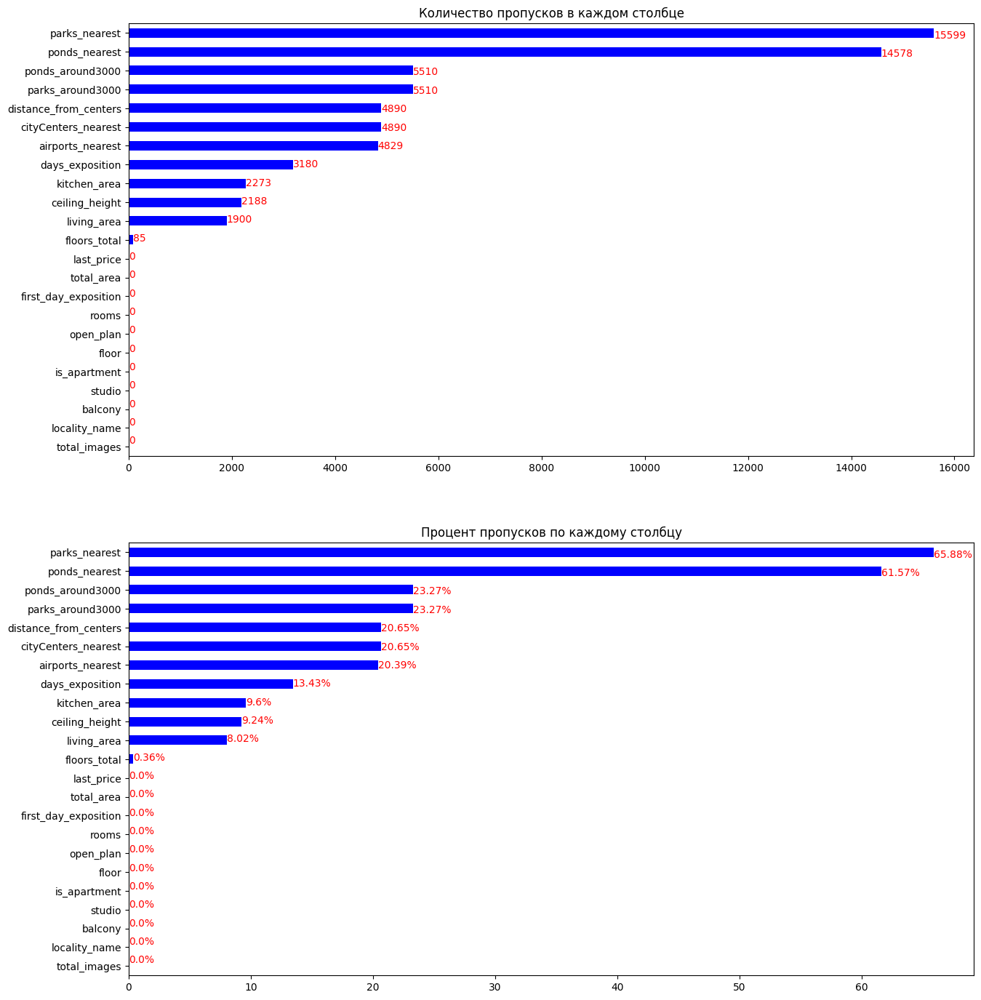
    


```python
# найдем средний процент пропусков в столбцах 
print('Средний процент пропусков в столбцах датафрейма: ' + str((df.isna().sum() / len(df) * 100).mean().round(2)) + '%')
```

    Средний процент пропусков в столбцах датафрейма: 12.01%
    

**Как минимум, мы полностью избавились от пропусков в 3 столбцах, а также на 7,5 процентов уменьшили среднее количество пропусков по датафрейму.** 

### Изменение типов данных в столбцах датафрейма


```python
# посмотрим еще раз, какие типы данных у нас в столбцах
df.dtypes
```


    total_images               int64
    last_price               float64
    total_area               float64
    first_day_exposition      object
    rooms                      int64
    ceiling_height           float64
    floors_total             float64
    living_area              float64
    floor                      int64
    is_apartment                bool
    studio                      bool
    open_plan                   bool
    kitchen_area             float64
    balcony                  float64
    locality_name             object
    airports_nearest         float64
    cityCenters_nearest      float64
    parks_around3000         float64
    parks_nearest            float64
    ponds_around3000         float64
    ponds_nearest            float64
    days_exposition          float64
    distance_from_centers     object
    dtype: object


#### Столбец `first_day_exposition`

Для удобства восприятия и, вожможно, дальнейшей работы с датами изменим тип данных в столбце `first_day_exposition`.


```python
df['first_day_exposition'] = pd.to_datetime(df['first_day_exposition'], format='%Y-%m-%dT%H:%M:%S')
df.head(5)
```


<div>
<style scoped>
    .dataframe tbody tr th:only-of-type {
        vertical-align: middle;
    }

    .dataframe tbody tr th {
        vertical-align: top;
    }

    .dataframe thead th {
        text-align: right;
    }
</style>
<table border="1" class="dataframe">
  <thead>
    <tr style="text-align: right;">
      <th></th>
      <th>total_images</th>
      <th>last_price</th>
      <th>total_area</th>
      <th>first_day_exposition</th>
      <th>rooms</th>
      <th>ceiling_height</th>
      <th>floors_total</th>
      <th>living_area</th>
      <th>floor</th>
      <th>is_apartment</th>
      <th>studio</th>
      <th>open_plan</th>
      <th>kitchen_area</th>
      <th>balcony</th>
      <th>locality_name</th>
      <th>airports_nearest</th>
      <th>cityCenters_nearest</th>
      <th>parks_around3000</th>
      <th>parks_nearest</th>
      <th>ponds_around3000</th>
      <th>ponds_nearest</th>
      <th>days_exposition</th>
      <th>distance_from_centers</th>
    </tr>
  </thead>
  <tbody>
    <tr>
      <th>0</th>
      <td>20</td>
      <td>13000000.00</td>
      <td>108.00</td>
      <td>2019-03-07</td>
      <td>3</td>
      <td>2.70</td>
      <td>16.00</td>
      <td>51.00</td>
      <td>8</td>
      <td>False</td>
      <td>False</td>
      <td>False</td>
      <td>25.00</td>
      <td>0.00</td>
      <td>Санкт-Петербург</td>
      <td>18863.00</td>
      <td>16028.00</td>
      <td>1.00</td>
      <td>482.00</td>
      <td>2.00</td>
      <td>755.00</td>
      <td>NaN</td>
      <td>ПГТ</td>
    </tr>
    <tr>
      <th>1</th>
      <td>7</td>
      <td>3350000.00</td>
      <td>40.40</td>
      <td>2018-12-04</td>
      <td>1</td>
      <td>2.60</td>
      <td>11.00</td>
      <td>18.60</td>
      <td>1</td>
      <td>False</td>
      <td>False</td>
      <td>False</td>
      <td>11.00</td>
      <td>2.00</td>
      <td>Шушары</td>
      <td>12817.00</td>
      <td>18603.00</td>
      <td>0.00</td>
      <td>NaN</td>
      <td>0.00</td>
      <td>NaN</td>
      <td>81.00</td>
      <td>ПГТ</td>
    </tr>
    <tr>
      <th>2</th>
      <td>10</td>
      <td>5196000.00</td>
      <td>56.00</td>
      <td>2015-08-20</td>
      <td>2</td>
      <td>2.60</td>
      <td>5.00</td>
      <td>34.30</td>
      <td>4</td>
      <td>False</td>
      <td>False</td>
      <td>False</td>
      <td>8.30</td>
      <td>0.00</td>
      <td>Санкт-Петербург</td>
      <td>21741.00</td>
      <td>13933.00</td>
      <td>1.00</td>
      <td>90.00</td>
      <td>2.00</td>
      <td>574.00</td>
      <td>558.00</td>
      <td>окраина города</td>
    </tr>
    <tr>
      <th>3</th>
      <td>0</td>
      <td>64900000.00</td>
      <td>159.00</td>
      <td>2015-07-24</td>
      <td>3</td>
      <td>2.80</td>
      <td>14.00</td>
      <td>NaN</td>
      <td>9</td>
      <td>False</td>
      <td>False</td>
      <td>False</td>
      <td>NaN</td>
      <td>0.00</td>
      <td>Санкт-Петербург</td>
      <td>28098.00</td>
      <td>6800.00</td>
      <td>2.00</td>
      <td>84.00</td>
      <td>3.00</td>
      <td>234.00</td>
      <td>424.00</td>
      <td>город</td>
    </tr>
    <tr>
      <th>4</th>
      <td>2</td>
      <td>10000000.00</td>
      <td>100.00</td>
      <td>2018-06-19</td>
      <td>2</td>
      <td>3.03</td>
      <td>14.00</td>
      <td>32.00</td>
      <td>13</td>
      <td>False</td>
      <td>False</td>
      <td>False</td>
      <td>41.00</td>
      <td>0.00</td>
      <td>Санкт-Петербург</td>
      <td>31856.00</td>
      <td>8098.00</td>
      <td>2.00</td>
      <td>112.00</td>
      <td>1.00</td>
      <td>48.00</td>
      <td>121.00</td>
      <td>город</td>
    </tr>
  </tbody>
</table>
</div>


#### Столбцы `floors_total`, `balcony`,  `parks_around3000`,  `ponds_around3000`, `days_exposition`

**Изменим тип данных в столбцах на `int`, поскольку все они связаны с подсчетом, а подсчет ведется в натуральных числах.**


```python
columns = ['floors_total', 'balcony', 'parks_around3000', 'ponds_around3000', 'days_exposition']
for column in columns:
    df = df.astype({column: 'Int64'}, errors='ignore') # спасибо тем, кто доработал python и дал возможность 
                                        # изменять тип данных, если в столбце есть NaN (как делать с ними - без понятия)

df.dtypes # почему-то не меняется тип данных в столбце 'days_exposition', так и не понял, почему. закинул в игнор=)  
```


    total_images                      int64
    last_price                      float64
    total_area                      float64
    first_day_exposition     datetime64[ns]
    rooms                             int64
    ceiling_height                  float64
    floors_total                      Int64
    living_area                     float64
    floor                             int64
    is_apartment                       bool
    studio                             bool
    open_plan                          bool
    kitchen_area                    float64
    balcony                           Int64
    locality_name                    object
    airports_nearest                float64
    cityCenters_nearest             float64
    parks_around3000                  Int64
    parks_nearest                   float64
    ponds_around3000                  Int64
    ponds_nearest                   float64
    days_exposition                 float64
    distance_from_centers            object
    dtype: object


### Избавляемся от дубликатов в столбце `locality_name`

[<font color=blue>Пришлось делать это раньше</font>](#link_1)</font>

### Поиск и устранение редких и выбивающихся значений

Определим, в каких столбцах мы будем работать с редкими и выбивающимися значениями.


```python
# еще раз выведем общую информацию о датафрейме
pd.options.display.float_format = '{:.2f}'.format # не нравится экспоненциальная запись по столбцу "last_price"
df.describe()
```


<div>
<style scoped>
    .dataframe tbody tr th:only-of-type {
        vertical-align: middle;
    }

    .dataframe tbody tr th {
        vertical-align: top;
    }

    .dataframe thead th {
        text-align: right;
    }
</style>
<table border="1" class="dataframe">
  <thead>
    <tr style="text-align: right;">
      <th></th>
      <th>total_images</th>
      <th>last_price</th>
      <th>total_area</th>
      <th>rooms</th>
      <th>ceiling_height</th>
      <th>floors_total</th>
      <th>living_area</th>
      <th>floor</th>
      <th>kitchen_area</th>
      <th>balcony</th>
      <th>airports_nearest</th>
      <th>cityCenters_nearest</th>
      <th>parks_around3000</th>
      <th>parks_nearest</th>
      <th>ponds_around3000</th>
      <th>ponds_nearest</th>
      <th>days_exposition</th>
    </tr>
  </thead>
  <tbody>
    <tr>
      <th>count</th>
      <td>23678.00</td>
      <td>23678.00</td>
      <td>23678.00</td>
      <td>23678.00</td>
      <td>21490.00</td>
      <td>23593.00</td>
      <td>21778.00</td>
      <td>23678.00</td>
      <td>21405.00</td>
      <td>23678.00</td>
      <td>18849.00</td>
      <td>18788.00</td>
      <td>18168.00</td>
      <td>8079.00</td>
      <td>18168.00</td>
      <td>9100.00</td>
      <td>20498.00</td>
    </tr>
    <tr>
      <th>mean</th>
      <td>9.86</td>
      <td>6543085.61</td>
      <td>60.34</td>
      <td>2.07</td>
      <td>2.74</td>
      <td>10.67</td>
      <td>34.46</td>
      <td>5.89</td>
      <td>10.57</td>
      <td>0.59</td>
      <td>29543.70</td>
      <td>14460.56</td>
      <td>0.61</td>
      <td>490.80</td>
      <td>0.77</td>
      <td>518.17</td>
      <td>180.90</td>
    </tr>
    <tr>
      <th>std</th>
      <td>5.68</td>
      <td>10891357.90</td>
      <td>35.66</td>
      <td>1.08</td>
      <td>1.04</td>
      <td>6.59</td>
      <td>22.04</td>
      <td>4.88</td>
      <td>5.90</td>
      <td>0.96</td>
      <td>13063.96</td>
      <td>8608.33</td>
      <td>0.80</td>
      <td>342.32</td>
      <td>0.94</td>
      <td>277.81</td>
      <td>219.78</td>
    </tr>
    <tr>
      <th>min</th>
      <td>0.00</td>
      <td>12190.00</td>
      <td>12.00</td>
      <td>0.00</td>
      <td>1.00</td>
      <td>1.00</td>
      <td>2.00</td>
      <td>1.00</td>
      <td>1.30</td>
      <td>0.00</td>
      <td>0.00</td>
      <td>181.00</td>
      <td>0.00</td>
      <td>1.00</td>
      <td>0.00</td>
      <td>13.00</td>
      <td>1.00</td>
    </tr>
    <tr>
      <th>25%</th>
      <td>6.00</td>
      <td>3400000.00</td>
      <td>40.00</td>
      <td>1.00</td>
      <td>2.60</td>
      <td>5.00</td>
      <td>18.60</td>
      <td>2.00</td>
      <td>7.00</td>
      <td>0.00</td>
      <td>18832.00</td>
      <td>9456.50</td>
      <td>0.00</td>
      <td>288.00</td>
      <td>0.00</td>
      <td>294.00</td>
      <td>45.00</td>
    </tr>
    <tr>
      <th>50%</th>
      <td>9.00</td>
      <td>4650000.00</td>
      <td>52.00</td>
      <td>2.00</td>
      <td>2.60</td>
      <td>9.00</td>
      <td>30.00</td>
      <td>4.00</td>
      <td>9.10</td>
      <td>0.00</td>
      <td>27370.00</td>
      <td>13277.00</td>
      <td>0.00</td>
      <td>455.00</td>
      <td>1.00</td>
      <td>503.00</td>
      <td>95.00</td>
    </tr>
    <tr>
      <th>75%</th>
      <td>14.00</td>
      <td>6800000.00</td>
      <td>69.80</td>
      <td>3.00</td>
      <td>2.80</td>
      <td>16.00</td>
      <td>42.30</td>
      <td>8.00</td>
      <td>12.00</td>
      <td>1.00</td>
      <td>38786.00</td>
      <td>16779.75</td>
      <td>1.00</td>
      <td>612.00</td>
      <td>1.00</td>
      <td>730.00</td>
      <td>232.00</td>
    </tr>
    <tr>
      <th>max</th>
      <td>50.00</td>
      <td>763000000.00</td>
      <td>900.00</td>
      <td>19.00</td>
      <td>100.00</td>
      <td>60.00</td>
      <td>409.70</td>
      <td>33.00</td>
      <td>112.00</td>
      <td>5.00</td>
      <td>84869.00</td>
      <td>65968.00</td>
      <td>3.00</td>
      <td>3190.00</td>
      <td>3.00</td>
      <td>1344.00</td>
      <td>1580.00</td>
    </tr>
  </tbody>
</table>
</div>


- <font color=green> total_images</font>: мало интересует в рамках данного исследования, да и аномальных значений не наблюдается.
- <font color=red> last_price</font>: выглядит правдоподобно, но 763 млн. все же спущают. Проверим.
- <font color=red> total_area</font>: если в 12-ти метровую студию я еще могу поверить, то на замок в 900 $м^2$ хочется посмотреть детальнее.
- <font color=red> rooms</font>: вероятнее всего ноль проставили в студии, а вот 19 комнат оправдать может только большие значения в столбцах с площадями. 
- <font color=red> ceiling_height</font>: имеет место опечатка. И если аномально большие значения можно поделить на 10 (ибо ошиблись в запятой), то, что делать с аномально маленькими значениями, я пока не знаю. если их будет не много - удалим.
- <font color=red> floors_total</font>: [Википедия](https://ru.wikipedia.org/wiki/%D0%A1%D0%BF%D0%B8%D1%81%D0%BE%D0%BA_%D1%81%D0%B0%D0%BC%D1%8B%D1%85_%D0%B2%D1%8B%D1%81%D0%BE%D0%BA%D0%B8%D1%85_%D0%B7%D0%B4%D0%B0%D0%BD%D0%B8%D0%B9_%D0%A1%D0%B0%D0%BD%D0%BA%D1%82-%D0%9F%D0%B5%D1%82%D0%B5%D1%80%D0%B1%D1%83%D1%80%D0%B3%D0%B0) говорит, что самое высокое здание Санкт-Петербурга - это Лахта-центр, имеющий 88 этажей, а вот дальше провал, и на втором месте Лидер Тауэр с высотой в 42 этажа. Самый высокий ЖК расположился на 3 месте, и это "Князь Александр Невский", имеющий 37 этажей. Поэтому 60 этажей выглядят "небольшим" преувеличением. Будем отталкиваться от 3 места и значения "40", "50", "60" (если они есть) понизим до "4", "5", "6" соответственно (если это не будет противоречить столбцу `floor`.
- <font color=red> living_area</font>: неужели есть студия с 2 $м^2$ жилой площади? Если это строка со значением 12 в столбце `total_area` (или около того), то поверим. Сочувствую этому бедолаге. 409 $м^2$ проверим.
- <font color=green> floor</font>: Википедия одобряет.
- <font color=red> kitchen_area</font>: аналогично `living_area` - посмотрим.
- <font color=green> balcony</font>: зависть - это плохо, но 5 балконов бывает...не у меня.
- <font color=green> airports_nearest</font>: в Москве, насколько я помню, до относительно недавнего времени были ограницения на 30 км. В Питера нашел только, что в радиусе 20 км нужно согласовывать строительство ([карта](https://www.zemvopros.ru/pics/aerodrom3.jpg) сюда бОльшая часть Питера попадает=)). Но судя по Яндекс картам уже на расстоянии 5 км от Пулково есть дома, поэтому убережем людей и зададим минимальный радиус 5000 м.
- <font color=green> cityCenters_nearest</font>: все ок.  
- <font color=green> parks_around3000</font>: все ок.  
- <font color=green> parks_nearest</font>: все ок.  
- <font color=green> ponds_around3000</font>: все ок.  
- <font color=green> ponds_nearest</font>: все ок.  
- <font color=green> ponds_nearest</font>: все ок.  
- <font color=green> days_exposition</font>: все ок. 

<a id='link_8'></a>**Также при устранении аномалий, редких и выбивающихся значений будем пользоваться "Диаграммой размаха" и перцентилем. В качестве границ установим значения перцентилей на отметках 0,05 и 99,5.**


```python
print('Диаграмма размаха ("Ящик с усами")')
Image('https://pictures.s3.yandex.net/resources/___2_7_11_1582034319.jpg')
```

    Диаграмма размаха ("Ящик с усами")
    


    
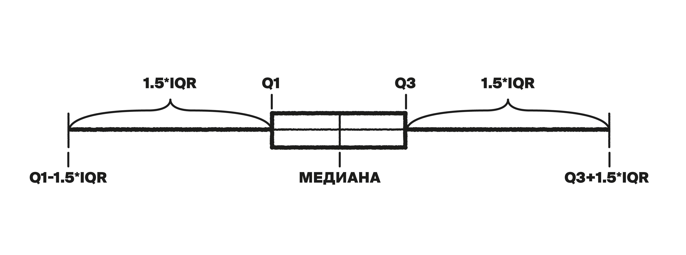
    


#### Столбец `last_price`


```python
print_boxplot_limits(df, 'last_price') # смотрим на "усы" 
df.boxplot('last_price') # диаграмма размаха
plt.ticklabel_format(style='plain', axis='y')
plt.ylim(df['last_price'].describe()[3], df['last_price'].describe()[7]) # ограничения значений по оси ординат
df_anomaly(df, 'last_price') # датафрейм с выбивающимися значениями (для изучения) 
```

    Минимальное значение по диаграмме размаха: 12190.0
    Максимальное значение по диаграмме размаха: 11900000.0
    


<div>
<style scoped>
    .dataframe tbody tr th:only-of-type {
        vertical-align: middle;
    }

    .dataframe tbody tr th {
        vertical-align: top;
    }

    .dataframe thead th {
        text-align: right;
    }
</style>
<table border="1" class="dataframe">
  <thead>
    <tr style="text-align: right;">
      <th></th>
      <th>total_images</th>
      <th>last_price</th>
      <th>total_area</th>
      <th>first_day_exposition</th>
      <th>rooms</th>
      <th>ceiling_height</th>
      <th>floors_total</th>
      <th>living_area</th>
      <th>floor</th>
      <th>is_apartment</th>
      <th>studio</th>
      <th>open_plan</th>
      <th>kitchen_area</th>
      <th>balcony</th>
      <th>locality_name</th>
      <th>airports_nearest</th>
      <th>cityCenters_nearest</th>
      <th>parks_around3000</th>
      <th>parks_nearest</th>
      <th>ponds_around3000</th>
      <th>ponds_nearest</th>
      <th>days_exposition</th>
      <th>distance_from_centers</th>
    </tr>
  </thead>
  <tbody>
    <tr>
      <th>12971</th>
      <td>19</td>
      <td>763000000.00</td>
      <td>400.00</td>
      <td>2017-09-30</td>
      <td>7</td>
      <td>3.10</td>
      <td>10</td>
      <td>250.00</td>
      <td>10</td>
      <td>False</td>
      <td>False</td>
      <td>False</td>
      <td>NaN</td>
      <td>2</td>
      <td>Санкт-Петербург</td>
      <td>25108.00</td>
      <td>3956.00</td>
      <td>1</td>
      <td>530.00</td>
      <td>3</td>
      <td>756.00</td>
      <td>33.00</td>
      <td>центр</td>
    </tr>
    <tr>
      <th>19540</th>
      <td>8</td>
      <td>420000000.00</td>
      <td>900.00</td>
      <td>2017-12-06</td>
      <td>12</td>
      <td>2.80</td>
      <td>25</td>
      <td>409.70</td>
      <td>25</td>
      <td>False</td>
      <td>False</td>
      <td>False</td>
      <td>112.00</td>
      <td>0</td>
      <td>Санкт-Петербург</td>
      <td>30706.00</td>
      <td>7877.00</td>
      <td>0</td>
      <td>NaN</td>
      <td>2</td>
      <td>318.00</td>
      <td>106.00</td>
      <td>город</td>
    </tr>
    <tr>
      <th>14706</th>
      <td>15</td>
      <td>401300000.00</td>
      <td>401.00</td>
      <td>2016-02-20</td>
      <td>5</td>
      <td>3.10</td>
      <td>9</td>
      <td>204.00</td>
      <td>9</td>
      <td>False</td>
      <td>False</td>
      <td>False</td>
      <td>24.00</td>
      <td>3</td>
      <td>Санкт-Петербург</td>
      <td>21912.00</td>
      <td>2389.00</td>
      <td>1</td>
      <td>545.00</td>
      <td>1</td>
      <td>478.00</td>
      <td>393.00</td>
      <td>центр</td>
    </tr>
    <tr>
      <th>1436</th>
      <td>19</td>
      <td>330000000.00</td>
      <td>190.00</td>
      <td>2018-04-04</td>
      <td>3</td>
      <td>3.50</td>
      <td>7</td>
      <td>95.00</td>
      <td>5</td>
      <td>False</td>
      <td>False</td>
      <td>False</td>
      <td>40.00</td>
      <td>0</td>
      <td>Санкт-Петербург</td>
      <td>23011.00</td>
      <td>1197.00</td>
      <td>3</td>
      <td>519.00</td>
      <td>3</td>
      <td>285.00</td>
      <td>233.00</td>
      <td>центр</td>
    </tr>
    <tr>
      <th>15651</th>
      <td>20</td>
      <td>300000000.00</td>
      <td>618.00</td>
      <td>2017-12-18</td>
      <td>7</td>
      <td>3.40</td>
      <td>7</td>
      <td>258.00</td>
      <td>5</td>
      <td>False</td>
      <td>False</td>
      <td>False</td>
      <td>70.00</td>
      <td>0</td>
      <td>Санкт-Петербург</td>
      <td>32440.00</td>
      <td>5297.00</td>
      <td>0</td>
      <td>NaN</td>
      <td>2</td>
      <td>198.00</td>
      <td>111.00</td>
      <td>город</td>
    </tr>
    <tr>
      <th>...</th>
      <td>...</td>
      <td>...</td>
      <td>...</td>
      <td>...</td>
      <td>...</td>
      <td>...</td>
      <td>...</td>
      <td>...</td>
      <td>...</td>
      <td>...</td>
      <td>...</td>
      <td>...</td>
      <td>...</td>
      <td>...</td>
      <td>...</td>
      <td>...</td>
      <td>...</td>
      <td>...</td>
      <td>...</td>
      <td>...</td>
      <td>...</td>
      <td>...</td>
      <td>...</td>
    </tr>
    <tr>
      <th>15604</th>
      <td>20</td>
      <td>11900000.00</td>
      <td>107.00</td>
      <td>2019-02-12</td>
      <td>4</td>
      <td>2.60</td>
      <td>10</td>
      <td>65.50</td>
      <td>9</td>
      <td>False</td>
      <td>False</td>
      <td>False</td>
      <td>14.00</td>
      <td>0</td>
      <td>Санкт-Петербург</td>
      <td>32605.00</td>
      <td>13704.00</td>
      <td>0</td>
      <td>NaN</td>
      <td>1</td>
      <td>580.00</td>
      <td>NaN</td>
      <td>окраина города</td>
    </tr>
    <tr>
      <th>23343</th>
      <td>12</td>
      <td>11900000.00</td>
      <td>85.00</td>
      <td>2017-04-10</td>
      <td>3</td>
      <td>2.60</td>
      <td>8</td>
      <td>51.00</td>
      <td>7</td>
      <td>False</td>
      <td>False</td>
      <td>False</td>
      <td>13.60</td>
      <td>0</td>
      <td>Санкт-Петербург</td>
      <td>18140.00</td>
      <td>17143.00</td>
      <td>1</td>
      <td>1514.00</td>
      <td>2</td>
      <td>16.00</td>
      <td>475.00</td>
      <td>ПГТ</td>
    </tr>
    <tr>
      <th>4035</th>
      <td>7</td>
      <td>11900000.00</td>
      <td>130.00</td>
      <td>2017-05-03</td>
      <td>5</td>
      <td>3.10</td>
      <td>2</td>
      <td>84.20</td>
      <td>1</td>
      <td>False</td>
      <td>False</td>
      <td>False</td>
      <td>10.00</td>
      <td>0</td>
      <td>Санкт-Петербург</td>
      <td>31284.00</td>
      <td>2991.00</td>
      <td>1</td>
      <td>85.00</td>
      <td>2</td>
      <td>710.00</td>
      <td>95.00</td>
      <td>центр</td>
    </tr>
    <tr>
      <th>21492</th>
      <td>5</td>
      <td>11900000.00</td>
      <td>70.00</td>
      <td>2017-08-08</td>
      <td>2</td>
      <td>3.00</td>
      <td>6</td>
      <td>40.00</td>
      <td>2</td>
      <td>False</td>
      <td>False</td>
      <td>False</td>
      <td>12.00</td>
      <td>0</td>
      <td>Санкт-Петербург</td>
      <td>51465.00</td>
      <td>15116.00</td>
      <td>0</td>
      <td>NaN</td>
      <td>0</td>
      <td>NaN</td>
      <td>120.00</td>
      <td>ПГТ</td>
    </tr>
    <tr>
      <th>8793</th>
      <td>7</td>
      <td>12190.00</td>
      <td>109.00</td>
      <td>2019-03-20</td>
      <td>2</td>
      <td>2.75</td>
      <td>25</td>
      <td>32.00</td>
      <td>25</td>
      <td>False</td>
      <td>False</td>
      <td>False</td>
      <td>40.50</td>
      <td>0</td>
      <td>Санкт-Петербург</td>
      <td>36421.00</td>
      <td>9176.00</td>
      <td>1</td>
      <td>805.00</td>
      <td>0</td>
      <td>NaN</td>
      <td>8.00</td>
      <td>город</td>
    </tr>
  </tbody>
</table>
<p>2061 rows × 23 columns</p>
</div>


    
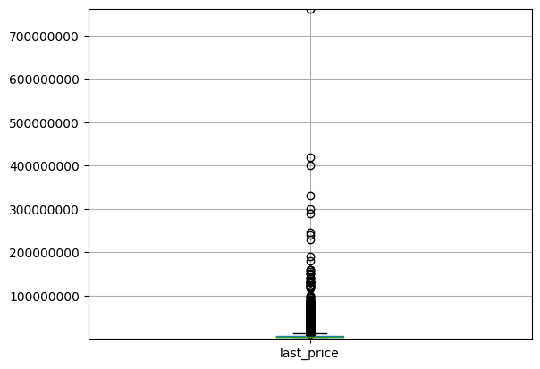
    


<a id='link_9'></a></font>**Все аномальные значения по столбцу `last_price` больше правой границы усов.  
Однако чересчур большой ценник может говорить о премиальности жилья. Этот сегмент лучше всего рассматривать и анализировать отдельно, в нем своя специфика и нюансы. Экстремально маленькие значения также отсечем с помощью перцентиля, как обозначили выше, поскольку скорее всего в таких значениях либо допущены ошибки, либо существует какой-то нюанс при продаже: прописан ребенок, продается доля и прочее.**

#### Столбец `total_area`


```python
print_boxplot_limits(df, 'total_area') # смотрим на "усы" 
df.boxplot('total_area') # диаграмма размаха
plt.ylim(df['total_area'].describe()[3], df['total_area'].describe()[7]) # ограничения значений по оси ординат
df_anomaly(df, 'total_area') # датафрейм с выбивающимися значениями (для изучения)
```

    Минимальное значение по диаграмме размаха: 12.0
    Максимальное значение по диаграмме размаха: 114.5
    


<div>
<style scoped>
    .dataframe tbody tr th:only-of-type {
        vertical-align: middle;
    }

    .dataframe tbody tr th {
        vertical-align: top;
    }

    .dataframe thead th {
        text-align: right;
    }
</style>
<table border="1" class="dataframe">
  <thead>
    <tr style="text-align: right;">
      <th></th>
      <th>total_images</th>
      <th>last_price</th>
      <th>total_area</th>
      <th>first_day_exposition</th>
      <th>rooms</th>
      <th>ceiling_height</th>
      <th>floors_total</th>
      <th>living_area</th>
      <th>floor</th>
      <th>is_apartment</th>
      <th>studio</th>
      <th>open_plan</th>
      <th>kitchen_area</th>
      <th>balcony</th>
      <th>locality_name</th>
      <th>airports_nearest</th>
      <th>cityCenters_nearest</th>
      <th>parks_around3000</th>
      <th>parks_nearest</th>
      <th>ponds_around3000</th>
      <th>ponds_nearest</th>
      <th>days_exposition</th>
      <th>distance_from_centers</th>
    </tr>
  </thead>
  <tbody>
    <tr>
      <th>19540</th>
      <td>8</td>
      <td>420000000.00</td>
      <td>900.00</td>
      <td>2017-12-06</td>
      <td>12</td>
      <td>2.80</td>
      <td>25</td>
      <td>409.70</td>
      <td>25</td>
      <td>False</td>
      <td>False</td>
      <td>False</td>
      <td>112.00</td>
      <td>0</td>
      <td>Санкт-Петербург</td>
      <td>30706.00</td>
      <td>7877.00</td>
      <td>0</td>
      <td>NaN</td>
      <td>2</td>
      <td>318.00</td>
      <td>106.00</td>
      <td>город</td>
    </tr>
    <tr>
      <th>12859</th>
      <td>20</td>
      <td>140000000.00</td>
      <td>631.20</td>
      <td>2019-04-09</td>
      <td>7</td>
      <td>3.90</td>
      <td>4</td>
      <td>322.30</td>
      <td>4</td>
      <td>False</td>
      <td>False</td>
      <td>False</td>
      <td>19.50</td>
      <td>1</td>
      <td>Санкт-Петербург</td>
      <td>25707.00</td>
      <td>4972.00</td>
      <td>0</td>
      <td>NaN</td>
      <td>2</td>
      <td>210.00</td>
      <td>NaN</td>
      <td>центр</td>
    </tr>
    <tr>
      <th>3117</th>
      <td>19</td>
      <td>140000000.00</td>
      <td>631.00</td>
      <td>2019-03-30</td>
      <td>7</td>
      <td>3.10</td>
      <td>5</td>
      <td>NaN</td>
      <td>5</td>
      <td>False</td>
      <td>False</td>
      <td>False</td>
      <td>60.00</td>
      <td>0</td>
      <td>Санкт-Петербург</td>
      <td>25707.00</td>
      <td>4972.00</td>
      <td>0</td>
      <td>NaN</td>
      <td>2</td>
      <td>210.00</td>
      <td>NaN</td>
      <td>центр</td>
    </tr>
    <tr>
      <th>15651</th>
      <td>20</td>
      <td>300000000.00</td>
      <td>618.00</td>
      <td>2017-12-18</td>
      <td>7</td>
      <td>3.40</td>
      <td>7</td>
      <td>258.00</td>
      <td>5</td>
      <td>False</td>
      <td>False</td>
      <td>False</td>
      <td>70.00</td>
      <td>0</td>
      <td>Санкт-Петербург</td>
      <td>32440.00</td>
      <td>5297.00</td>
      <td>0</td>
      <td>NaN</td>
      <td>2</td>
      <td>198.00</td>
      <td>111.00</td>
      <td>город</td>
    </tr>
    <tr>
      <th>5358</th>
      <td>20</td>
      <td>65000000.00</td>
      <td>590.00</td>
      <td>2019-02-14</td>
      <td>15</td>
      <td>3.50</td>
      <td>6</td>
      <td>409.00</td>
      <td>3</td>
      <td>False</td>
      <td>False</td>
      <td>False</td>
      <td>100.00</td>
      <td>0</td>
      <td>Санкт-Петербург</td>
      <td>24447.00</td>
      <td>4666.00</td>
      <td>1</td>
      <td>767.00</td>
      <td>0</td>
      <td>NaN</td>
      <td>14.00</td>
      <td>центр</td>
    </tr>
    <tr>
      <th>...</th>
      <td>...</td>
      <td>...</td>
      <td>...</td>
      <td>...</td>
      <td>...</td>
      <td>...</td>
      <td>...</td>
      <td>...</td>
      <td>...</td>
      <td>...</td>
      <td>...</td>
      <td>...</td>
      <td>...</td>
      <td>...</td>
      <td>...</td>
      <td>...</td>
      <td>...</td>
      <td>...</td>
      <td>...</td>
      <td>...</td>
      <td>...</td>
      <td>...</td>
      <td>...</td>
    </tr>
    <tr>
      <th>12831</th>
      <td>13</td>
      <td>12354000.00</td>
      <td>114.60</td>
      <td>2016-01-18</td>
      <td>4</td>
      <td>2.80</td>
      <td>10</td>
      <td>74.00</td>
      <td>5</td>
      <td>False</td>
      <td>False</td>
      <td>False</td>
      <td>12.00</td>
      <td>2</td>
      <td>Санкт-Петербург</td>
      <td>23639.00</td>
      <td>5164.00</td>
      <td>0</td>
      <td>NaN</td>
      <td>1</td>
      <td>756.00</td>
      <td>357.00</td>
      <td>город</td>
    </tr>
    <tr>
      <th>20809</th>
      <td>12</td>
      <td>12990000.00</td>
      <td>114.60</td>
      <td>2017-06-29</td>
      <td>4</td>
      <td>2.78</td>
      <td>9</td>
      <td>74.10</td>
      <td>8</td>
      <td>False</td>
      <td>False</td>
      <td>False</td>
      <td>12.00</td>
      <td>2</td>
      <td>Санкт-Петербург</td>
      <td>23900.00</td>
      <td>5232.00</td>
      <td>1</td>
      <td>2137.00</td>
      <td>1</td>
      <td>933.00</td>
      <td>326.00</td>
      <td>город</td>
    </tr>
    <tr>
      <th>18273</th>
      <td>13</td>
      <td>28114000.00</td>
      <td>114.55</td>
      <td>2017-07-26</td>
      <td>4</td>
      <td>3.00</td>
      <td>7</td>
      <td>NaN</td>
      <td>4</td>
      <td>False</td>
      <td>False</td>
      <td>False</td>
      <td>14.33</td>
      <td>1</td>
      <td>Санкт-Петербург</td>
      <td>25528.00</td>
      <td>6631.00</td>
      <td>1</td>
      <td>572.00</td>
      <td>0</td>
      <td>NaN</td>
      <td>482.00</td>
      <td>город</td>
    </tr>
    <tr>
      <th>16094</th>
      <td>4</td>
      <td>5650000.00</td>
      <td>114.50</td>
      <td>2017-10-11</td>
      <td>3</td>
      <td>2.75</td>
      <td>9</td>
      <td>83.00</td>
      <td>5</td>
      <td>False</td>
      <td>False</td>
      <td>False</td>
      <td>13.60</td>
      <td>1</td>
      <td>Синявино</td>
      <td>NaN</td>
      <td>NaN</td>
      <td>&lt;NA&gt;</td>
      <td>NaN</td>
      <td>&lt;NA&gt;</td>
      <td>NaN</td>
      <td>22.00</td>
      <td>None</td>
    </tr>
    <tr>
      <th>19904</th>
      <td>4</td>
      <td>2400000.00</td>
      <td>12.00</td>
      <td>2017-07-19</td>
      <td>1</td>
      <td>2.55</td>
      <td>5</td>
      <td>10.00</td>
      <td>2</td>
      <td>False</td>
      <td>False</td>
      <td>False</td>
      <td>NaN</td>
      <td>0</td>
      <td>Санкт-Петербург</td>
      <td>21314.00</td>
      <td>964.00</td>
      <td>1</td>
      <td>886.00</td>
      <td>2</td>
      <td>45.00</td>
      <td>200.00</td>
      <td>центр</td>
    </tr>
  </tbody>
</table>
<p>1244 rows × 23 columns</p>
</div>


    
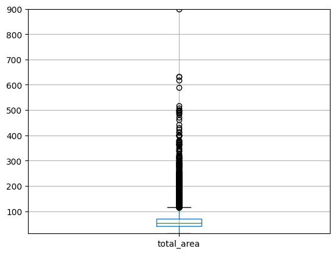
    


<a id='link_11'></a>**Про "замки" мы проговорили на прошлом этапе. Они станут темой отдельного исследования когда-нибудь. 
Ограничим выборку по перцентилям, чтобы избежать слишком больших значений и слишком маленьких.**

#### Столбец `rooms`


```python
print_boxplot_limits(df, 'rooms') # смотрим на "усы" 
df.boxplot('rooms') # диаграмма размаха
plt.ylim(df['rooms'].describe()[3], df['rooms'].describe()[7]) # ограничения значений по оси ординат
df_anomaly(df, 'rooms') # датафрейм с выбивающимися значениями (для изучения)
```

    Минимальное значение по диаграмме размаха: 0.0
    Максимальное значение по диаграмме размаха: 6.0
    


<div>
<style scoped>
    .dataframe tbody tr th:only-of-type {
        vertical-align: middle;
    }

    .dataframe tbody tr th {
        vertical-align: top;
    }

    .dataframe thead th {
        text-align: right;
    }
</style>
<table border="1" class="dataframe">
  <thead>
    <tr style="text-align: right;">
      <th></th>
      <th>total_images</th>
      <th>last_price</th>
      <th>total_area</th>
      <th>first_day_exposition</th>
      <th>rooms</th>
      <th>ceiling_height</th>
      <th>floors_total</th>
      <th>living_area</th>
      <th>floor</th>
      <th>is_apartment</th>
      <th>studio</th>
      <th>open_plan</th>
      <th>kitchen_area</th>
      <th>balcony</th>
      <th>locality_name</th>
      <th>airports_nearest</th>
      <th>cityCenters_nearest</th>
      <th>parks_around3000</th>
      <th>parks_nearest</th>
      <th>ponds_around3000</th>
      <th>ponds_nearest</th>
      <th>days_exposition</th>
      <th>distance_from_centers</th>
    </tr>
  </thead>
  <tbody>
    <tr>
      <th>14498</th>
      <td>6</td>
      <td>32250000.00</td>
      <td>374.60</td>
      <td>2018-06-09</td>
      <td>19</td>
      <td>3.10</td>
      <td>5</td>
      <td>264.50</td>
      <td>2</td>
      <td>False</td>
      <td>False</td>
      <td>False</td>
      <td>27.60</td>
      <td>0</td>
      <td>Санкт-Петербург</td>
      <td>19497.00</td>
      <td>3574.00</td>
      <td>0</td>
      <td>NaN</td>
      <td>2</td>
      <td>548.00</td>
      <td>114.00</td>
      <td>центр</td>
    </tr>
    <tr>
      <th>18848</th>
      <td>6</td>
      <td>28500000.00</td>
      <td>270.00</td>
      <td>2015-03-02</td>
      <td>16</td>
      <td>3.00</td>
      <td>4</td>
      <td>180.00</td>
      <td>4</td>
      <td>False</td>
      <td>False</td>
      <td>False</td>
      <td>13.00</td>
      <td>1</td>
      <td>Санкт-Петербург</td>
      <td>23575.00</td>
      <td>4142.00</td>
      <td>1</td>
      <td>516.00</td>
      <td>0</td>
      <td>NaN</td>
      <td>1365.00</td>
      <td>центр</td>
    </tr>
    <tr>
      <th>5358</th>
      <td>20</td>
      <td>65000000.00</td>
      <td>590.00</td>
      <td>2019-02-14</td>
      <td>15</td>
      <td>3.50</td>
      <td>6</td>
      <td>409.00</td>
      <td>3</td>
      <td>False</td>
      <td>False</td>
      <td>False</td>
      <td>100.00</td>
      <td>0</td>
      <td>Санкт-Петербург</td>
      <td>24447.00</td>
      <td>4666.00</td>
      <td>1</td>
      <td>767.00</td>
      <td>0</td>
      <td>NaN</td>
      <td>14.00</td>
      <td>центр</td>
    </tr>
    <tr>
      <th>20829</th>
      <td>6</td>
      <td>28659000.00</td>
      <td>245.40</td>
      <td>2016-03-31</td>
      <td>14</td>
      <td>3.10</td>
      <td>4</td>
      <td>168.30</td>
      <td>2</td>
      <td>False</td>
      <td>False</td>
      <td>False</td>
      <td>25.90</td>
      <td>0</td>
      <td>Санкт-Петербург</td>
      <td>21104.00</td>
      <td>2054.00</td>
      <td>3</td>
      <td>541.00</td>
      <td>2</td>
      <td>118.00</td>
      <td>95.00</td>
      <td>центр</td>
    </tr>
    <tr>
      <th>866</th>
      <td>5</td>
      <td>25000000.00</td>
      <td>363.00</td>
      <td>2017-12-23</td>
      <td>14</td>
      <td>3.16</td>
      <td>5</td>
      <td>222.00</td>
      <td>4</td>
      <td>False</td>
      <td>False</td>
      <td>False</td>
      <td>16.60</td>
      <td>0</td>
      <td>Санкт-Петербург</td>
      <td>38076.00</td>
      <td>7950.00</td>
      <td>0</td>
      <td>NaN</td>
      <td>2</td>
      <td>435.00</td>
      <td>418.00</td>
      <td>город</td>
    </tr>
    <tr>
      <th>...</th>
      <td>...</td>
      <td>...</td>
      <td>...</td>
      <td>...</td>
      <td>...</td>
      <td>...</td>
      <td>...</td>
      <td>...</td>
      <td>...</td>
      <td>...</td>
      <td>...</td>
      <td>...</td>
      <td>...</td>
      <td>...</td>
      <td>...</td>
      <td>...</td>
      <td>...</td>
      <td>...</td>
      <td>...</td>
      <td>...</td>
      <td>...</td>
      <td>...</td>
      <td>...</td>
    </tr>
    <tr>
      <th>15273</th>
      <td>9</td>
      <td>2700000.00</td>
      <td>25.20</td>
      <td>2017-11-10</td>
      <td>0</td>
      <td>NaN</td>
      <td>9</td>
      <td>15.20</td>
      <td>2</td>
      <td>False</td>
      <td>False</td>
      <td>True</td>
      <td>NaN</td>
      <td>2</td>
      <td>Кудрово</td>
      <td>NaN</td>
      <td>NaN</td>
      <td>&lt;NA&gt;</td>
      <td>NaN</td>
      <td>&lt;NA&gt;</td>
      <td>NaN</td>
      <td>23.00</td>
      <td>None</td>
    </tr>
    <tr>
      <th>15319</th>
      <td>4</td>
      <td>5970000.00</td>
      <td>43.30</td>
      <td>2017-07-20</td>
      <td>0</td>
      <td>2.80</td>
      <td>9</td>
      <td>28.20</td>
      <td>2</td>
      <td>False</td>
      <td>True</td>
      <td>False</td>
      <td>NaN</td>
      <td>2</td>
      <td>Санкт-Петербург</td>
      <td>23617.00</td>
      <td>5223.00</td>
      <td>0</td>
      <td>NaN</td>
      <td>1</td>
      <td>874.00</td>
      <td>30.00</td>
      <td>город</td>
    </tr>
    <tr>
      <th>5074</th>
      <td>18</td>
      <td>3500000.00</td>
      <td>28.00</td>
      <td>2017-07-10</td>
      <td>0</td>
      <td>2.65</td>
      <td>25</td>
      <td>20.00</td>
      <td>17</td>
      <td>False</td>
      <td>True</td>
      <td>False</td>
      <td>NaN</td>
      <td>0</td>
      <td>Санкт-Петербург</td>
      <td>6989.00</td>
      <td>13205.00</td>
      <td>1</td>
      <td>535.00</td>
      <td>0</td>
      <td>NaN</td>
      <td>28.00</td>
      <td>окраина города</td>
    </tr>
    <tr>
      <th>15361</th>
      <td>8</td>
      <td>2200000.00</td>
      <td>27.40</td>
      <td>2017-05-25</td>
      <td>0</td>
      <td>2.50</td>
      <td>6</td>
      <td>18.60</td>
      <td>4</td>
      <td>False</td>
      <td>True</td>
      <td>False</td>
      <td>NaN</td>
      <td>2</td>
      <td>Всеволожск</td>
      <td>NaN</td>
      <td>NaN</td>
      <td>&lt;NA&gt;</td>
      <td>NaN</td>
      <td>&lt;NA&gt;</td>
      <td>NaN</td>
      <td>422.00</td>
      <td>None</td>
    </tr>
    <tr>
      <th>23637</th>
      <td>8</td>
      <td>2350000.00</td>
      <td>26.00</td>
      <td>2018-06-26</td>
      <td>0</td>
      <td>NaN</td>
      <td>25</td>
      <td>17.00</td>
      <td>4</td>
      <td>False</td>
      <td>True</td>
      <td>False</td>
      <td>NaN</td>
      <td>2</td>
      <td>Бугры</td>
      <td>NaN</td>
      <td>NaN</td>
      <td>&lt;NA&gt;</td>
      <td>NaN</td>
      <td>&lt;NA&gt;</td>
      <td>NaN</td>
      <td>207.00</td>
      <td>None</td>
    </tr>
  </tbody>
</table>
<p>392 rows × 23 columns</p>
</div>


    
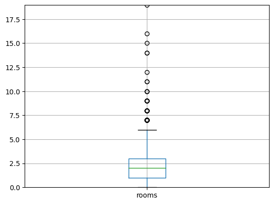
    


**Ограничим нашу выборку сверху перцентилем, чтобы отсечь, как правило, дорогие квартиры с множеством комнат.
Объявления с нулем комнат в большинстве своем касаются студий. К тому же в них указаны маленькие общие площади. Ничего удивительного в них нет. Оставляем все без изменений.**

#### Столбец `ceiling_height`


```python
print_boxplot_limits(df, 'ceiling_height') # смотрим на "усы" 
df.boxplot('ceiling_height') # диаграмма размаха
plt.ylim(df['ceiling_height'].describe()[3], df['ceiling_height'].describe()[7]) # ограничения значений по оси ординат
df_anomaly(df, 'ceiling_height') # датафрейм с выбивающимися значениями (для изучения)
```

    Минимальное значение по диаграмме размаха: 0.7000000000000004
    Максимальное значение по диаграмме размаха: 3.0999999999999996
    


<div>
<style scoped>
    .dataframe tbody tr th:only-of-type {
        vertical-align: middle;
    }

    .dataframe tbody tr th {
        vertical-align: top;
    }

    .dataframe thead th {
        text-align: right;
    }
</style>
<table border="1" class="dataframe">
  <thead>
    <tr style="text-align: right;">
      <th></th>
      <th>total_images</th>
      <th>last_price</th>
      <th>total_area</th>
      <th>first_day_exposition</th>
      <th>rooms</th>
      <th>ceiling_height</th>
      <th>floors_total</th>
      <th>living_area</th>
      <th>floor</th>
      <th>is_apartment</th>
      <th>studio</th>
      <th>open_plan</th>
      <th>kitchen_area</th>
      <th>balcony</th>
      <th>locality_name</th>
      <th>airports_nearest</th>
      <th>cityCenters_nearest</th>
      <th>parks_around3000</th>
      <th>parks_nearest</th>
      <th>ponds_around3000</th>
      <th>ponds_nearest</th>
      <th>days_exposition</th>
      <th>distance_from_centers</th>
    </tr>
  </thead>
  <tbody>
    <tr>
      <th>22869</th>
      <td>0</td>
      <td>15000000.00</td>
      <td>25.00</td>
      <td>2018-07-25</td>
      <td>1</td>
      <td>100.00</td>
      <td>5</td>
      <td>14.00</td>
      <td>5</td>
      <td>True</td>
      <td>False</td>
      <td>False</td>
      <td>11.00</td>
      <td>5</td>
      <td>Санкт-Петербург</td>
      <td>34963.00</td>
      <td>8283.00</td>
      <td>1</td>
      <td>223.00</td>
      <td>3</td>
      <td>30.00</td>
      <td>19.00</td>
      <td>город</td>
    </tr>
    <tr>
      <th>22336</th>
      <td>19</td>
      <td>9999000.00</td>
      <td>92.40</td>
      <td>2019-04-05</td>
      <td>2</td>
      <td>32.00</td>
      <td>6</td>
      <td>55.50</td>
      <td>5</td>
      <td>False</td>
      <td>False</td>
      <td>False</td>
      <td>16.50</td>
      <td>4</td>
      <td>Санкт-Петербург</td>
      <td>18838.00</td>
      <td>3506.00</td>
      <td>0</td>
      <td>NaN</td>
      <td>3</td>
      <td>511.00</td>
      <td>NaN</td>
      <td>центр</td>
    </tr>
    <tr>
      <th>3148</th>
      <td>14</td>
      <td>2900000.00</td>
      <td>75.00</td>
      <td>2018-11-12</td>
      <td>3</td>
      <td>32.00</td>
      <td>3</td>
      <td>53.00</td>
      <td>2</td>
      <td>False</td>
      <td>False</td>
      <td>False</td>
      <td>8.00</td>
      <td>0</td>
      <td>Волхов</td>
      <td>NaN</td>
      <td>NaN</td>
      <td>&lt;NA&gt;</td>
      <td>NaN</td>
      <td>&lt;NA&gt;</td>
      <td>NaN</td>
      <td>NaN</td>
      <td>None</td>
    </tr>
    <tr>
      <th>21377</th>
      <td>19</td>
      <td>4900000.00</td>
      <td>42.00</td>
      <td>2017-04-18</td>
      <td>1</td>
      <td>27.50</td>
      <td>24</td>
      <td>37.70</td>
      <td>19</td>
      <td>False</td>
      <td>False</td>
      <td>False</td>
      <td>11.00</td>
      <td>2</td>
      <td>Санкт-Петербург</td>
      <td>42742.00</td>
      <td>9760.00</td>
      <td>0</td>
      <td>NaN</td>
      <td>0</td>
      <td>NaN</td>
      <td>61.00</td>
      <td>город</td>
    </tr>
    <tr>
      <th>20478</th>
      <td>11</td>
      <td>8000000.00</td>
      <td>45.00</td>
      <td>2017-07-18</td>
      <td>1</td>
      <td>27.00</td>
      <td>4</td>
      <td>22.00</td>
      <td>2</td>
      <td>False</td>
      <td>False</td>
      <td>False</td>
      <td>10.00</td>
      <td>1</td>
      <td>Санкт-Петербург</td>
      <td>18975.00</td>
      <td>3246.00</td>
      <td>0</td>
      <td>NaN</td>
      <td>3</td>
      <td>449.00</td>
      <td>429.00</td>
      <td>центр</td>
    </tr>
    <tr>
      <th>...</th>
      <td>...</td>
      <td>...</td>
      <td>...</td>
      <td>...</td>
      <td>...</td>
      <td>...</td>
      <td>...</td>
      <td>...</td>
      <td>...</td>
      <td>...</td>
      <td>...</td>
      <td>...</td>
      <td>...</td>
      <td>...</td>
      <td>...</td>
      <td>...</td>
      <td>...</td>
      <td>...</td>
      <td>...</td>
      <td>...</td>
      <td>...</td>
      <td>...</td>
      <td>...</td>
    </tr>
    <tr>
      <th>14338</th>
      <td>8</td>
      <td>4200000.00</td>
      <td>30.90</td>
      <td>2019-03-26</td>
      <td>1</td>
      <td>3.10</td>
      <td>5</td>
      <td>16.60</td>
      <td>2</td>
      <td>False</td>
      <td>False</td>
      <td>False</td>
      <td>5.90</td>
      <td>0</td>
      <td>Санкт-Петербург</td>
      <td>18852.00</td>
      <td>3867.00</td>
      <td>0</td>
      <td>NaN</td>
      <td>1</td>
      <td>53.00</td>
      <td>22.00</td>
      <td>центр</td>
    </tr>
    <tr>
      <th>14344</th>
      <td>1</td>
      <td>12185600.00</td>
      <td>95.20</td>
      <td>2018-01-15</td>
      <td>3</td>
      <td>3.10</td>
      <td>16</td>
      <td>51.07</td>
      <td>12</td>
      <td>False</td>
      <td>False</td>
      <td>False</td>
      <td>12.55</td>
      <td>0</td>
      <td>Санкт-Петербург</td>
      <td>37434.00</td>
      <td>8460.00</td>
      <td>1</td>
      <td>441.00</td>
      <td>2</td>
      <td>427.00</td>
      <td>445.00</td>
      <td>город</td>
    </tr>
    <tr>
      <th>14349</th>
      <td>8</td>
      <td>6790000.00</td>
      <td>71.70</td>
      <td>2018-11-03</td>
      <td>2</td>
      <td>3.10</td>
      <td>6</td>
      <td>31.80</td>
      <td>5</td>
      <td>False</td>
      <td>False</td>
      <td>False</td>
      <td>14.90</td>
      <td>0</td>
      <td>Санкт-Петербург</td>
      <td>20069.00</td>
      <td>3776.00</td>
      <td>1</td>
      <td>347.00</td>
      <td>1</td>
      <td>226.00</td>
      <td>180.00</td>
      <td>центр</td>
    </tr>
    <tr>
      <th>14355</th>
      <td>10</td>
      <td>7700000.00</td>
      <td>59.10</td>
      <td>2016-12-19</td>
      <td>2</td>
      <td>3.10</td>
      <td>6</td>
      <td>37.10</td>
      <td>3</td>
      <td>False</td>
      <td>False</td>
      <td>False</td>
      <td>9.20</td>
      <td>0</td>
      <td>Санкт-Петербург</td>
      <td>25648.00</td>
      <td>4222.00</td>
      <td>0</td>
      <td>NaN</td>
      <td>1</td>
      <td>909.00</td>
      <td>436.00</td>
      <td>центр</td>
    </tr>
    <tr>
      <th>24</th>
      <td>8</td>
      <td>6500000.00</td>
      <td>97.20</td>
      <td>2015-10-31</td>
      <td>2</td>
      <td>3.10</td>
      <td>3</td>
      <td>46.50</td>
      <td>1</td>
      <td>False</td>
      <td>False</td>
      <td>False</td>
      <td>19.60</td>
      <td>0</td>
      <td>Санкт-Петербург</td>
      <td>20052.00</td>
      <td>2336.00</td>
      <td>3</td>
      <td>411.00</td>
      <td>3</td>
      <td>124.00</td>
      <td>265.00</td>
      <td>центр</td>
    </tr>
  </tbody>
</table>
<p>2109 rows × 23 columns</p>
</div>


    
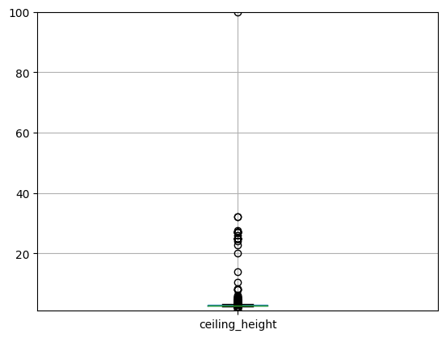
    


**Очень странно выглядит минимальное значение "усов". Таких потолков и для подсобных помещений мало. Посмотрим, сколько таких объявлений, если их не очень много - удалим эти строки, если какое-то весомое количество - заменим, как делали на шаге [<font color=blue>2.1.7</font>](#link_2)</font>.  
Потолки в 10 м тоже заменим на вменяемые: понизим им разрядность.**


```python
# поделим все значения больше и равные 10 в столбце "ceiling_height" на 10
df['ceiling_height'] = df['ceiling_height'].where(~(df['ceiling_height'] >= 10), df['ceiling_height'] / 10)
# есть потолок 100 м, уберем его отдельно 
df['ceiling_height'] = df['ceiling_height'].where(~(df['ceiling_height'] >= 10), df['ceiling_height'] / 10)
```


```python
print('Количество объявлений с потолками меньше 2.4 м: ' + str(len(df[df['ceiling_height'] < 2.4])))
df[df['ceiling_height'] < 2.4].sort_values('ceiling_height')
```

    Количество объявлений с потолками меньше 2.4 м: 26
    


<div>
<style scoped>
    .dataframe tbody tr th:only-of-type {
        vertical-align: middle;
    }

    .dataframe tbody tr th {
        vertical-align: top;
    }

    .dataframe thead th {
        text-align: right;
    }
</style>
<table border="1" class="dataframe">
  <thead>
    <tr style="text-align: right;">
      <th></th>
      <th>total_images</th>
      <th>last_price</th>
      <th>total_area</th>
      <th>first_day_exposition</th>
      <th>rooms</th>
      <th>ceiling_height</th>
      <th>floors_total</th>
      <th>living_area</th>
      <th>floor</th>
      <th>is_apartment</th>
      <th>studio</th>
      <th>open_plan</th>
      <th>kitchen_area</th>
      <th>balcony</th>
      <th>locality_name</th>
      <th>airports_nearest</th>
      <th>cityCenters_nearest</th>
      <th>parks_around3000</th>
      <th>parks_nearest</th>
      <th>ponds_around3000</th>
      <th>ponds_nearest</th>
      <th>days_exposition</th>
      <th>distance_from_centers</th>
    </tr>
  </thead>
  <tbody>
    <tr>
      <th>22869</th>
      <td>0</td>
      <td>15000000.00</td>
      <td>25.00</td>
      <td>2018-07-25</td>
      <td>1</td>
      <td>1.00</td>
      <td>5</td>
      <td>14.00</td>
      <td>5</td>
      <td>True</td>
      <td>False</td>
      <td>False</td>
      <td>11.00</td>
      <td>5</td>
      <td>Санкт-Петербург</td>
      <td>34963.00</td>
      <td>8283.00</td>
      <td>1</td>
      <td>223.00</td>
      <td>3</td>
      <td>30.00</td>
      <td>19.00</td>
      <td>город</td>
    </tr>
    <tr>
      <th>22590</th>
      <td>16</td>
      <td>6000000.00</td>
      <td>55.00</td>
      <td>2018-10-31</td>
      <td>2</td>
      <td>1.00</td>
      <td>12</td>
      <td>32.40</td>
      <td>7</td>
      <td>False</td>
      <td>False</td>
      <td>False</td>
      <td>10.00</td>
      <td>0</td>
      <td>Санкт-Петербург</td>
      <td>33053.00</td>
      <td>14217.00</td>
      <td>2</td>
      <td>293.00</td>
      <td>2</td>
      <td>289.00</td>
      <td>13.00</td>
      <td>окраина города</td>
    </tr>
    <tr>
      <th>22309</th>
      <td>20</td>
      <td>5300000.00</td>
      <td>45.00</td>
      <td>2017-09-30</td>
      <td>1</td>
      <td>1.03</td>
      <td>16</td>
      <td>15.50</td>
      <td>15</td>
      <td>False</td>
      <td>False</td>
      <td>False</td>
      <td>NaN</td>
      <td>0</td>
      <td>Санкт-Петербург</td>
      <td>36353.00</td>
      <td>11936.00</td>
      <td>2</td>
      <td>440.00</td>
      <td>2</td>
      <td>450.00</td>
      <td>136.00</td>
      <td>окраина города</td>
    </tr>
    <tr>
      <th>5712</th>
      <td>5</td>
      <td>1500000.00</td>
      <td>42.80</td>
      <td>2017-08-14</td>
      <td>2</td>
      <td>1.20</td>
      <td>2</td>
      <td>27.50</td>
      <td>1</td>
      <td>False</td>
      <td>False</td>
      <td>False</td>
      <td>5.20</td>
      <td>0</td>
      <td>Мга</td>
      <td>NaN</td>
      <td>NaN</td>
      <td>&lt;NA&gt;</td>
      <td>NaN</td>
      <td>&lt;NA&gt;</td>
      <td>NaN</td>
      <td>248.00</td>
      <td>None</td>
    </tr>
    <tr>
      <th>15061</th>
      <td>19</td>
      <td>5600000.00</td>
      <td>56.40</td>
      <td>2018-05-11</td>
      <td>2</td>
      <td>1.40</td>
      <td>14</td>
      <td>32.40</td>
      <td>5</td>
      <td>False</td>
      <td>False</td>
      <td>False</td>
      <td>9.10</td>
      <td>2</td>
      <td>Санкт-Петербург</td>
      <td>14814.00</td>
      <td>13610.00</td>
      <td>0</td>
      <td>NaN</td>
      <td>0</td>
      <td>NaN</td>
      <td>315.00</td>
      <td>окраина города</td>
    </tr>
    <tr>
      <th>16934</th>
      <td>5</td>
      <td>4100000.00</td>
      <td>40.00</td>
      <td>2017-10-17</td>
      <td>1</td>
      <td>1.75</td>
      <td>37</td>
      <td>17.40</td>
      <td>5</td>
      <td>False</td>
      <td>False</td>
      <td>False</td>
      <td>8.34</td>
      <td>0</td>
      <td>Санкт-Петербург</td>
      <td>18732.00</td>
      <td>20444.00</td>
      <td>0</td>
      <td>NaN</td>
      <td>3</td>
      <td>80.00</td>
      <td>71.00</td>
      <td>ПГТ</td>
    </tr>
    <tr>
      <th>19329</th>
      <td>5</td>
      <td>1700000.00</td>
      <td>40.00</td>
      <td>2018-07-15</td>
      <td>2</td>
      <td>2.00</td>
      <td>9</td>
      <td>NaN</td>
      <td>8</td>
      <td>False</td>
      <td>False</td>
      <td>False</td>
      <td>NaN</td>
      <td>0</td>
      <td>Сосновый Бор</td>
      <td>NaN</td>
      <td>NaN</td>
      <td>&lt;NA&gt;</td>
      <td>NaN</td>
      <td>&lt;NA&gt;</td>
      <td>NaN</td>
      <td>45.00</td>
      <td>None</td>
    </tr>
    <tr>
      <th>19098</th>
      <td>7</td>
      <td>2700000.00</td>
      <td>56.00</td>
      <td>2018-02-04</td>
      <td>3</td>
      <td>2.00</td>
      <td>5</td>
      <td>46.00</td>
      <td>1</td>
      <td>False</td>
      <td>False</td>
      <td>False</td>
      <td>6.00</td>
      <td>0</td>
      <td>Выборг</td>
      <td>NaN</td>
      <td>NaN</td>
      <td>&lt;NA&gt;</td>
      <td>NaN</td>
      <td>&lt;NA&gt;</td>
      <td>NaN</td>
      <td>282.00</td>
      <td>None</td>
    </tr>
    <tr>
      <th>17496</th>
      <td>15</td>
      <td>6700000.00</td>
      <td>92.90</td>
      <td>2019-02-19</td>
      <td>3</td>
      <td>2.00</td>
      <td>17</td>
      <td>53.20</td>
      <td>14</td>
      <td>False</td>
      <td>False</td>
      <td>False</td>
      <td>12.00</td>
      <td>5</td>
      <td>Санкт-Петербург</td>
      <td>16295.00</td>
      <td>15092.00</td>
      <td>1</td>
      <td>967.00</td>
      <td>0</td>
      <td>NaN</td>
      <td>NaN</td>
      <td>ПГТ</td>
    </tr>
    <tr>
      <th>22960</th>
      <td>17</td>
      <td>2300000.00</td>
      <td>53.60</td>
      <td>2018-10-18</td>
      <td>2</td>
      <td>2.00</td>
      <td>2</td>
      <td>19.00</td>
      <td>1</td>
      <td>False</td>
      <td>False</td>
      <td>False</td>
      <td>10.00</td>
      <td>0</td>
      <td>Всеволожск</td>
      <td>NaN</td>
      <td>NaN</td>
      <td>&lt;NA&gt;</td>
      <td>NaN</td>
      <td>&lt;NA&gt;</td>
      <td>NaN</td>
      <td>NaN</td>
      <td>None</td>
    </tr>
    <tr>
      <th>16446</th>
      <td>6</td>
      <td>12300000.00</td>
      <td>88.30</td>
      <td>2019-03-12</td>
      <td>3</td>
      <td>2.00</td>
      <td>5</td>
      <td>63.90</td>
      <td>2</td>
      <td>False</td>
      <td>False</td>
      <td>False</td>
      <td>12.00</td>
      <td>0</td>
      <td>Санкт-Петербург</td>
      <td>38415.00</td>
      <td>7675.00</td>
      <td>1</td>
      <td>568.00</td>
      <td>1</td>
      <td>154.00</td>
      <td>NaN</td>
      <td>город</td>
    </tr>
    <tr>
      <th>16884</th>
      <td>0</td>
      <td>1500000.00</td>
      <td>33.00</td>
      <td>2018-10-03</td>
      <td>1</td>
      <td>2.00</td>
      <td>5</td>
      <td>20.00</td>
      <td>5</td>
      <td>False</td>
      <td>False</td>
      <td>False</td>
      <td>6.00</td>
      <td>0</td>
      <td>Выборг</td>
      <td>NaN</td>
      <td>NaN</td>
      <td>&lt;NA&gt;</td>
      <td>NaN</td>
      <td>&lt;NA&gt;</td>
      <td>NaN</td>
      <td>6.00</td>
      <td>None</td>
    </tr>
    <tr>
      <th>11352</th>
      <td>4</td>
      <td>3300000.00</td>
      <td>36.00</td>
      <td>2017-06-18</td>
      <td>1</td>
      <td>2.00</td>
      <td>17</td>
      <td>15.20</td>
      <td>12</td>
      <td>False</td>
      <td>False</td>
      <td>False</td>
      <td>10.10</td>
      <td>0</td>
      <td>Металлострой</td>
      <td>25268.00</td>
      <td>26980.00</td>
      <td>0</td>
      <td>NaN</td>
      <td>0</td>
      <td>NaN</td>
      <td>53.00</td>
      <td>ПГТ</td>
    </tr>
    <tr>
      <th>5850</th>
      <td>9</td>
      <td>1650000.00</td>
      <td>35.50</td>
      <td>2018-05-29</td>
      <td>1</td>
      <td>2.00</td>
      <td>5</td>
      <td>NaN</td>
      <td>5</td>
      <td>False</td>
      <td>False</td>
      <td>False</td>
      <td>NaN</td>
      <td>0</td>
      <td>Луга</td>
      <td>NaN</td>
      <td>NaN</td>
      <td>&lt;NA&gt;</td>
      <td>NaN</td>
      <td>&lt;NA&gt;</td>
      <td>NaN</td>
      <td>100.00</td>
      <td>None</td>
    </tr>
    <tr>
      <th>4212</th>
      <td>1</td>
      <td>2120000.00</td>
      <td>35.43</td>
      <td>2017-12-18</td>
      <td>1</td>
      <td>2.00</td>
      <td>18</td>
      <td>16.60</td>
      <td>9</td>
      <td>False</td>
      <td>False</td>
      <td>False</td>
      <td>8.80</td>
      <td>2</td>
      <td>Тосно</td>
      <td>NaN</td>
      <td>NaN</td>
      <td>&lt;NA&gt;</td>
      <td>NaN</td>
      <td>&lt;NA&gt;</td>
      <td>NaN</td>
      <td>36.00</td>
      <td>None</td>
    </tr>
    <tr>
      <th>2572</th>
      <td>4</td>
      <td>2400000.00</td>
      <td>62.00</td>
      <td>2018-12-27</td>
      <td>3</td>
      <td>2.00</td>
      <td>5</td>
      <td>40.00</td>
      <td>4</td>
      <td>False</td>
      <td>False</td>
      <td>False</td>
      <td>6.00</td>
      <td>1</td>
      <td>Луга</td>
      <td>NaN</td>
      <td>NaN</td>
      <td>&lt;NA&gt;</td>
      <td>NaN</td>
      <td>&lt;NA&gt;</td>
      <td>NaN</td>
      <td>NaN</td>
      <td>None</td>
    </tr>
    <tr>
      <th>552</th>
      <td>11</td>
      <td>2999000.00</td>
      <td>33.50</td>
      <td>2017-03-30</td>
      <td>1</td>
      <td>2.00</td>
      <td>15</td>
      <td>17.50</td>
      <td>6</td>
      <td>False</td>
      <td>False</td>
      <td>False</td>
      <td>6.50</td>
      <td>0</td>
      <td>Санкт-Петербург</td>
      <td>33972.00</td>
      <td>11746.00</td>
      <td>1</td>
      <td>520.00</td>
      <td>1</td>
      <td>949.00</td>
      <td>270.00</td>
      <td>окраина города</td>
    </tr>
    <tr>
      <th>20520</th>
      <td>9</td>
      <td>3600000.00</td>
      <td>38.00</td>
      <td>2018-07-05</td>
      <td>1</td>
      <td>2.00</td>
      <td>12</td>
      <td>15.00</td>
      <td>9</td>
      <td>False</td>
      <td>False</td>
      <td>False</td>
      <td>11.80</td>
      <td>1</td>
      <td>Кудрово</td>
      <td>NaN</td>
      <td>NaN</td>
      <td>&lt;NA&gt;</td>
      <td>NaN</td>
      <td>&lt;NA&gt;</td>
      <td>NaN</td>
      <td>62.00</td>
      <td>None</td>
    </tr>
    <tr>
      <th>12755</th>
      <td>2</td>
      <td>1400000.00</td>
      <td>22.50</td>
      <td>2017-09-21</td>
      <td>1</td>
      <td>2.20</td>
      <td>2</td>
      <td>18.00</td>
      <td>2</td>
      <td>False</td>
      <td>False</td>
      <td>False</td>
      <td>4.50</td>
      <td>1</td>
      <td>Копорье</td>
      <td>NaN</td>
      <td>NaN</td>
      <td>&lt;NA&gt;</td>
      <td>NaN</td>
      <td>&lt;NA&gt;</td>
      <td>NaN</td>
      <td>45.00</td>
      <td>None</td>
    </tr>
    <tr>
      <th>17794</th>
      <td>1</td>
      <td>2300000.00</td>
      <td>58.60</td>
      <td>2016-05-12</td>
      <td>3</td>
      <td>2.25</td>
      <td>5</td>
      <td>44.10</td>
      <td>3</td>
      <td>False</td>
      <td>False</td>
      <td>False</td>
      <td>5.50</td>
      <td>1</td>
      <td>Бегуницы</td>
      <td>NaN</td>
      <td>NaN</td>
      <td>&lt;NA&gt;</td>
      <td>NaN</td>
      <td>&lt;NA&gt;</td>
      <td>NaN</td>
      <td>45.00</td>
      <td>None</td>
    </tr>
    <tr>
      <th>20507</th>
      <td>12</td>
      <td>5950000.00</td>
      <td>60.00</td>
      <td>2018-02-19</td>
      <td>2</td>
      <td>2.26</td>
      <td>14</td>
      <td>35.00</td>
      <td>11</td>
      <td>False</td>
      <td>False</td>
      <td>False</td>
      <td>13.00</td>
      <td>1</td>
      <td>Санкт-Петербург</td>
      <td>27028.00</td>
      <td>12570.00</td>
      <td>0</td>
      <td>NaN</td>
      <td>0</td>
      <td>NaN</td>
      <td>40.00</td>
      <td>окраина города</td>
    </tr>
    <tr>
      <th>23498</th>
      <td>7</td>
      <td>1600000.00</td>
      <td>54.00</td>
      <td>2016-12-26</td>
      <td>2</td>
      <td>2.30</td>
      <td>1</td>
      <td>33.00</td>
      <td>1</td>
      <td>False</td>
      <td>False</td>
      <td>False</td>
      <td>3.50</td>
      <td>0</td>
      <td>Высоцк</td>
      <td>NaN</td>
      <td>NaN</td>
      <td>&lt;NA&gt;</td>
      <td>NaN</td>
      <td>&lt;NA&gt;</td>
      <td>NaN</td>
      <td>281.00</td>
      <td>None</td>
    </tr>
    <tr>
      <th>5498</th>
      <td>17</td>
      <td>2200000.00</td>
      <td>56.00</td>
      <td>2018-04-02</td>
      <td>2</td>
      <td>2.30</td>
      <td>5</td>
      <td>45.00</td>
      <td>1</td>
      <td>False</td>
      <td>False</td>
      <td>False</td>
      <td>9.00</td>
      <td>2</td>
      <td>Сясьстрой</td>
      <td>NaN</td>
      <td>NaN</td>
      <td>&lt;NA&gt;</td>
      <td>NaN</td>
      <td>&lt;NA&gt;</td>
      <td>NaN</td>
      <td>55.00</td>
      <td>None</td>
    </tr>
    <tr>
      <th>1582</th>
      <td>4</td>
      <td>4100000.00</td>
      <td>45.60</td>
      <td>2016-01-13</td>
      <td>2</td>
      <td>2.30</td>
      <td>9</td>
      <td>28.40</td>
      <td>8</td>
      <td>False</td>
      <td>False</td>
      <td>False</td>
      <td>7.00</td>
      <td>2</td>
      <td>Санкт-Петербург</td>
      <td>49152.00</td>
      <td>14977.00</td>
      <td>1</td>
      <td>489.00</td>
      <td>1</td>
      <td>525.00</td>
      <td>329.00</td>
      <td>окраина города</td>
    </tr>
    <tr>
      <th>17762</th>
      <td>20</td>
      <td>2300000.00</td>
      <td>54.30</td>
      <td>2018-06-28</td>
      <td>3</td>
      <td>2.30</td>
      <td>5</td>
      <td>39.00</td>
      <td>2</td>
      <td>False</td>
      <td>False</td>
      <td>False</td>
      <td>5.30</td>
      <td>1</td>
      <td>Бегуницы</td>
      <td>NaN</td>
      <td>NaN</td>
      <td>&lt;NA&gt;</td>
      <td>NaN</td>
      <td>&lt;NA&gt;</td>
      <td>NaN</td>
      <td>189.00</td>
      <td>None</td>
    </tr>
    <tr>
      <th>227</th>
      <td>13</td>
      <td>2200000.00</td>
      <td>47.00</td>
      <td>2018-01-12</td>
      <td>3</td>
      <td>2.34</td>
      <td>5</td>
      <td>NaN</td>
      <td>1</td>
      <td>False</td>
      <td>False</td>
      <td>False</td>
      <td>NaN</td>
      <td>0</td>
      <td>Новый Свет</td>
      <td>NaN</td>
      <td>NaN</td>
      <td>&lt;NA&gt;</td>
      <td>NaN</td>
      <td>&lt;NA&gt;</td>
      <td>NaN</td>
      <td>45.00</td>
      <td>None</td>
    </tr>
  </tbody>
</table>
</div>


После понижения разрядности высоких потолков осталось всего лишь 26 объявлений с чрезвычайно низкими потолками. Удалим строки, где значения столбца `ceiling_height` меньше 2.2 м.


```python
df = df[df['ceiling_height'] >= 2.2]
```


```python
# проверим, не осталось ли потолков меньше 2.2 м
df.sort_values('ceiling_height', ascending=False).tail(2)
```


<div>
<style scoped>
    .dataframe tbody tr th:only-of-type {
        vertical-align: middle;
    }

    .dataframe tbody tr th {
        vertical-align: top;
    }

    .dataframe thead th {
        text-align: right;
    }
</style>
<table border="1" class="dataframe">
  <thead>
    <tr style="text-align: right;">
      <th></th>
      <th>total_images</th>
      <th>last_price</th>
      <th>total_area</th>
      <th>first_day_exposition</th>
      <th>rooms</th>
      <th>ceiling_height</th>
      <th>floors_total</th>
      <th>living_area</th>
      <th>floor</th>
      <th>is_apartment</th>
      <th>studio</th>
      <th>open_plan</th>
      <th>kitchen_area</th>
      <th>balcony</th>
      <th>locality_name</th>
      <th>airports_nearest</th>
      <th>cityCenters_nearest</th>
      <th>parks_around3000</th>
      <th>parks_nearest</th>
      <th>ponds_around3000</th>
      <th>ponds_nearest</th>
      <th>days_exposition</th>
      <th>distance_from_centers</th>
    </tr>
  </thead>
  <tbody>
    <tr>
      <th>17794</th>
      <td>1</td>
      <td>2300000.00</td>
      <td>58.60</td>
      <td>2016-05-12</td>
      <td>3</td>
      <td>2.25</td>
      <td>5</td>
      <td>44.10</td>
      <td>3</td>
      <td>False</td>
      <td>False</td>
      <td>False</td>
      <td>5.50</td>
      <td>1</td>
      <td>Бегуницы</td>
      <td>NaN</td>
      <td>NaN</td>
      <td>&lt;NA&gt;</td>
      <td>NaN</td>
      <td>&lt;NA&gt;</td>
      <td>NaN</td>
      <td>45.00</td>
      <td>None</td>
    </tr>
    <tr>
      <th>12755</th>
      <td>2</td>
      <td>1400000.00</td>
      <td>22.50</td>
      <td>2017-09-21</td>
      <td>1</td>
      <td>2.20</td>
      <td>2</td>
      <td>18.00</td>
      <td>2</td>
      <td>False</td>
      <td>False</td>
      <td>False</td>
      <td>4.50</td>
      <td>1</td>
      <td>Копорье</td>
      <td>NaN</td>
      <td>NaN</td>
      <td>&lt;NA&gt;</td>
      <td>NaN</td>
      <td>&lt;NA&gt;</td>
      <td>NaN</td>
      <td>45.00</td>
      <td>None</td>
    </tr>
  </tbody>
</table>
</div>


```python
# проверка результата 
print_boxplot_limits(df, 'ceiling_height') # смотрим на "усы" 
df.boxplot('ceiling_height') # диаграмма размаха
plt.ylim(df['ceiling_height'].describe()[3], df['ceiling_height'].describe()[7]) # ограничения значений по оси ординат
df_anomaly(df, 'ceiling_height') # датафрейм с выбивающимися значениями (для изучения)
```

    Минимальное значение по диаграмме размаха: 1.9000000000000006
    Максимальное значение по диаграмме размаха: 3.0999999999999996
    


<div>
<style scoped>
    .dataframe tbody tr th:only-of-type {
        vertical-align: middle;
    }

    .dataframe tbody tr th {
        vertical-align: top;
    }

    .dataframe thead th {
        text-align: right;
    }
</style>
<table border="1" class="dataframe">
  <thead>
    <tr style="text-align: right;">
      <th></th>
      <th>total_images</th>
      <th>last_price</th>
      <th>total_area</th>
      <th>first_day_exposition</th>
      <th>rooms</th>
      <th>ceiling_height</th>
      <th>floors_total</th>
      <th>living_area</th>
      <th>floor</th>
      <th>is_apartment</th>
      <th>studio</th>
      <th>open_plan</th>
      <th>kitchen_area</th>
      <th>balcony</th>
      <th>locality_name</th>
      <th>airports_nearest</th>
      <th>cityCenters_nearest</th>
      <th>parks_around3000</th>
      <th>parks_nearest</th>
      <th>ponds_around3000</th>
      <th>ponds_nearest</th>
      <th>days_exposition</th>
      <th>distance_from_centers</th>
    </tr>
  </thead>
  <tbody>
    <tr>
      <th>5863</th>
      <td>20</td>
      <td>5650000.00</td>
      <td>45.00</td>
      <td>2018-08-15</td>
      <td>1</td>
      <td>8.30</td>
      <td>16</td>
      <td>19.30</td>
      <td>14</td>
      <td>False</td>
      <td>False</td>
      <td>False</td>
      <td>8.30</td>
      <td>1</td>
      <td>Санкт-Петербург</td>
      <td>13069.00</td>
      <td>10763.00</td>
      <td>0</td>
      <td>NaN</td>
      <td>1</td>
      <td>613.00</td>
      <td>14.00</td>
      <td>окраина города</td>
    </tr>
    <tr>
      <th>3474</th>
      <td>3</td>
      <td>1400000.00</td>
      <td>30.00</td>
      <td>2018-03-16</td>
      <td>1</td>
      <td>8.00</td>
      <td>5</td>
      <td>15.30</td>
      <td>2</td>
      <td>False</td>
      <td>False</td>
      <td>False</td>
      <td>7.30</td>
      <td>0</td>
      <td>Нурма</td>
      <td>NaN</td>
      <td>NaN</td>
      <td>&lt;NA&gt;</td>
      <td>NaN</td>
      <td>&lt;NA&gt;</td>
      <td>NaN</td>
      <td>125.00</td>
      <td>None</td>
    </tr>
    <tr>
      <th>15743</th>
      <td>14</td>
      <td>5600000.00</td>
      <td>67.00</td>
      <td>2016-11-11</td>
      <td>3</td>
      <td>8.00</td>
      <td>16</td>
      <td>41.00</td>
      <td>1</td>
      <td>False</td>
      <td>False</td>
      <td>False</td>
      <td>8.00</td>
      <td>0</td>
      <td>Санкт-Петербург</td>
      <td>32691.00</td>
      <td>11035.00</td>
      <td>1</td>
      <td>723.00</td>
      <td>0</td>
      <td>NaN</td>
      <td>474.00</td>
      <td>окраина города</td>
    </tr>
    <tr>
      <th>17442</th>
      <td>0</td>
      <td>5350000.00</td>
      <td>54.00</td>
      <td>2015-06-16</td>
      <td>2</td>
      <td>8.00</td>
      <td>5</td>
      <td>29.00</td>
      <td>2</td>
      <td>False</td>
      <td>False</td>
      <td>False</td>
      <td>NaN</td>
      <td>1</td>
      <td>Красное Село</td>
      <td>24638.00</td>
      <td>28062.00</td>
      <td>0</td>
      <td>NaN</td>
      <td>0</td>
      <td>NaN</td>
      <td>469.00</td>
      <td>ПГТ</td>
    </tr>
    <tr>
      <th>20264</th>
      <td>17</td>
      <td>119000000.00</td>
      <td>187.60</td>
      <td>2017-07-10</td>
      <td>4</td>
      <td>6.00</td>
      <td>7</td>
      <td>147.00</td>
      <td>7</td>
      <td>False</td>
      <td>False</td>
      <td>False</td>
      <td>15.60</td>
      <td>0</td>
      <td>Санкт-Петербург</td>
      <td>26902.00</td>
      <td>5605.00</td>
      <td>3</td>
      <td>484.00</td>
      <td>1</td>
      <td>305.00</td>
      <td>259.00</td>
      <td>город</td>
    </tr>
    <tr>
      <th>...</th>
      <td>...</td>
      <td>...</td>
      <td>...</td>
      <td>...</td>
      <td>...</td>
      <td>...</td>
      <td>...</td>
      <td>...</td>
      <td>...</td>
      <td>...</td>
      <td>...</td>
      <td>...</td>
      <td>...</td>
      <td>...</td>
      <td>...</td>
      <td>...</td>
      <td>...</td>
      <td>...</td>
      <td>...</td>
      <td>...</td>
      <td>...</td>
      <td>...</td>
      <td>...</td>
    </tr>
    <tr>
      <th>13170</th>
      <td>2</td>
      <td>8400000.00</td>
      <td>120.00</td>
      <td>2016-04-15</td>
      <td>3</td>
      <td>3.10</td>
      <td>4</td>
      <td>80.00</td>
      <td>4</td>
      <td>False</td>
      <td>False</td>
      <td>False</td>
      <td>12.00</td>
      <td>0</td>
      <td>Санкт-Петербург</td>
      <td>20892.00</td>
      <td>623.00</td>
      <td>1</td>
      <td>473.00</td>
      <td>2</td>
      <td>330.00</td>
      <td>185.00</td>
      <td>центр</td>
    </tr>
    <tr>
      <th>13178</th>
      <td>0</td>
      <td>5150000.00</td>
      <td>47.00</td>
      <td>2015-07-26</td>
      <td>2</td>
      <td>3.10</td>
      <td>6</td>
      <td>29.00</td>
      <td>6</td>
      <td>False</td>
      <td>False</td>
      <td>False</td>
      <td>7.00</td>
      <td>0</td>
      <td>Санкт-Петербург</td>
      <td>21914.00</td>
      <td>1467.00</td>
      <td>0</td>
      <td>NaN</td>
      <td>2</td>
      <td>507.00</td>
      <td>626.00</td>
      <td>центр</td>
    </tr>
    <tr>
      <th>13194</th>
      <td>16</td>
      <td>32000000.00</td>
      <td>119.00</td>
      <td>2018-02-27</td>
      <td>3</td>
      <td>3.10</td>
      <td>9</td>
      <td>75.00</td>
      <td>7</td>
      <td>False</td>
      <td>False</td>
      <td>False</td>
      <td>19.00</td>
      <td>0</td>
      <td>Санкт-Петербург</td>
      <td>26055.00</td>
      <td>4800.00</td>
      <td>1</td>
      <td>648.00</td>
      <td>1</td>
      <td>779.00</td>
      <td>181.00</td>
      <td>центр</td>
    </tr>
    <tr>
      <th>13198</th>
      <td>12</td>
      <td>5100000.00</td>
      <td>41.00</td>
      <td>2017-12-09</td>
      <td>1</td>
      <td>3.10</td>
      <td>8</td>
      <td>16.00</td>
      <td>3</td>
      <td>False</td>
      <td>False</td>
      <td>False</td>
      <td>13.00</td>
      <td>0</td>
      <td>Санкт-Петербург</td>
      <td>18893.00</td>
      <td>4358.00</td>
      <td>0</td>
      <td>NaN</td>
      <td>1</td>
      <td>665.00</td>
      <td>59.00</td>
      <td>центр</td>
    </tr>
    <tr>
      <th>24</th>
      <td>8</td>
      <td>6500000.00</td>
      <td>97.20</td>
      <td>2015-10-31</td>
      <td>2</td>
      <td>3.10</td>
      <td>3</td>
      <td>46.50</td>
      <td>1</td>
      <td>False</td>
      <td>False</td>
      <td>False</td>
      <td>19.60</td>
      <td>0</td>
      <td>Санкт-Петербург</td>
      <td>20052.00</td>
      <td>2336.00</td>
      <td>3</td>
      <td>411.00</td>
      <td>3</td>
      <td>124.00</td>
      <td>265.00</td>
      <td>центр</td>
    </tr>
  </tbody>
</table>
<p>2086 rows × 23 columns</p>
</div>


    
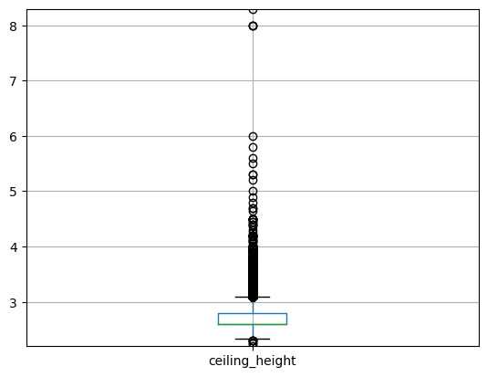
    


Чуть больше 2000 объявлений находится за границами диаграммы размаха, ограничим верхнее значение высоты потолков перцентилем.

#### Столбец `floors_total`


```python
print_boxplot_limits(df, 'floors_total') # смотрим на "усы" 
df.boxplot('floors_total') # диаграмма размаха
plt.ylim(df['floors_total'].describe()[3], df['floors_total'].describe()[7]) # ограничения значений по оси ординат
df_anomaly(df, 'floors_total') # датафрейм с выбивающимися значениями (для изучения)
```

    Минимальное значение по диаграмме размаха: 1.0
    Максимальное значение по диаграмме размаха: 32.5
    


<div>
<style scoped>
    .dataframe tbody tr th:only-of-type {
        vertical-align: middle;
    }

    .dataframe tbody tr th {
        vertical-align: top;
    }

    .dataframe thead th {
        text-align: right;
    }
</style>
<table border="1" class="dataframe">
  <thead>
    <tr style="text-align: right;">
      <th></th>
      <th>total_images</th>
      <th>last_price</th>
      <th>total_area</th>
      <th>first_day_exposition</th>
      <th>rooms</th>
      <th>ceiling_height</th>
      <th>floors_total</th>
      <th>living_area</th>
      <th>floor</th>
      <th>is_apartment</th>
      <th>studio</th>
      <th>open_plan</th>
      <th>kitchen_area</th>
      <th>balcony</th>
      <th>locality_name</th>
      <th>airports_nearest</th>
      <th>cityCenters_nearest</th>
      <th>parks_around3000</th>
      <th>parks_nearest</th>
      <th>ponds_around3000</th>
      <th>ponds_nearest</th>
      <th>days_exposition</th>
      <th>distance_from_centers</th>
    </tr>
  </thead>
  <tbody>
    <tr>
      <th>2253</th>
      <td>12</td>
      <td>3800000.00</td>
      <td>45.50</td>
      <td>2018-06-28</td>
      <td>2</td>
      <td>2.88</td>
      <td>60</td>
      <td>27.40</td>
      <td>4</td>
      <td>False</td>
      <td>False</td>
      <td>False</td>
      <td>7.40</td>
      <td>0</td>
      <td>Кронштадт</td>
      <td>67763.00</td>
      <td>49488.00</td>
      <td>2</td>
      <td>342.00</td>
      <td>3</td>
      <td>614.00</td>
      <td>166.00</td>
      <td>ПГТ</td>
    </tr>
    <tr>
      <th>16731</th>
      <td>9</td>
      <td>3978000.00</td>
      <td>40.00</td>
      <td>2018-09-24</td>
      <td>1</td>
      <td>2.65</td>
      <td>52</td>
      <td>10.50</td>
      <td>18</td>
      <td>False</td>
      <td>False</td>
      <td>False</td>
      <td>14.00</td>
      <td>0</td>
      <td>Санкт-Петербург</td>
      <td>20728.00</td>
      <td>12978.00</td>
      <td>1</td>
      <td>793.00</td>
      <td>0</td>
      <td>NaN</td>
      <td>45.00</td>
      <td>окраина города</td>
    </tr>
    <tr>
      <th>397</th>
      <td>15</td>
      <td>5990000.00</td>
      <td>54.00</td>
      <td>2018-03-22</td>
      <td>2</td>
      <td>2.60</td>
      <td>36</td>
      <td>21.40</td>
      <td>28</td>
      <td>False</td>
      <td>False</td>
      <td>False</td>
      <td>18.70</td>
      <td>1</td>
      <td>Санкт-Петербург</td>
      <td>18732.00</td>
      <td>20444.00</td>
      <td>0</td>
      <td>NaN</td>
      <td>3</td>
      <td>80.00</td>
      <td>11.00</td>
      <td>ПГТ</td>
    </tr>
    <tr>
      <th>5807</th>
      <td>17</td>
      <td>8150000.00</td>
      <td>80.00</td>
      <td>2019-01-09</td>
      <td>2</td>
      <td>2.70</td>
      <td>36</td>
      <td>41.00</td>
      <td>13</td>
      <td>False</td>
      <td>False</td>
      <td>False</td>
      <td>12.00</td>
      <td>5</td>
      <td>Санкт-Петербург</td>
      <td>18732.00</td>
      <td>20444.00</td>
      <td>0</td>
      <td>NaN</td>
      <td>3</td>
      <td>80.00</td>
      <td>38.00</td>
      <td>ПГТ</td>
    </tr>
    <tr>
      <th>11079</th>
      <td>16</td>
      <td>9200000.00</td>
      <td>75.00</td>
      <td>2019-02-22</td>
      <td>2</td>
      <td>2.70</td>
      <td>36</td>
      <td>40.00</td>
      <td>29</td>
      <td>False</td>
      <td>False</td>
      <td>False</td>
      <td>12.00</td>
      <td>2</td>
      <td>Санкт-Петербург</td>
      <td>18732.00</td>
      <td>20444.00</td>
      <td>0</td>
      <td>NaN</td>
      <td>3</td>
      <td>80.00</td>
      <td>NaN</td>
      <td>ПГТ</td>
    </tr>
    <tr>
      <th>871</th>
      <td>14</td>
      <td>7777777.00</td>
      <td>75.00</td>
      <td>2017-11-16</td>
      <td>2</td>
      <td>2.60</td>
      <td>35</td>
      <td>40.50</td>
      <td>23</td>
      <td>False</td>
      <td>False</td>
      <td>False</td>
      <td>11.70</td>
      <td>0</td>
      <td>Санкт-Петербург</td>
      <td>18732.00</td>
      <td>20444.00</td>
      <td>0</td>
      <td>NaN</td>
      <td>3</td>
      <td>80.00</td>
      <td>169.00</td>
      <td>ПГТ</td>
    </tr>
    <tr>
      <th>12888</th>
      <td>7</td>
      <td>7600000.00</td>
      <td>70.00</td>
      <td>2016-11-18</td>
      <td>3</td>
      <td>2.70</td>
      <td>35</td>
      <td>36.50</td>
      <td>27</td>
      <td>False</td>
      <td>False</td>
      <td>False</td>
      <td>23.10</td>
      <td>2</td>
      <td>Санкт-Петербург</td>
      <td>18732.00</td>
      <td>20444.00</td>
      <td>0</td>
      <td>NaN</td>
      <td>3</td>
      <td>80.00</td>
      <td>413.00</td>
      <td>ПГТ</td>
    </tr>
    <tr>
      <th>12960</th>
      <td>20</td>
      <td>6140000.00</td>
      <td>54.00</td>
      <td>2018-10-09</td>
      <td>2</td>
      <td>2.70</td>
      <td>35</td>
      <td>26.60</td>
      <td>13</td>
      <td>False</td>
      <td>False</td>
      <td>False</td>
      <td>19.10</td>
      <td>2</td>
      <td>Санкт-Петербург</td>
      <td>18732.00</td>
      <td>20444.00</td>
      <td>0</td>
      <td>NaN</td>
      <td>3</td>
      <td>80.00</td>
      <td>155.00</td>
      <td>ПГТ</td>
    </tr>
    <tr>
      <th>13975</th>
      <td>19</td>
      <td>6990000.00</td>
      <td>65.00</td>
      <td>2018-10-06</td>
      <td>2</td>
      <td>2.60</td>
      <td>35</td>
      <td>32.10</td>
      <td>23</td>
      <td>False</td>
      <td>False</td>
      <td>False</td>
      <td>8.90</td>
      <td>0</td>
      <td>Санкт-Петербург</td>
      <td>18732.00</td>
      <td>20444.00</td>
      <td>0</td>
      <td>NaN</td>
      <td>3</td>
      <td>80.00</td>
      <td>89.00</td>
      <td>ПГТ</td>
    </tr>
    <tr>
      <th>21809</th>
      <td>20</td>
      <td>10600000.00</td>
      <td>77.00</td>
      <td>2019-04-16</td>
      <td>2</td>
      <td>2.60</td>
      <td>35</td>
      <td>39.00</td>
      <td>11</td>
      <td>False</td>
      <td>False</td>
      <td>False</td>
      <td>14.00</td>
      <td>2</td>
      <td>Санкт-Петербург</td>
      <td>18732.00</td>
      <td>20444.00</td>
      <td>0</td>
      <td>NaN</td>
      <td>3</td>
      <td>80.00</td>
      <td>NaN</td>
      <td>ПГТ</td>
    </tr>
    <tr>
      <th>14347</th>
      <td>14</td>
      <td>8595000.00</td>
      <td>69.70</td>
      <td>2018-09-26</td>
      <td>2</td>
      <td>2.60</td>
      <td>35</td>
      <td>27.40</td>
      <td>26</td>
      <td>False</td>
      <td>False</td>
      <td>False</td>
      <td>23.30</td>
      <td>0</td>
      <td>Санкт-Петербург</td>
      <td>18732.00</td>
      <td>20444.00</td>
      <td>0</td>
      <td>NaN</td>
      <td>3</td>
      <td>80.00</td>
      <td>NaN</td>
      <td>ПГТ</td>
    </tr>
    <tr>
      <th>20938</th>
      <td>18</td>
      <td>9900000.00</td>
      <td>100.90</td>
      <td>2019-04-08</td>
      <td>3</td>
      <td>2.60</td>
      <td>35</td>
      <td>53.40</td>
      <td>22</td>
      <td>False</td>
      <td>False</td>
      <td>False</td>
      <td>13.40</td>
      <td>0</td>
      <td>Санкт-Петербург</td>
      <td>18732.00</td>
      <td>20444.00</td>
      <td>0</td>
      <td>NaN</td>
      <td>3</td>
      <td>80.00</td>
      <td>NaN</td>
      <td>ПГТ</td>
    </tr>
    <tr>
      <th>15982</th>
      <td>1</td>
      <td>5900000.00</td>
      <td>62.00</td>
      <td>2015-03-01</td>
      <td>2</td>
      <td>2.60</td>
      <td>35</td>
      <td>34.00</td>
      <td>9</td>
      <td>False</td>
      <td>False</td>
      <td>False</td>
      <td>10.00</td>
      <td>1</td>
      <td>Санкт-Петербург</td>
      <td>18732.00</td>
      <td>20444.00</td>
      <td>0</td>
      <td>NaN</td>
      <td>3</td>
      <td>80.00</td>
      <td>547.00</td>
      <td>ПГТ</td>
    </tr>
    <tr>
      <th>21599</th>
      <td>12</td>
      <td>6200000.00</td>
      <td>51.00</td>
      <td>2017-08-27</td>
      <td>2</td>
      <td>2.60</td>
      <td>35</td>
      <td>27.00</td>
      <td>13</td>
      <td>False</td>
      <td>False</td>
      <td>False</td>
      <td>19.00</td>
      <td>0</td>
      <td>Санкт-Петербург</td>
      <td>18732.00</td>
      <td>20444.00</td>
      <td>0</td>
      <td>NaN</td>
      <td>3</td>
      <td>80.00</td>
      <td>NaN</td>
      <td>ПГТ</td>
    </tr>
    <tr>
      <th>18218</th>
      <td>4</td>
      <td>9900000.00</td>
      <td>101.00</td>
      <td>2018-09-27</td>
      <td>3</td>
      <td>2.60</td>
      <td>35</td>
      <td>53.40</td>
      <td>33</td>
      <td>False</td>
      <td>False</td>
      <td>False</td>
      <td>13.70</td>
      <td>2</td>
      <td>Санкт-Петербург</td>
      <td>18737.00</td>
      <td>20450.00</td>
      <td>0</td>
      <td>NaN</td>
      <td>3</td>
      <td>72.00</td>
      <td>7.00</td>
      <td>ПГТ</td>
    </tr>
    <tr>
      <th>18617</th>
      <td>8</td>
      <td>7350000.00</td>
      <td>68.50</td>
      <td>2017-10-09</td>
      <td>2</td>
      <td>2.60</td>
      <td>35</td>
      <td>27.00</td>
      <td>3</td>
      <td>False</td>
      <td>False</td>
      <td>False</td>
      <td>23.00</td>
      <td>1</td>
      <td>Санкт-Петербург</td>
      <td>18627.00</td>
      <td>20339.00</td>
      <td>1</td>
      <td>609.00</td>
      <td>3</td>
      <td>145.00</td>
      <td>41.00</td>
      <td>ПГТ</td>
    </tr>
    <tr>
      <th>9579</th>
      <td>9</td>
      <td>3450000.00</td>
      <td>24.80</td>
      <td>2019-02-01</td>
      <td>0</td>
      <td>2.68</td>
      <td>35</td>
      <td>16.00</td>
      <td>17</td>
      <td>False</td>
      <td>True</td>
      <td>False</td>
      <td>NaN</td>
      <td>2</td>
      <td>Санкт-Петербург</td>
      <td>18732.00</td>
      <td>20444.00</td>
      <td>0</td>
      <td>NaN</td>
      <td>3</td>
      <td>80.00</td>
      <td>45.00</td>
      <td>ПГТ</td>
    </tr>
    <tr>
      <th>9370</th>
      <td>12</td>
      <td>7390000.00</td>
      <td>70.00</td>
      <td>2017-02-21</td>
      <td>2</td>
      <td>2.70</td>
      <td>35</td>
      <td>28.00</td>
      <td>3</td>
      <td>False</td>
      <td>False</td>
      <td>False</td>
      <td>23.00</td>
      <td>2</td>
      <td>Санкт-Петербург</td>
      <td>18732.00</td>
      <td>20444.00</td>
      <td>0</td>
      <td>NaN</td>
      <td>3</td>
      <td>80.00</td>
      <td>236.00</td>
      <td>ПГТ</td>
    </tr>
    <tr>
      <th>9186</th>
      <td>7</td>
      <td>6500000.00</td>
      <td>49.10</td>
      <td>2019-04-12</td>
      <td>1</td>
      <td>2.50</td>
      <td>35</td>
      <td>31.00</td>
      <td>3</td>
      <td>False</td>
      <td>False</td>
      <td>False</td>
      <td>7.00</td>
      <td>0</td>
      <td>Санкт-Петербург</td>
      <td>18732.00</td>
      <td>20444.00</td>
      <td>0</td>
      <td>NaN</td>
      <td>3</td>
      <td>80.00</td>
      <td>3.00</td>
      <td>ПГТ</td>
    </tr>
    <tr>
      <th>8496</th>
      <td>20</td>
      <td>7500000.00</td>
      <td>73.30</td>
      <td>2017-05-18</td>
      <td>3</td>
      <td>2.60</td>
      <td>35</td>
      <td>28.00</td>
      <td>27</td>
      <td>False</td>
      <td>False</td>
      <td>False</td>
      <td>23.10</td>
      <td>0</td>
      <td>Санкт-Петербург</td>
      <td>18732.00</td>
      <td>20444.00</td>
      <td>0</td>
      <td>NaN</td>
      <td>3</td>
      <td>80.00</td>
      <td>250.00</td>
      <td>ПГТ</td>
    </tr>
    <tr>
      <th>7236</th>
      <td>10</td>
      <td>4599000.00</td>
      <td>42.00</td>
      <td>2019-01-10</td>
      <td>1</td>
      <td>2.60</td>
      <td>35</td>
      <td>15.00</td>
      <td>12</td>
      <td>False</td>
      <td>False</td>
      <td>False</td>
      <td>11.00</td>
      <td>2</td>
      <td>Санкт-Петербург</td>
      <td>18732.00</td>
      <td>20444.00</td>
      <td>0</td>
      <td>NaN</td>
      <td>3</td>
      <td>80.00</td>
      <td>72.00</td>
      <td>ПГТ</td>
    </tr>
    <tr>
      <th>5808</th>
      <td>12</td>
      <td>4590000.00</td>
      <td>43.00</td>
      <td>2018-10-19</td>
      <td>1</td>
      <td>2.60</td>
      <td>35</td>
      <td>14.00</td>
      <td>11</td>
      <td>False</td>
      <td>False</td>
      <td>False</td>
      <td>15.00</td>
      <td>0</td>
      <td>Санкт-Петербург</td>
      <td>18732.00</td>
      <td>20444.00</td>
      <td>0</td>
      <td>NaN</td>
      <td>3</td>
      <td>80.00</td>
      <td>82.00</td>
      <td>ПГТ</td>
    </tr>
    <tr>
      <th>22946</th>
      <td>14</td>
      <td>7690000.00</td>
      <td>75.00</td>
      <td>2018-03-27</td>
      <td>2</td>
      <td>2.60</td>
      <td>35</td>
      <td>40.00</td>
      <td>8</td>
      <td>False</td>
      <td>False</td>
      <td>False</td>
      <td>15.00</td>
      <td>0</td>
      <td>Санкт-Петербург</td>
      <td>18732.00</td>
      <td>20444.00</td>
      <td>0</td>
      <td>NaN</td>
      <td>3</td>
      <td>80.00</td>
      <td>NaN</td>
      <td>ПГТ</td>
    </tr>
    <tr>
      <th>5749</th>
      <td>20</td>
      <td>3590000.00</td>
      <td>25.00</td>
      <td>2017-08-30</td>
      <td>0</td>
      <td>2.80</td>
      <td>35</td>
      <td>NaN</td>
      <td>26</td>
      <td>False</td>
      <td>False</td>
      <td>True</td>
      <td>NaN</td>
      <td>2</td>
      <td>Санкт-Петербург</td>
      <td>18732.00</td>
      <td>20444.00</td>
      <td>0</td>
      <td>NaN</td>
      <td>3</td>
      <td>80.00</td>
      <td>198.00</td>
      <td>ПГТ</td>
    </tr>
    <tr>
      <th>4855</th>
      <td>12</td>
      <td>5500000.00</td>
      <td>50.00</td>
      <td>2017-06-22</td>
      <td>1</td>
      <td>2.80</td>
      <td>35</td>
      <td>22.00</td>
      <td>4</td>
      <td>False</td>
      <td>False</td>
      <td>False</td>
      <td>13.00</td>
      <td>0</td>
      <td>Санкт-Петербург</td>
      <td>18627.00</td>
      <td>20339.00</td>
      <td>1</td>
      <td>609.00</td>
      <td>3</td>
      <td>145.00</td>
      <td>537.00</td>
      <td>ПГТ</td>
    </tr>
    <tr>
      <th>2966</th>
      <td>9</td>
      <td>4300000.00</td>
      <td>37.00</td>
      <td>2017-08-08</td>
      <td>1</td>
      <td>2.60</td>
      <td>35</td>
      <td>14.00</td>
      <td>15</td>
      <td>False</td>
      <td>False</td>
      <td>False</td>
      <td>10.40</td>
      <td>0</td>
      <td>Санкт-Петербург</td>
      <td>18732.00</td>
      <td>20444.00</td>
      <td>0</td>
      <td>NaN</td>
      <td>3</td>
      <td>80.00</td>
      <td>50.00</td>
      <td>ПГТ</td>
    </tr>
    <tr>
      <th>1917</th>
      <td>13</td>
      <td>10150000.00</td>
      <td>74.00</td>
      <td>2017-11-17</td>
      <td>2</td>
      <td>2.80</td>
      <td>35</td>
      <td>34.40</td>
      <td>30</td>
      <td>False</td>
      <td>False</td>
      <td>False</td>
      <td>13.00</td>
      <td>0</td>
      <td>Санкт-Петербург</td>
      <td>18732.00</td>
      <td>20444.00</td>
      <td>0</td>
      <td>NaN</td>
      <td>3</td>
      <td>80.00</td>
      <td>NaN</td>
      <td>ПГТ</td>
    </tr>
    <tr>
      <th>1060</th>
      <td>10</td>
      <td>5200000.00</td>
      <td>50.00</td>
      <td>2015-11-06</td>
      <td>2</td>
      <td>2.60</td>
      <td>35</td>
      <td>39.00</td>
      <td>15</td>
      <td>False</td>
      <td>False</td>
      <td>False</td>
      <td>20.50</td>
      <td>2</td>
      <td>Санкт-Петербург</td>
      <td>18732.00</td>
      <td>20444.00</td>
      <td>0</td>
      <td>NaN</td>
      <td>3</td>
      <td>80.00</td>
      <td>281.00</td>
      <td>ПГТ</td>
    </tr>
    <tr>
      <th>18629</th>
      <td>20</td>
      <td>5700000.00</td>
      <td>54.00</td>
      <td>2017-12-08</td>
      <td>1</td>
      <td>2.60</td>
      <td>35</td>
      <td>21.00</td>
      <td>31</td>
      <td>False</td>
      <td>False</td>
      <td>False</td>
      <td>18.00</td>
      <td>0</td>
      <td>Санкт-Петербург</td>
      <td>18732.00</td>
      <td>20444.00</td>
      <td>0</td>
      <td>NaN</td>
      <td>3</td>
      <td>80.00</td>
      <td>128.00</td>
      <td>ПГТ</td>
    </tr>
    <tr>
      <th>1697</th>
      <td>11</td>
      <td>3550000.00</td>
      <td>28.00</td>
      <td>2018-02-08</td>
      <td>1</td>
      <td>2.65</td>
      <td>34</td>
      <td>18.00</td>
      <td>23</td>
      <td>False</td>
      <td>False</td>
      <td>False</td>
      <td>NaN</td>
      <td>0</td>
      <td>Санкт-Петербург</td>
      <td>18732.00</td>
      <td>20444.00</td>
      <td>0</td>
      <td>NaN</td>
      <td>3</td>
      <td>80.00</td>
      <td>410.00</td>
      <td>ПГТ</td>
    </tr>
    <tr>
      <th>11575</th>
      <td>9</td>
      <td>9900000.00</td>
      <td>101.00</td>
      <td>2016-04-28</td>
      <td>3</td>
      <td>2.60</td>
      <td>33</td>
      <td>53.00</td>
      <td>32</td>
      <td>False</td>
      <td>False</td>
      <td>False</td>
      <td>21.00</td>
      <td>0</td>
      <td>Санкт-Петербург</td>
      <td>18732.00</td>
      <td>20444.00</td>
      <td>0</td>
      <td>NaN</td>
      <td>3</td>
      <td>80.00</td>
      <td>53.00</td>
      <td>ПГТ</td>
    </tr>
    <tr>
      <th>22550</th>
      <td>2</td>
      <td>5800000.00</td>
      <td>115.00</td>
      <td>2017-09-12</td>
      <td>2</td>
      <td>2.60</td>
      <td>1</td>
      <td>40.00</td>
      <td>1</td>
      <td>False</td>
      <td>False</td>
      <td>False</td>
      <td>14.00</td>
      <td>0</td>
      <td>Сестрорецк</td>
      <td>54331.00</td>
      <td>35394.00</td>
      <td>0</td>
      <td>NaN</td>
      <td>0</td>
      <td>NaN</td>
      <td>124.00</td>
      <td>ПГТ</td>
    </tr>
    <tr>
      <th>22855</th>
      <td>16</td>
      <td>2950000.00</td>
      <td>31.00</td>
      <td>2018-03-07</td>
      <td>1</td>
      <td>2.70</td>
      <td>1</td>
      <td>16.40</td>
      <td>1</td>
      <td>False</td>
      <td>False</td>
      <td>False</td>
      <td>5.60</td>
      <td>0</td>
      <td>Зеленогорск</td>
      <td>73115.00</td>
      <td>54214.00</td>
      <td>3</td>
      <td>188.00</td>
      <td>1</td>
      <td>269.00</td>
      <td>328.00</td>
      <td>ПГТ</td>
    </tr>
    <tr>
      <th>21603</th>
      <td>12</td>
      <td>1900000.00</td>
      <td>40.00</td>
      <td>2019-01-29</td>
      <td>2</td>
      <td>2.90</td>
      <td>1</td>
      <td>19.20</td>
      <td>1</td>
      <td>False</td>
      <td>False</td>
      <td>False</td>
      <td>6.50</td>
      <td>0</td>
      <td>Сосново</td>
      <td>NaN</td>
      <td>NaN</td>
      <td>&lt;NA&gt;</td>
      <td>NaN</td>
      <td>&lt;NA&gt;</td>
      <td>NaN</td>
      <td>NaN</td>
      <td>None</td>
    </tr>
    <tr>
      <th>11641</th>
      <td>6</td>
      <td>3685000.00</td>
      <td>44.70</td>
      <td>2018-07-05</td>
      <td>1</td>
      <td>2.50</td>
      <td>1</td>
      <td>23.50</td>
      <td>1</td>
      <td>False</td>
      <td>False</td>
      <td>False</td>
      <td>15.00</td>
      <td>0</td>
      <td>Санкт-Петербург</td>
      <td>41351.00</td>
      <td>15457.00</td>
      <td>0</td>
      <td>NaN</td>
      <td>3</td>
      <td>534.00</td>
      <td>112.00</td>
      <td>ПГТ</td>
    </tr>
    <tr>
      <th>18900</th>
      <td>2</td>
      <td>1800000.00</td>
      <td>65.00</td>
      <td>2018-02-02</td>
      <td>3</td>
      <td>2.45</td>
      <td>1</td>
      <td>NaN</td>
      <td>1</td>
      <td>False</td>
      <td>False</td>
      <td>False</td>
      <td>NaN</td>
      <td>0</td>
      <td>Свирьстрой</td>
      <td>NaN</td>
      <td>NaN</td>
      <td>&lt;NA&gt;</td>
      <td>NaN</td>
      <td>&lt;NA&gt;</td>
      <td>NaN</td>
      <td>45.00</td>
      <td>None</td>
    </tr>
    <tr>
      <th>17020</th>
      <td>10</td>
      <td>3700000.00</td>
      <td>100.00</td>
      <td>2018-01-01</td>
      <td>3</td>
      <td>3.00</td>
      <td>1</td>
      <td>35.00</td>
      <td>1</td>
      <td>False</td>
      <td>False</td>
      <td>False</td>
      <td>22.00</td>
      <td>0</td>
      <td>Каськово</td>
      <td>NaN</td>
      <td>NaN</td>
      <td>&lt;NA&gt;</td>
      <td>NaN</td>
      <td>&lt;NA&gt;</td>
      <td>NaN</td>
      <td>346.00</td>
      <td>None</td>
    </tr>
    <tr>
      <th>15543</th>
      <td>12</td>
      <td>3500000.00</td>
      <td>54.00</td>
      <td>2017-12-01</td>
      <td>2</td>
      <td>2.90</td>
      <td>1</td>
      <td>24.40</td>
      <td>1</td>
      <td>False</td>
      <td>False</td>
      <td>False</td>
      <td>7.30</td>
      <td>0</td>
      <td>Большая Ижора</td>
      <td>NaN</td>
      <td>NaN</td>
      <td>&lt;NA&gt;</td>
      <td>NaN</td>
      <td>&lt;NA&gt;</td>
      <td>NaN</td>
      <td>202.00</td>
      <td>None</td>
    </tr>
    <tr>
      <th>14836</th>
      <td>3</td>
      <td>3900000.00</td>
      <td>45.00</td>
      <td>2018-02-01</td>
      <td>2</td>
      <td>3.00</td>
      <td>1</td>
      <td>28.40</td>
      <td>1</td>
      <td>False</td>
      <td>False</td>
      <td>False</td>
      <td>3.30</td>
      <td>0</td>
      <td>Стрельна</td>
      <td>26770.00</td>
      <td>23654.00</td>
      <td>0</td>
      <td>NaN</td>
      <td>2</td>
      <td>640.00</td>
      <td>196.00</td>
      <td>ПГТ</td>
    </tr>
    <tr>
      <th>8388</th>
      <td>20</td>
      <td>3550000.00</td>
      <td>48.20</td>
      <td>2019-03-30</td>
      <td>3</td>
      <td>2.65</td>
      <td>1</td>
      <td>33.90</td>
      <td>1</td>
      <td>False</td>
      <td>False</td>
      <td>False</td>
      <td>9.10</td>
      <td>0</td>
      <td>Сестрорецк</td>
      <td>50046.00</td>
      <td>31144.00</td>
      <td>0</td>
      <td>NaN</td>
      <td>0</td>
      <td>NaN</td>
      <td>NaN</td>
      <td>ПГТ</td>
    </tr>
    <tr>
      <th>8335</th>
      <td>10</td>
      <td>2700000.00</td>
      <td>80.00</td>
      <td>2018-07-07</td>
      <td>3</td>
      <td>3.00</td>
      <td>1</td>
      <td>45.00</td>
      <td>1</td>
      <td>False</td>
      <td>False</td>
      <td>False</td>
      <td>15.00</td>
      <td>0</td>
      <td>Луга</td>
      <td>NaN</td>
      <td>NaN</td>
      <td>&lt;NA&gt;</td>
      <td>NaN</td>
      <td>&lt;NA&gt;</td>
      <td>NaN</td>
      <td>51.00</td>
      <td>None</td>
    </tr>
    <tr>
      <th>5787</th>
      <td>16</td>
      <td>9000000.00</td>
      <td>88.00</td>
      <td>2018-08-06</td>
      <td>3</td>
      <td>2.60</td>
      <td>1</td>
      <td>NaN</td>
      <td>1</td>
      <td>False</td>
      <td>False</td>
      <td>False</td>
      <td>NaN</td>
      <td>0</td>
      <td>Санкт-Петербург</td>
      <td>44870.00</td>
      <td>20802.00</td>
      <td>0</td>
      <td>NaN</td>
      <td>1</td>
      <td>792.00</td>
      <td>60.00</td>
      <td>ПГТ</td>
    </tr>
    <tr>
      <th>23498</th>
      <td>7</td>
      <td>1600000.00</td>
      <td>54.00</td>
      <td>2016-12-26</td>
      <td>2</td>
      <td>2.30</td>
      <td>1</td>
      <td>33.00</td>
      <td>1</td>
      <td>False</td>
      <td>False</td>
      <td>False</td>
      <td>3.50</td>
      <td>0</td>
      <td>Высоцк</td>
      <td>NaN</td>
      <td>NaN</td>
      <td>&lt;NA&gt;</td>
      <td>NaN</td>
      <td>&lt;NA&gt;</td>
      <td>NaN</td>
      <td>281.00</td>
      <td>None</td>
    </tr>
  </tbody>
</table>
</div>


    
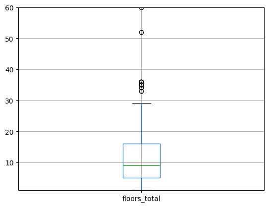
    


Википедия и диаграмма размаха не сошлись на 4 этажа.  
Как видно по "дефектному" датафрейму, у нас 2 объявления в домах выше 37 этажа. В 52 этажа в 13 км от Питера не верится. Удалим это значение.  
Самое высокое здание в Кронштадте - [Морской Никольский собор](https://ru.wikipedia.org/wiki/%D0%9C%D0%BE%D1%80%D1%81%D0%BA%D0%BE%D0%B9_%D0%9D%D0%B8%D0%BA%D0%BE%D0%BB%D1%8C%D1%81%D0%BA%D0%B8%D0%B9_%D1%81%D0%BE%D0%B1%D0%BE%D1%80_(%D0%9A%D1%80%D0%BE%D0%BD%D1%88%D1%82%D0%B0%D0%B4%D1%82)). Его высота 70,5м. Шестидесятиэтажное здание с потолками 2,88 должно быть куда выше. Квартира по этому объявлению продается на 4 этаже, скорее всего в этажности всего здания допущена ошибка.  


```python
df = df[df['floors_total'] != 52] # удаляем объявление на 52 этаже
df['floors_total'] = df['floors_total'].where(~(df['floors_total'] == 60), 6) # заменяем 60 этажей на 6
```


```python
# проверяем результат
print_boxplot_limits(df, 'floors_total') # смотрим на "усы" 
df.boxplot('floors_total') # диаграмма размаха
plt.ylim(df['floors_total'].describe()[3], df['floors_total'].describe()[7]) # ограничения значений по оси ординат
df_anomaly(df, 'floors_total') # датафрейм с выбивающимися значениями (для изучения)
```

    Минимальное значение по диаграмме размаха: 1.0
    Максимальное значение по диаграмме размаха: 32.5
    


<div>
<style scoped>
    .dataframe tbody tr th:only-of-type {
        vertical-align: middle;
    }

    .dataframe tbody tr th {
        vertical-align: top;
    }

    .dataframe thead th {
        text-align: right;
    }
</style>
<table border="1" class="dataframe">
  <thead>
    <tr style="text-align: right;">
      <th></th>
      <th>total_images</th>
      <th>last_price</th>
      <th>total_area</th>
      <th>first_day_exposition</th>
      <th>rooms</th>
      <th>ceiling_height</th>
      <th>floors_total</th>
      <th>living_area</th>
      <th>floor</th>
      <th>is_apartment</th>
      <th>studio</th>
      <th>open_plan</th>
      <th>kitchen_area</th>
      <th>balcony</th>
      <th>locality_name</th>
      <th>airports_nearest</th>
      <th>cityCenters_nearest</th>
      <th>parks_around3000</th>
      <th>parks_nearest</th>
      <th>ponds_around3000</th>
      <th>ponds_nearest</th>
      <th>days_exposition</th>
      <th>distance_from_centers</th>
    </tr>
  </thead>
  <tbody>
    <tr>
      <th>397</th>
      <td>15</td>
      <td>5990000.00</td>
      <td>54.00</td>
      <td>2018-03-22</td>
      <td>2</td>
      <td>2.60</td>
      <td>36</td>
      <td>21.40</td>
      <td>28</td>
      <td>False</td>
      <td>False</td>
      <td>False</td>
      <td>18.70</td>
      <td>1</td>
      <td>Санкт-Петербург</td>
      <td>18732.00</td>
      <td>20444.00</td>
      <td>0</td>
      <td>NaN</td>
      <td>3</td>
      <td>80.00</td>
      <td>11.00</td>
      <td>ПГТ</td>
    </tr>
    <tr>
      <th>5807</th>
      <td>17</td>
      <td>8150000.00</td>
      <td>80.00</td>
      <td>2019-01-09</td>
      <td>2</td>
      <td>2.70</td>
      <td>36</td>
      <td>41.00</td>
      <td>13</td>
      <td>False</td>
      <td>False</td>
      <td>False</td>
      <td>12.00</td>
      <td>5</td>
      <td>Санкт-Петербург</td>
      <td>18732.00</td>
      <td>20444.00</td>
      <td>0</td>
      <td>NaN</td>
      <td>3</td>
      <td>80.00</td>
      <td>38.00</td>
      <td>ПГТ</td>
    </tr>
    <tr>
      <th>11079</th>
      <td>16</td>
      <td>9200000.00</td>
      <td>75.00</td>
      <td>2019-02-22</td>
      <td>2</td>
      <td>2.70</td>
      <td>36</td>
      <td>40.00</td>
      <td>29</td>
      <td>False</td>
      <td>False</td>
      <td>False</td>
      <td>12.00</td>
      <td>2</td>
      <td>Санкт-Петербург</td>
      <td>18732.00</td>
      <td>20444.00</td>
      <td>0</td>
      <td>NaN</td>
      <td>3</td>
      <td>80.00</td>
      <td>NaN</td>
      <td>ПГТ</td>
    </tr>
    <tr>
      <th>20938</th>
      <td>18</td>
      <td>9900000.00</td>
      <td>100.90</td>
      <td>2019-04-08</td>
      <td>3</td>
      <td>2.60</td>
      <td>35</td>
      <td>53.40</td>
      <td>22</td>
      <td>False</td>
      <td>False</td>
      <td>False</td>
      <td>13.40</td>
      <td>0</td>
      <td>Санкт-Петербург</td>
      <td>18732.00</td>
      <td>20444.00</td>
      <td>0</td>
      <td>NaN</td>
      <td>3</td>
      <td>80.00</td>
      <td>NaN</td>
      <td>ПГТ</td>
    </tr>
    <tr>
      <th>18617</th>
      <td>8</td>
      <td>7350000.00</td>
      <td>68.50</td>
      <td>2017-10-09</td>
      <td>2</td>
      <td>2.60</td>
      <td>35</td>
      <td>27.00</td>
      <td>3</td>
      <td>False</td>
      <td>False</td>
      <td>False</td>
      <td>23.00</td>
      <td>1</td>
      <td>Санкт-Петербург</td>
      <td>18627.00</td>
      <td>20339.00</td>
      <td>1</td>
      <td>609.00</td>
      <td>3</td>
      <td>145.00</td>
      <td>41.00</td>
      <td>ПГТ</td>
    </tr>
    <tr>
      <th>18218</th>
      <td>4</td>
      <td>9900000.00</td>
      <td>101.00</td>
      <td>2018-09-27</td>
      <td>3</td>
      <td>2.60</td>
      <td>35</td>
      <td>53.40</td>
      <td>33</td>
      <td>False</td>
      <td>False</td>
      <td>False</td>
      <td>13.70</td>
      <td>2</td>
      <td>Санкт-Петербург</td>
      <td>18737.00</td>
      <td>20450.00</td>
      <td>0</td>
      <td>NaN</td>
      <td>3</td>
      <td>72.00</td>
      <td>7.00</td>
      <td>ПГТ</td>
    </tr>
    <tr>
      <th>21599</th>
      <td>12</td>
      <td>6200000.00</td>
      <td>51.00</td>
      <td>2017-08-27</td>
      <td>2</td>
      <td>2.60</td>
      <td>35</td>
      <td>27.00</td>
      <td>13</td>
      <td>False</td>
      <td>False</td>
      <td>False</td>
      <td>19.00</td>
      <td>0</td>
      <td>Санкт-Петербург</td>
      <td>18732.00</td>
      <td>20444.00</td>
      <td>0</td>
      <td>NaN</td>
      <td>3</td>
      <td>80.00</td>
      <td>NaN</td>
      <td>ПГТ</td>
    </tr>
    <tr>
      <th>15982</th>
      <td>1</td>
      <td>5900000.00</td>
      <td>62.00</td>
      <td>2015-03-01</td>
      <td>2</td>
      <td>2.60</td>
      <td>35</td>
      <td>34.00</td>
      <td>9</td>
      <td>False</td>
      <td>False</td>
      <td>False</td>
      <td>10.00</td>
      <td>1</td>
      <td>Санкт-Петербург</td>
      <td>18732.00</td>
      <td>20444.00</td>
      <td>0</td>
      <td>NaN</td>
      <td>3</td>
      <td>80.00</td>
      <td>547.00</td>
      <td>ПГТ</td>
    </tr>
    <tr>
      <th>21809</th>
      <td>20</td>
      <td>10600000.00</td>
      <td>77.00</td>
      <td>2019-04-16</td>
      <td>2</td>
      <td>2.60</td>
      <td>35</td>
      <td>39.00</td>
      <td>11</td>
      <td>False</td>
      <td>False</td>
      <td>False</td>
      <td>14.00</td>
      <td>2</td>
      <td>Санкт-Петербург</td>
      <td>18732.00</td>
      <td>20444.00</td>
      <td>0</td>
      <td>NaN</td>
      <td>3</td>
      <td>80.00</td>
      <td>NaN</td>
      <td>ПГТ</td>
    </tr>
    <tr>
      <th>14347</th>
      <td>14</td>
      <td>8595000.00</td>
      <td>69.70</td>
      <td>2018-09-26</td>
      <td>2</td>
      <td>2.60</td>
      <td>35</td>
      <td>27.40</td>
      <td>26</td>
      <td>False</td>
      <td>False</td>
      <td>False</td>
      <td>23.30</td>
      <td>0</td>
      <td>Санкт-Петербург</td>
      <td>18732.00</td>
      <td>20444.00</td>
      <td>0</td>
      <td>NaN</td>
      <td>3</td>
      <td>80.00</td>
      <td>NaN</td>
      <td>ПГТ</td>
    </tr>
    <tr>
      <th>13975</th>
      <td>19</td>
      <td>6990000.00</td>
      <td>65.00</td>
      <td>2018-10-06</td>
      <td>2</td>
      <td>2.60</td>
      <td>35</td>
      <td>32.10</td>
      <td>23</td>
      <td>False</td>
      <td>False</td>
      <td>False</td>
      <td>8.90</td>
      <td>0</td>
      <td>Санкт-Петербург</td>
      <td>18732.00</td>
      <td>20444.00</td>
      <td>0</td>
      <td>NaN</td>
      <td>3</td>
      <td>80.00</td>
      <td>89.00</td>
      <td>ПГТ</td>
    </tr>
    <tr>
      <th>12960</th>
      <td>20</td>
      <td>6140000.00</td>
      <td>54.00</td>
      <td>2018-10-09</td>
      <td>2</td>
      <td>2.70</td>
      <td>35</td>
      <td>26.60</td>
      <td>13</td>
      <td>False</td>
      <td>False</td>
      <td>False</td>
      <td>19.10</td>
      <td>2</td>
      <td>Санкт-Петербург</td>
      <td>18732.00</td>
      <td>20444.00</td>
      <td>0</td>
      <td>NaN</td>
      <td>3</td>
      <td>80.00</td>
      <td>155.00</td>
      <td>ПГТ</td>
    </tr>
    <tr>
      <th>12888</th>
      <td>7</td>
      <td>7600000.00</td>
      <td>70.00</td>
      <td>2016-11-18</td>
      <td>3</td>
      <td>2.70</td>
      <td>35</td>
      <td>36.50</td>
      <td>27</td>
      <td>False</td>
      <td>False</td>
      <td>False</td>
      <td>23.10</td>
      <td>2</td>
      <td>Санкт-Петербург</td>
      <td>18732.00</td>
      <td>20444.00</td>
      <td>0</td>
      <td>NaN</td>
      <td>3</td>
      <td>80.00</td>
      <td>413.00</td>
      <td>ПГТ</td>
    </tr>
    <tr>
      <th>871</th>
      <td>14</td>
      <td>7777777.00</td>
      <td>75.00</td>
      <td>2017-11-16</td>
      <td>2</td>
      <td>2.60</td>
      <td>35</td>
      <td>40.50</td>
      <td>23</td>
      <td>False</td>
      <td>False</td>
      <td>False</td>
      <td>11.70</td>
      <td>0</td>
      <td>Санкт-Петербург</td>
      <td>18732.00</td>
      <td>20444.00</td>
      <td>0</td>
      <td>NaN</td>
      <td>3</td>
      <td>80.00</td>
      <td>169.00</td>
      <td>ПГТ</td>
    </tr>
    <tr>
      <th>9579</th>
      <td>9</td>
      <td>3450000.00</td>
      <td>24.80</td>
      <td>2019-02-01</td>
      <td>0</td>
      <td>2.68</td>
      <td>35</td>
      <td>16.00</td>
      <td>17</td>
      <td>False</td>
      <td>True</td>
      <td>False</td>
      <td>NaN</td>
      <td>2</td>
      <td>Санкт-Петербург</td>
      <td>18732.00</td>
      <td>20444.00</td>
      <td>0</td>
      <td>NaN</td>
      <td>3</td>
      <td>80.00</td>
      <td>45.00</td>
      <td>ПГТ</td>
    </tr>
    <tr>
      <th>9370</th>
      <td>12</td>
      <td>7390000.00</td>
      <td>70.00</td>
      <td>2017-02-21</td>
      <td>2</td>
      <td>2.70</td>
      <td>35</td>
      <td>28.00</td>
      <td>3</td>
      <td>False</td>
      <td>False</td>
      <td>False</td>
      <td>23.00</td>
      <td>2</td>
      <td>Санкт-Петербург</td>
      <td>18732.00</td>
      <td>20444.00</td>
      <td>0</td>
      <td>NaN</td>
      <td>3</td>
      <td>80.00</td>
      <td>236.00</td>
      <td>ПГТ</td>
    </tr>
    <tr>
      <th>9186</th>
      <td>7</td>
      <td>6500000.00</td>
      <td>49.10</td>
      <td>2019-04-12</td>
      <td>1</td>
      <td>2.50</td>
      <td>35</td>
      <td>31.00</td>
      <td>3</td>
      <td>False</td>
      <td>False</td>
      <td>False</td>
      <td>7.00</td>
      <td>0</td>
      <td>Санкт-Петербург</td>
      <td>18732.00</td>
      <td>20444.00</td>
      <td>0</td>
      <td>NaN</td>
      <td>3</td>
      <td>80.00</td>
      <td>3.00</td>
      <td>ПГТ</td>
    </tr>
    <tr>
      <th>8496</th>
      <td>20</td>
      <td>7500000.00</td>
      <td>73.30</td>
      <td>2017-05-18</td>
      <td>3</td>
      <td>2.60</td>
      <td>35</td>
      <td>28.00</td>
      <td>27</td>
      <td>False</td>
      <td>False</td>
      <td>False</td>
      <td>23.10</td>
      <td>0</td>
      <td>Санкт-Петербург</td>
      <td>18732.00</td>
      <td>20444.00</td>
      <td>0</td>
      <td>NaN</td>
      <td>3</td>
      <td>80.00</td>
      <td>250.00</td>
      <td>ПГТ</td>
    </tr>
    <tr>
      <th>7236</th>
      <td>10</td>
      <td>4599000.00</td>
      <td>42.00</td>
      <td>2019-01-10</td>
      <td>1</td>
      <td>2.60</td>
      <td>35</td>
      <td>15.00</td>
      <td>12</td>
      <td>False</td>
      <td>False</td>
      <td>False</td>
      <td>11.00</td>
      <td>2</td>
      <td>Санкт-Петербург</td>
      <td>18732.00</td>
      <td>20444.00</td>
      <td>0</td>
      <td>NaN</td>
      <td>3</td>
      <td>80.00</td>
      <td>72.00</td>
      <td>ПГТ</td>
    </tr>
    <tr>
      <th>5808</th>
      <td>12</td>
      <td>4590000.00</td>
      <td>43.00</td>
      <td>2018-10-19</td>
      <td>1</td>
      <td>2.60</td>
      <td>35</td>
      <td>14.00</td>
      <td>11</td>
      <td>False</td>
      <td>False</td>
      <td>False</td>
      <td>15.00</td>
      <td>0</td>
      <td>Санкт-Петербург</td>
      <td>18732.00</td>
      <td>20444.00</td>
      <td>0</td>
      <td>NaN</td>
      <td>3</td>
      <td>80.00</td>
      <td>82.00</td>
      <td>ПГТ</td>
    </tr>
    <tr>
      <th>22946</th>
      <td>14</td>
      <td>7690000.00</td>
      <td>75.00</td>
      <td>2018-03-27</td>
      <td>2</td>
      <td>2.60</td>
      <td>35</td>
      <td>40.00</td>
      <td>8</td>
      <td>False</td>
      <td>False</td>
      <td>False</td>
      <td>15.00</td>
      <td>0</td>
      <td>Санкт-Петербург</td>
      <td>18732.00</td>
      <td>20444.00</td>
      <td>0</td>
      <td>NaN</td>
      <td>3</td>
      <td>80.00</td>
      <td>NaN</td>
      <td>ПГТ</td>
    </tr>
    <tr>
      <th>5749</th>
      <td>20</td>
      <td>3590000.00</td>
      <td>25.00</td>
      <td>2017-08-30</td>
      <td>0</td>
      <td>2.80</td>
      <td>35</td>
      <td>NaN</td>
      <td>26</td>
      <td>False</td>
      <td>False</td>
      <td>True</td>
      <td>NaN</td>
      <td>2</td>
      <td>Санкт-Петербург</td>
      <td>18732.00</td>
      <td>20444.00</td>
      <td>0</td>
      <td>NaN</td>
      <td>3</td>
      <td>80.00</td>
      <td>198.00</td>
      <td>ПГТ</td>
    </tr>
    <tr>
      <th>4855</th>
      <td>12</td>
      <td>5500000.00</td>
      <td>50.00</td>
      <td>2017-06-22</td>
      <td>1</td>
      <td>2.80</td>
      <td>35</td>
      <td>22.00</td>
      <td>4</td>
      <td>False</td>
      <td>False</td>
      <td>False</td>
      <td>13.00</td>
      <td>0</td>
      <td>Санкт-Петербург</td>
      <td>18627.00</td>
      <td>20339.00</td>
      <td>1</td>
      <td>609.00</td>
      <td>3</td>
      <td>145.00</td>
      <td>537.00</td>
      <td>ПГТ</td>
    </tr>
    <tr>
      <th>2966</th>
      <td>9</td>
      <td>4300000.00</td>
      <td>37.00</td>
      <td>2017-08-08</td>
      <td>1</td>
      <td>2.60</td>
      <td>35</td>
      <td>14.00</td>
      <td>15</td>
      <td>False</td>
      <td>False</td>
      <td>False</td>
      <td>10.40</td>
      <td>0</td>
      <td>Санкт-Петербург</td>
      <td>18732.00</td>
      <td>20444.00</td>
      <td>0</td>
      <td>NaN</td>
      <td>3</td>
      <td>80.00</td>
      <td>50.00</td>
      <td>ПГТ</td>
    </tr>
    <tr>
      <th>1917</th>
      <td>13</td>
      <td>10150000.00</td>
      <td>74.00</td>
      <td>2017-11-17</td>
      <td>2</td>
      <td>2.80</td>
      <td>35</td>
      <td>34.40</td>
      <td>30</td>
      <td>False</td>
      <td>False</td>
      <td>False</td>
      <td>13.00</td>
      <td>0</td>
      <td>Санкт-Петербург</td>
      <td>18732.00</td>
      <td>20444.00</td>
      <td>0</td>
      <td>NaN</td>
      <td>3</td>
      <td>80.00</td>
      <td>NaN</td>
      <td>ПГТ</td>
    </tr>
    <tr>
      <th>1060</th>
      <td>10</td>
      <td>5200000.00</td>
      <td>50.00</td>
      <td>2015-11-06</td>
      <td>2</td>
      <td>2.60</td>
      <td>35</td>
      <td>39.00</td>
      <td>15</td>
      <td>False</td>
      <td>False</td>
      <td>False</td>
      <td>20.50</td>
      <td>2</td>
      <td>Санкт-Петербург</td>
      <td>18732.00</td>
      <td>20444.00</td>
      <td>0</td>
      <td>NaN</td>
      <td>3</td>
      <td>80.00</td>
      <td>281.00</td>
      <td>ПГТ</td>
    </tr>
    <tr>
      <th>18629</th>
      <td>20</td>
      <td>5700000.00</td>
      <td>54.00</td>
      <td>2017-12-08</td>
      <td>1</td>
      <td>2.60</td>
      <td>35</td>
      <td>21.00</td>
      <td>31</td>
      <td>False</td>
      <td>False</td>
      <td>False</td>
      <td>18.00</td>
      <td>0</td>
      <td>Санкт-Петербург</td>
      <td>18732.00</td>
      <td>20444.00</td>
      <td>0</td>
      <td>NaN</td>
      <td>3</td>
      <td>80.00</td>
      <td>128.00</td>
      <td>ПГТ</td>
    </tr>
    <tr>
      <th>1697</th>
      <td>11</td>
      <td>3550000.00</td>
      <td>28.00</td>
      <td>2018-02-08</td>
      <td>1</td>
      <td>2.65</td>
      <td>34</td>
      <td>18.00</td>
      <td>23</td>
      <td>False</td>
      <td>False</td>
      <td>False</td>
      <td>NaN</td>
      <td>0</td>
      <td>Санкт-Петербург</td>
      <td>18732.00</td>
      <td>20444.00</td>
      <td>0</td>
      <td>NaN</td>
      <td>3</td>
      <td>80.00</td>
      <td>410.00</td>
      <td>ПГТ</td>
    </tr>
    <tr>
      <th>11575</th>
      <td>9</td>
      <td>9900000.00</td>
      <td>101.00</td>
      <td>2016-04-28</td>
      <td>3</td>
      <td>2.60</td>
      <td>33</td>
      <td>53.00</td>
      <td>32</td>
      <td>False</td>
      <td>False</td>
      <td>False</td>
      <td>21.00</td>
      <td>0</td>
      <td>Санкт-Петербург</td>
      <td>18732.00</td>
      <td>20444.00</td>
      <td>0</td>
      <td>NaN</td>
      <td>3</td>
      <td>80.00</td>
      <td>53.00</td>
      <td>ПГТ</td>
    </tr>
    <tr>
      <th>22550</th>
      <td>2</td>
      <td>5800000.00</td>
      <td>115.00</td>
      <td>2017-09-12</td>
      <td>2</td>
      <td>2.60</td>
      <td>1</td>
      <td>40.00</td>
      <td>1</td>
      <td>False</td>
      <td>False</td>
      <td>False</td>
      <td>14.00</td>
      <td>0</td>
      <td>Сестрорецк</td>
      <td>54331.00</td>
      <td>35394.00</td>
      <td>0</td>
      <td>NaN</td>
      <td>0</td>
      <td>NaN</td>
      <td>124.00</td>
      <td>ПГТ</td>
    </tr>
    <tr>
      <th>22855</th>
      <td>16</td>
      <td>2950000.00</td>
      <td>31.00</td>
      <td>2018-03-07</td>
      <td>1</td>
      <td>2.70</td>
      <td>1</td>
      <td>16.40</td>
      <td>1</td>
      <td>False</td>
      <td>False</td>
      <td>False</td>
      <td>5.60</td>
      <td>0</td>
      <td>Зеленогорск</td>
      <td>73115.00</td>
      <td>54214.00</td>
      <td>3</td>
      <td>188.00</td>
      <td>1</td>
      <td>269.00</td>
      <td>328.00</td>
      <td>ПГТ</td>
    </tr>
    <tr>
      <th>21603</th>
      <td>12</td>
      <td>1900000.00</td>
      <td>40.00</td>
      <td>2019-01-29</td>
      <td>2</td>
      <td>2.90</td>
      <td>1</td>
      <td>19.20</td>
      <td>1</td>
      <td>False</td>
      <td>False</td>
      <td>False</td>
      <td>6.50</td>
      <td>0</td>
      <td>Сосново</td>
      <td>NaN</td>
      <td>NaN</td>
      <td>&lt;NA&gt;</td>
      <td>NaN</td>
      <td>&lt;NA&gt;</td>
      <td>NaN</td>
      <td>NaN</td>
      <td>None</td>
    </tr>
    <tr>
      <th>11641</th>
      <td>6</td>
      <td>3685000.00</td>
      <td>44.70</td>
      <td>2018-07-05</td>
      <td>1</td>
      <td>2.50</td>
      <td>1</td>
      <td>23.50</td>
      <td>1</td>
      <td>False</td>
      <td>False</td>
      <td>False</td>
      <td>15.00</td>
      <td>0</td>
      <td>Санкт-Петербург</td>
      <td>41351.00</td>
      <td>15457.00</td>
      <td>0</td>
      <td>NaN</td>
      <td>3</td>
      <td>534.00</td>
      <td>112.00</td>
      <td>ПГТ</td>
    </tr>
    <tr>
      <th>18900</th>
      <td>2</td>
      <td>1800000.00</td>
      <td>65.00</td>
      <td>2018-02-02</td>
      <td>3</td>
      <td>2.45</td>
      <td>1</td>
      <td>NaN</td>
      <td>1</td>
      <td>False</td>
      <td>False</td>
      <td>False</td>
      <td>NaN</td>
      <td>0</td>
      <td>Свирьстрой</td>
      <td>NaN</td>
      <td>NaN</td>
      <td>&lt;NA&gt;</td>
      <td>NaN</td>
      <td>&lt;NA&gt;</td>
      <td>NaN</td>
      <td>45.00</td>
      <td>None</td>
    </tr>
    <tr>
      <th>17020</th>
      <td>10</td>
      <td>3700000.00</td>
      <td>100.00</td>
      <td>2018-01-01</td>
      <td>3</td>
      <td>3.00</td>
      <td>1</td>
      <td>35.00</td>
      <td>1</td>
      <td>False</td>
      <td>False</td>
      <td>False</td>
      <td>22.00</td>
      <td>0</td>
      <td>Каськово</td>
      <td>NaN</td>
      <td>NaN</td>
      <td>&lt;NA&gt;</td>
      <td>NaN</td>
      <td>&lt;NA&gt;</td>
      <td>NaN</td>
      <td>346.00</td>
      <td>None</td>
    </tr>
    <tr>
      <th>15543</th>
      <td>12</td>
      <td>3500000.00</td>
      <td>54.00</td>
      <td>2017-12-01</td>
      <td>2</td>
      <td>2.90</td>
      <td>1</td>
      <td>24.40</td>
      <td>1</td>
      <td>False</td>
      <td>False</td>
      <td>False</td>
      <td>7.30</td>
      <td>0</td>
      <td>Большая Ижора</td>
      <td>NaN</td>
      <td>NaN</td>
      <td>&lt;NA&gt;</td>
      <td>NaN</td>
      <td>&lt;NA&gt;</td>
      <td>NaN</td>
      <td>202.00</td>
      <td>None</td>
    </tr>
    <tr>
      <th>14836</th>
      <td>3</td>
      <td>3900000.00</td>
      <td>45.00</td>
      <td>2018-02-01</td>
      <td>2</td>
      <td>3.00</td>
      <td>1</td>
      <td>28.40</td>
      <td>1</td>
      <td>False</td>
      <td>False</td>
      <td>False</td>
      <td>3.30</td>
      <td>0</td>
      <td>Стрельна</td>
      <td>26770.00</td>
      <td>23654.00</td>
      <td>0</td>
      <td>NaN</td>
      <td>2</td>
      <td>640.00</td>
      <td>196.00</td>
      <td>ПГТ</td>
    </tr>
    <tr>
      <th>8388</th>
      <td>20</td>
      <td>3550000.00</td>
      <td>48.20</td>
      <td>2019-03-30</td>
      <td>3</td>
      <td>2.65</td>
      <td>1</td>
      <td>33.90</td>
      <td>1</td>
      <td>False</td>
      <td>False</td>
      <td>False</td>
      <td>9.10</td>
      <td>0</td>
      <td>Сестрорецк</td>
      <td>50046.00</td>
      <td>31144.00</td>
      <td>0</td>
      <td>NaN</td>
      <td>0</td>
      <td>NaN</td>
      <td>NaN</td>
      <td>ПГТ</td>
    </tr>
    <tr>
      <th>8335</th>
      <td>10</td>
      <td>2700000.00</td>
      <td>80.00</td>
      <td>2018-07-07</td>
      <td>3</td>
      <td>3.00</td>
      <td>1</td>
      <td>45.00</td>
      <td>1</td>
      <td>False</td>
      <td>False</td>
      <td>False</td>
      <td>15.00</td>
      <td>0</td>
      <td>Луга</td>
      <td>NaN</td>
      <td>NaN</td>
      <td>&lt;NA&gt;</td>
      <td>NaN</td>
      <td>&lt;NA&gt;</td>
      <td>NaN</td>
      <td>51.00</td>
      <td>None</td>
    </tr>
    <tr>
      <th>5787</th>
      <td>16</td>
      <td>9000000.00</td>
      <td>88.00</td>
      <td>2018-08-06</td>
      <td>3</td>
      <td>2.60</td>
      <td>1</td>
      <td>NaN</td>
      <td>1</td>
      <td>False</td>
      <td>False</td>
      <td>False</td>
      <td>NaN</td>
      <td>0</td>
      <td>Санкт-Петербург</td>
      <td>44870.00</td>
      <td>20802.00</td>
      <td>0</td>
      <td>NaN</td>
      <td>1</td>
      <td>792.00</td>
      <td>60.00</td>
      <td>ПГТ</td>
    </tr>
    <tr>
      <th>23498</th>
      <td>7</td>
      <td>1600000.00</td>
      <td>54.00</td>
      <td>2016-12-26</td>
      <td>2</td>
      <td>2.30</td>
      <td>1</td>
      <td>33.00</td>
      <td>1</td>
      <td>False</td>
      <td>False</td>
      <td>False</td>
      <td>3.50</td>
      <td>0</td>
      <td>Высоцк</td>
      <td>NaN</td>
      <td>NaN</td>
      <td>&lt;NA&gt;</td>
      <td>NaN</td>
      <td>&lt;NA&gt;</td>
      <td>NaN</td>
      <td>281.00</td>
      <td>None</td>
    </tr>
  </tbody>
</table>
</div>


    
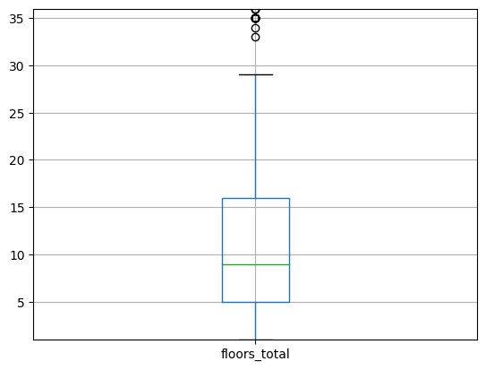
    


Выглядит чуть симпатичнее. 

#### Столбец `living_area`


```python
print_boxplot_limits(df, 'living_area') # смотрим на "усы" 
df.boxplot('living_area') # диаграмма размаха
plt.ylim(df['living_area'].describe()[3], df['living_area'].describe()[7]) # ограничения значений по оси ординат
df_anomaly(df, 'living_area') # датафрейм с выбивающимися значениями (для изучения)
```

    Минимальное значение по диаграмме размаха: 2.0
    Максимальное значение по диаграмме размаха: 79.075
    


<div>
<style scoped>
    .dataframe tbody tr th:only-of-type {
        vertical-align: middle;
    }

    .dataframe tbody tr th {
        vertical-align: top;
    }

    .dataframe thead th {
        text-align: right;
    }
</style>
<table border="1" class="dataframe">
  <thead>
    <tr style="text-align: right;">
      <th></th>
      <th>total_images</th>
      <th>last_price</th>
      <th>total_area</th>
      <th>first_day_exposition</th>
      <th>rooms</th>
      <th>ceiling_height</th>
      <th>floors_total</th>
      <th>living_area</th>
      <th>floor</th>
      <th>is_apartment</th>
      <th>studio</th>
      <th>open_plan</th>
      <th>kitchen_area</th>
      <th>balcony</th>
      <th>locality_name</th>
      <th>airports_nearest</th>
      <th>cityCenters_nearest</th>
      <th>parks_around3000</th>
      <th>parks_nearest</th>
      <th>ponds_around3000</th>
      <th>ponds_nearest</th>
      <th>days_exposition</th>
      <th>distance_from_centers</th>
    </tr>
  </thead>
  <tbody>
    <tr>
      <th>19540</th>
      <td>8</td>
      <td>420000000.00</td>
      <td>900.00</td>
      <td>2017-12-06</td>
      <td>12</td>
      <td>2.80</td>
      <td>25</td>
      <td>409.70</td>
      <td>25</td>
      <td>False</td>
      <td>False</td>
      <td>False</td>
      <td>112.00</td>
      <td>0</td>
      <td>Санкт-Петербург</td>
      <td>30706.00</td>
      <td>7877.00</td>
      <td>0</td>
      <td>NaN</td>
      <td>2</td>
      <td>318.00</td>
      <td>106.00</td>
      <td>город</td>
    </tr>
    <tr>
      <th>5358</th>
      <td>20</td>
      <td>65000000.00</td>
      <td>590.00</td>
      <td>2019-02-14</td>
      <td>15</td>
      <td>3.50</td>
      <td>6</td>
      <td>409.00</td>
      <td>3</td>
      <td>False</td>
      <td>False</td>
      <td>False</td>
      <td>100.00</td>
      <td>0</td>
      <td>Санкт-Петербург</td>
      <td>24447.00</td>
      <td>4666.00</td>
      <td>1</td>
      <td>767.00</td>
      <td>0</td>
      <td>NaN</td>
      <td>14.00</td>
      <td>центр</td>
    </tr>
    <tr>
      <th>12401</th>
      <td>20</td>
      <td>91500000.00</td>
      <td>495.00</td>
      <td>2017-06-19</td>
      <td>7</td>
      <td>4.65</td>
      <td>7</td>
      <td>347.50</td>
      <td>7</td>
      <td>False</td>
      <td>False</td>
      <td>False</td>
      <td>25.00</td>
      <td>0</td>
      <td>Санкт-Петербург</td>
      <td>28040.09</td>
      <td>5735.00</td>
      <td>2</td>
      <td>110.00</td>
      <td>0</td>
      <td>NaN</td>
      <td>14.00</td>
      <td>город</td>
    </tr>
    <tr>
      <th>4237</th>
      <td>1</td>
      <td>50000000.00</td>
      <td>517.00</td>
      <td>2017-10-14</td>
      <td>7</td>
      <td>3.10</td>
      <td>4</td>
      <td>332.00</td>
      <td>3</td>
      <td>False</td>
      <td>False</td>
      <td>False</td>
      <td>22.00</td>
      <td>0</td>
      <td>Санкт-Петербург</td>
      <td>22835.00</td>
      <td>1847.00</td>
      <td>2</td>
      <td>477.00</td>
      <td>2</td>
      <td>540.00</td>
      <td>NaN</td>
      <td>центр</td>
    </tr>
    <tr>
      <th>12859</th>
      <td>20</td>
      <td>140000000.00</td>
      <td>631.20</td>
      <td>2019-04-09</td>
      <td>7</td>
      <td>3.90</td>
      <td>4</td>
      <td>322.30</td>
      <td>4</td>
      <td>False</td>
      <td>False</td>
      <td>False</td>
      <td>19.50</td>
      <td>1</td>
      <td>Санкт-Петербург</td>
      <td>25707.00</td>
      <td>4972.00</td>
      <td>0</td>
      <td>NaN</td>
      <td>2</td>
      <td>210.00</td>
      <td>NaN</td>
      <td>центр</td>
    </tr>
    <tr>
      <th>...</th>
      <td>...</td>
      <td>...</td>
      <td>...</td>
      <td>...</td>
      <td>...</td>
      <td>...</td>
      <td>...</td>
      <td>...</td>
      <td>...</td>
      <td>...</td>
      <td>...</td>
      <td>...</td>
      <td>...</td>
      <td>...</td>
      <td>...</td>
      <td>...</td>
      <td>...</td>
      <td>...</td>
      <td>...</td>
      <td>...</td>
      <td>...</td>
      <td>...</td>
      <td>...</td>
    </tr>
    <tr>
      <th>5004</th>
      <td>7</td>
      <td>21988800.00</td>
      <td>152.70</td>
      <td>2018-01-13</td>
      <td>4</td>
      <td>2.73</td>
      <td>20</td>
      <td>79.20</td>
      <td>16</td>
      <td>False</td>
      <td>False</td>
      <td>False</td>
      <td>31.47</td>
      <td>0</td>
      <td>Санкт-Петербург</td>
      <td>39140.00</td>
      <td>10364.00</td>
      <td>2</td>
      <td>173.00</td>
      <td>3</td>
      <td>196.00</td>
      <td>NaN</td>
      <td>окраина города</td>
    </tr>
    <tr>
      <th>11748</th>
      <td>8</td>
      <td>48000000.00</td>
      <td>138.20</td>
      <td>2019-04-03</td>
      <td>3</td>
      <td>3.10</td>
      <td>5</td>
      <td>79.20</td>
      <td>4</td>
      <td>False</td>
      <td>False</td>
      <td>False</td>
      <td>22.00</td>
      <td>0</td>
      <td>Санкт-Петербург</td>
      <td>25962.00</td>
      <td>591.00</td>
      <td>3</td>
      <td>319.00</td>
      <td>3</td>
      <td>566.00</td>
      <td>9.00</td>
      <td>центр</td>
    </tr>
    <tr>
      <th>1305</th>
      <td>8</td>
      <td>10700000.00</td>
      <td>135.00</td>
      <td>2017-01-16</td>
      <td>5</td>
      <td>3.10</td>
      <td>6</td>
      <td>79.20</td>
      <td>6</td>
      <td>False</td>
      <td>False</td>
      <td>False</td>
      <td>16.70</td>
      <td>0</td>
      <td>Санкт-Петербург</td>
      <td>26175.00</td>
      <td>4750.00</td>
      <td>0</td>
      <td>NaN</td>
      <td>1</td>
      <td>367.00</td>
      <td>NaN</td>
      <td>центр</td>
    </tr>
    <tr>
      <th>13915</th>
      <td>20</td>
      <td>6350000.00</td>
      <td>52.00</td>
      <td>2018-02-06</td>
      <td>2</td>
      <td>3.00</td>
      <td>6</td>
      <td>2.00</td>
      <td>2</td>
      <td>False</td>
      <td>False</td>
      <td>False</td>
      <td>9.00</td>
      <td>0</td>
      <td>Санкт-Петербург</td>
      <td>32453.00</td>
      <td>6521.00</td>
      <td>0</td>
      <td>NaN</td>
      <td>1</td>
      <td>1012.00</td>
      <td>91.00</td>
      <td>город</td>
    </tr>
    <tr>
      <th>21758</th>
      <td>0</td>
      <td>2330000.00</td>
      <td>23.00</td>
      <td>2018-01-01</td>
      <td>0</td>
      <td>2.60</td>
      <td>24</td>
      <td>2.00</td>
      <td>22</td>
      <td>False</td>
      <td>True</td>
      <td>False</td>
      <td>NaN</td>
      <td>0</td>
      <td>Мурино</td>
      <td>51553.00</td>
      <td>21888.00</td>
      <td>&lt;NA&gt;</td>
      <td>NaN</td>
      <td>&lt;NA&gt;</td>
      <td>NaN</td>
      <td>66.00</td>
      <td>ПГТ</td>
    </tr>
  </tbody>
</table>
<p>728 rows × 23 columns</p>
</div>


    
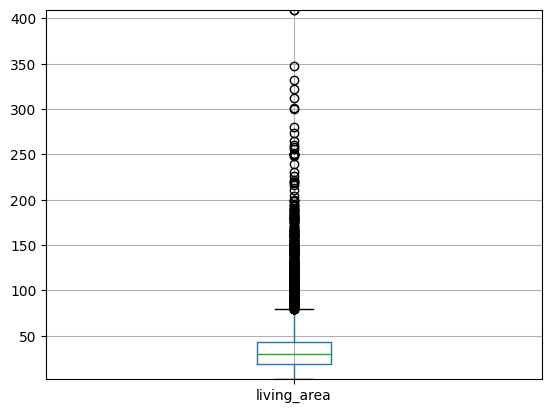
    


"Большие" значения вопросов не вызывают, если ранее мы уже в них поверили.   
Из двух квартир с жилой площадью 2 $м^2$ можно предположить наличие опечатки лишь в той, где общая площадь 52 $м^2$ и кухня 9. Логично предположить, что жилая площадь все-таки 20 $м^2$. Заменим это значение.


```python
df.loc[(df['living_area'] == 2.00) & (df['total_area'] == 52.00), 'living_area'] = 20
```

#### Столбец `kitchen_area`


```python
print_boxplot_limits(df, 'kitchen_area') # смотрим на "усы" 
df.boxplot('kitchen_area') # диаграмма размаха
plt.ylim(df['kitchen_area'].describe()[3], df['kitchen_area'].describe()[7]) # ограничения значений по оси ординат
df_anomaly(df, 'kitchen_area') # датафрейм с выбивающимися значениями (для изучения)
```

    Минимальное значение по диаграмме размаха: 1.3
    Максимальное значение по диаграмме размаха: 19.5
    


<div>
<style scoped>
    .dataframe tbody tr th:only-of-type {
        vertical-align: middle;
    }

    .dataframe tbody tr th {
        vertical-align: top;
    }

    .dataframe thead th {
        text-align: right;
    }
</style>
<table border="1" class="dataframe">
  <thead>
    <tr style="text-align: right;">
      <th></th>
      <th>total_images</th>
      <th>last_price</th>
      <th>total_area</th>
      <th>first_day_exposition</th>
      <th>rooms</th>
      <th>ceiling_height</th>
      <th>floors_total</th>
      <th>living_area</th>
      <th>floor</th>
      <th>is_apartment</th>
      <th>studio</th>
      <th>open_plan</th>
      <th>kitchen_area</th>
      <th>balcony</th>
      <th>locality_name</th>
      <th>airports_nearest</th>
      <th>cityCenters_nearest</th>
      <th>parks_around3000</th>
      <th>parks_nearest</th>
      <th>ponds_around3000</th>
      <th>ponds_nearest</th>
      <th>days_exposition</th>
      <th>distance_from_centers</th>
    </tr>
  </thead>
  <tbody>
    <tr>
      <th>19540</th>
      <td>8</td>
      <td>420000000.00</td>
      <td>900.00</td>
      <td>2017-12-06</td>
      <td>12</td>
      <td>2.80</td>
      <td>25</td>
      <td>409.70</td>
      <td>25</td>
      <td>False</td>
      <td>False</td>
      <td>False</td>
      <td>112.00</td>
      <td>0</td>
      <td>Санкт-Петербург</td>
      <td>30706.00</td>
      <td>7877.00</td>
      <td>0</td>
      <td>NaN</td>
      <td>2</td>
      <td>318.00</td>
      <td>106.00</td>
      <td>город</td>
    </tr>
    <tr>
      <th>20215</th>
      <td>2</td>
      <td>85000000.00</td>
      <td>249.70</td>
      <td>2018-02-01</td>
      <td>3</td>
      <td>3.10</td>
      <td>10</td>
      <td>72.00</td>
      <td>9</td>
      <td>False</td>
      <td>False</td>
      <td>False</td>
      <td>107.00</td>
      <td>4</td>
      <td>Санкт-Петербург</td>
      <td>31532.00</td>
      <td>4624.00</td>
      <td>1</td>
      <td>2218.00</td>
      <td>2</td>
      <td>99.00</td>
      <td>26.00</td>
      <td>центр</td>
    </tr>
    <tr>
      <th>2489</th>
      <td>9</td>
      <td>12500000.00</td>
      <td>255.00</td>
      <td>2017-04-21</td>
      <td>3</td>
      <td>2.80</td>
      <td>2</td>
      <td>153.90</td>
      <td>2</td>
      <td>False</td>
      <td>False</td>
      <td>False</td>
      <td>100.70</td>
      <td>0</td>
      <td>Санкт-Петербург</td>
      <td>29544.00</td>
      <td>6916.00</td>
      <td>0</td>
      <td>NaN</td>
      <td>3</td>
      <td>198.00</td>
      <td>102.00</td>
      <td>город</td>
    </tr>
    <tr>
      <th>5358</th>
      <td>20</td>
      <td>65000000.00</td>
      <td>590.00</td>
      <td>2019-02-14</td>
      <td>15</td>
      <td>3.50</td>
      <td>6</td>
      <td>409.00</td>
      <td>3</td>
      <td>False</td>
      <td>False</td>
      <td>False</td>
      <td>100.00</td>
      <td>0</td>
      <td>Санкт-Петербург</td>
      <td>24447.00</td>
      <td>4666.00</td>
      <td>1</td>
      <td>767.00</td>
      <td>0</td>
      <td>NaN</td>
      <td>14.00</td>
      <td>центр</td>
    </tr>
    <tr>
      <th>16239</th>
      <td>5</td>
      <td>82400000.00</td>
      <td>181.10</td>
      <td>2017-05-24</td>
      <td>3</td>
      <td>3.90</td>
      <td>9</td>
      <td>58.20</td>
      <td>4</td>
      <td>False</td>
      <td>False</td>
      <td>False</td>
      <td>93.20</td>
      <td>0</td>
      <td>Санкт-Петербург</td>
      <td>25525.00</td>
      <td>5845.00</td>
      <td>2</td>
      <td>116.00</td>
      <td>0</td>
      <td>NaN</td>
      <td>501.00</td>
      <td>город</td>
    </tr>
    <tr>
      <th>...</th>
      <td>...</td>
      <td>...</td>
      <td>...</td>
      <td>...</td>
      <td>...</td>
      <td>...</td>
      <td>...</td>
      <td>...</td>
      <td>...</td>
      <td>...</td>
      <td>...</td>
      <td>...</td>
      <td>...</td>
      <td>...</td>
      <td>...</td>
      <td>...</td>
      <td>...</td>
      <td>...</td>
      <td>...</td>
      <td>...</td>
      <td>...</td>
      <td>...</td>
      <td>...</td>
    </tr>
    <tr>
      <th>12042</th>
      <td>7</td>
      <td>15990000.00</td>
      <td>177.20</td>
      <td>2017-06-22</td>
      <td>5</td>
      <td>3.31</td>
      <td>4</td>
      <td>123.60</td>
      <td>2</td>
      <td>False</td>
      <td>False</td>
      <td>False</td>
      <td>19.50</td>
      <td>0</td>
      <td>Санкт-Петербург</td>
      <td>24287.00</td>
      <td>2835.00</td>
      <td>0</td>
      <td>NaN</td>
      <td>3</td>
      <td>257.00</td>
      <td>NaN</td>
      <td>центр</td>
    </tr>
    <tr>
      <th>1183</th>
      <td>3</td>
      <td>5200000.00</td>
      <td>45.20</td>
      <td>2018-11-02</td>
      <td>1</td>
      <td>2.70</td>
      <td>12</td>
      <td>13.50</td>
      <td>1</td>
      <td>False</td>
      <td>False</td>
      <td>False</td>
      <td>19.50</td>
      <td>0</td>
      <td>Кудрово</td>
      <td>NaN</td>
      <td>NaN</td>
      <td>&lt;NA&gt;</td>
      <td>NaN</td>
      <td>&lt;NA&gt;</td>
      <td>NaN</td>
      <td>60.00</td>
      <td>None</td>
    </tr>
    <tr>
      <th>475</th>
      <td>1</td>
      <td>16512000.00</td>
      <td>103.20</td>
      <td>2017-09-26</td>
      <td>3</td>
      <td>2.80</td>
      <td>11</td>
      <td>55.70</td>
      <td>5</td>
      <td>False</td>
      <td>False</td>
      <td>False</td>
      <td>19.50</td>
      <td>2</td>
      <td>Санкт-Петербург</td>
      <td>28399.00</td>
      <td>7101.00</td>
      <td>2</td>
      <td>290.00</td>
      <td>3</td>
      <td>221.00</td>
      <td>12.00</td>
      <td>город</td>
    </tr>
    <tr>
      <th>11048</th>
      <td>9</td>
      <td>7350000.00</td>
      <td>51.66</td>
      <td>2017-08-17</td>
      <td>1</td>
      <td>2.60</td>
      <td>20</td>
      <td>14.10</td>
      <td>10</td>
      <td>False</td>
      <td>False</td>
      <td>False</td>
      <td>19.50</td>
      <td>2</td>
      <td>Санкт-Петербург</td>
      <td>39204.00</td>
      <td>10430.00</td>
      <td>2</td>
      <td>627.00</td>
      <td>3</td>
      <td>77.00</td>
      <td>15.00</td>
      <td>окраина города</td>
    </tr>
    <tr>
      <th>20217</th>
      <td>7</td>
      <td>4250000.00</td>
      <td>28.50</td>
      <td>2019-05-01</td>
      <td>1</td>
      <td>2.80</td>
      <td>14</td>
      <td>19.50</td>
      <td>10</td>
      <td>False</td>
      <td>False</td>
      <td>False</td>
      <td>1.30</td>
      <td>0</td>
      <td>Санкт-Петербург</td>
      <td>37199.00</td>
      <td>12721.00</td>
      <td>0</td>
      <td>NaN</td>
      <td>0</td>
      <td>NaN</td>
      <td>NaN</td>
      <td>окраина города</td>
    </tr>
  </tbody>
</table>
<p>1156 rows × 23 columns</p>
</div>


    
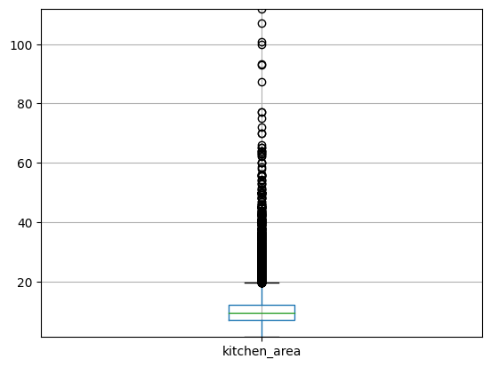
    


В целом даже не вызывает вопросов: 1.3 м кухню не заменить на 13, потому что тогда не умещаемся в `total_area`.


```python
df = df[
    (df['last_price'] <= df['last_price'].quantile(0.995)) & (df['last_price'] >= df['last_price'].quantile(0.005)) 
    & (df['total_area'] <= df['total_area'].quantile(0.995)) & (df['total_area'] >= df['total_area'].quantile(0.005))
    & (df['rooms'] <= df['rooms'].quantile(0.995)) 
    & (df['ceiling_height'] <= df['ceiling_height'].quantile(0.995))
    #& (df['floors_total'] <= df['floors_total'].quantile(0.995)) & (df['floors_total'] >= df['floors_total'].quantile(0.005))
    #& (df['living_area'] <= df['living_area'].quantile(0.995)) & (df['living_area'] >= df['living_area'].quantile(0.005))
    #& (df['kitchen_area'] <= df['kitchen_area'].quantile(0.995)) & (df['kitchen_area'] >= df['kitchen_area'].quantile(0.005))
       ]
```


```python
df.describe()
```


<div>
<style scoped>
    .dataframe tbody tr th:only-of-type {
        vertical-align: middle;
    }

    .dataframe tbody tr th {
        vertical-align: top;
    }

    .dataframe thead th {
        text-align: right;
    }
</style>
<table border="1" class="dataframe">
  <thead>
    <tr style="text-align: right;">
      <th></th>
      <th>total_images</th>
      <th>last_price</th>
      <th>total_area</th>
      <th>rooms</th>
      <th>ceiling_height</th>
      <th>floors_total</th>
      <th>living_area</th>
      <th>floor</th>
      <th>kitchen_area</th>
      <th>balcony</th>
      <th>airports_nearest</th>
      <th>cityCenters_nearest</th>
      <th>parks_around3000</th>
      <th>parks_nearest</th>
      <th>ponds_around3000</th>
      <th>ponds_nearest</th>
      <th>days_exposition</th>
    </tr>
  </thead>
  <tbody>
    <tr>
      <th>count</th>
      <td>20893.00</td>
      <td>20893.00</td>
      <td>20893.00</td>
      <td>20893.00</td>
      <td>20893.00</td>
      <td>20893.00</td>
      <td>19439.00</td>
      <td>20893.00</td>
      <td>19160.00</td>
      <td>20893.00</td>
      <td>18355.00</td>
      <td>18327.00</td>
      <td>17730.00</td>
      <td>7808.00</td>
      <td>17730.00</td>
      <td>8792.00</td>
      <td>18103.00</td>
    </tr>
    <tr>
      <th>mean</th>
      <td>9.97</td>
      <td>6269033.12</td>
      <td>59.40</td>
      <td>2.06</td>
      <td>2.70</td>
      <td>11.00</td>
      <td>33.89</td>
      <td>6.04</td>
      <td>10.52</td>
      <td>0.62</td>
      <td>29600.47</td>
      <td>14588.01</td>
      <td>0.60</td>
      <td>492.19</td>
      <td>0.76</td>
      <td>521.09</td>
      <td>182.54</td>
    </tr>
    <tr>
      <th>std</th>
      <td>5.68</td>
      <td>4998822.93</td>
      <td>27.93</td>
      <td>1.00</td>
      <td>0.22</td>
      <td>6.59</td>
      <td>18.18</td>
      <td>4.94</td>
      <td>5.45</td>
      <td>0.98</td>
      <td>13131.53</td>
      <td>8588.54</td>
      <td>0.79</td>
      <td>342.62</td>
      <td>0.93</td>
      <td>277.76</td>
      <td>221.68</td>
    </tr>
    <tr>
      <th>min</th>
      <td>0.00</td>
      <td>1050000.00</td>
      <td>24.00</td>
      <td>0.00</td>
      <td>2.25</td>
      <td>1.00</td>
      <td>3.00</td>
      <td>1.00</td>
      <td>1.30</td>
      <td>0.00</td>
      <td>0.00</td>
      <td>181.00</td>
      <td>0.00</td>
      <td>1.00</td>
      <td>0.00</td>
      <td>13.00</td>
      <td>1.00</td>
    </tr>
    <tr>
      <th>25%</th>
      <td>6.00</td>
      <td>3650000.00</td>
      <td>40.50</td>
      <td>1.00</td>
      <td>2.60</td>
      <td>5.00</td>
      <td>19.00</td>
      <td>2.00</td>
      <td>7.00</td>
      <td>0.00</td>
      <td>18727.00</td>
      <td>9700.00</td>
      <td>0.00</td>
      <td>288.00</td>
      <td>0.00</td>
      <td>298.00</td>
      <td>45.00</td>
    </tr>
    <tr>
      <th>50%</th>
      <td>10.00</td>
      <td>4850000.00</td>
      <td>52.40</td>
      <td>2.00</td>
      <td>2.60</td>
      <td>9.00</td>
      <td>30.10</td>
      <td>5.00</td>
      <td>9.30</td>
      <td>0.00</td>
      <td>27556.00</td>
      <td>13354.00</td>
      <td>0.00</td>
      <td>456.00</td>
      <td>0.00</td>
      <td>505.50</td>
      <td>97.00</td>
    </tr>
    <tr>
      <th>75%</th>
      <td>14.00</td>
      <td>6990000.00</td>
      <td>70.00</td>
      <td>3.00</td>
      <td>2.80</td>
      <td>16.00</td>
      <td>42.50</td>
      <td>8.00</td>
      <td>12.00</td>
      <td>1.00</td>
      <td>38919.00</td>
      <td>16795.00</td>
      <td>1.00</td>
      <td>613.00</td>
      <td>1.00</td>
      <td>733.00</td>
      <td>233.00</td>
    </tr>
    <tr>
      <th>max</th>
      <td>50.00</td>
      <td>57906000.00</td>
      <td>251.00</td>
      <td>6.00</td>
      <td>3.90</td>
      <td>36.00</td>
      <td>184.00</td>
      <td>33.00</td>
      <td>87.20</td>
      <td>5.00</td>
      <td>84869.00</td>
      <td>65968.00</td>
      <td>3.00</td>
      <td>3190.00</td>
      <td>3.00</td>
      <td>1344.00</td>
      <td>1580.00</td>
    </tr>
  </tbody>
</table>
</div>


```python
len(df)
```


    20893


**Как итог: мы порезали чуть меньше 12% датафрейма. Да, это немного больше, чем критические 10%, но попытки раздвигать границы обрезки приводят к просачиванию экстремально низких или высоких значений. А сейчас все-таки датафрейм выглядит достаточно правдоподобно.** 

## Посчитайте и добавьте в таблицу новые столбцы

### Цена одного квадратного метра


```python
# цену квадратного метра найдем делением цены  на общую площадь 
df['price_per_m2'] = df['last_price'] / df['total_area']
```


```python
# посмотрим на результат 
df.head(10)
```


<div>
<style scoped>
    .dataframe tbody tr th:only-of-type {
        vertical-align: middle;
    }

    .dataframe tbody tr th {
        vertical-align: top;
    }

    .dataframe thead th {
        text-align: right;
    }
</style>
<table border="1" class="dataframe">
  <thead>
    <tr style="text-align: right;">
      <th></th>
      <th>total_images</th>
      <th>last_price</th>
      <th>total_area</th>
      <th>first_day_exposition</th>
      <th>rooms</th>
      <th>ceiling_height</th>
      <th>floors_total</th>
      <th>living_area</th>
      <th>floor</th>
      <th>is_apartment</th>
      <th>studio</th>
      <th>open_plan</th>
      <th>kitchen_area</th>
      <th>balcony</th>
      <th>locality_name</th>
      <th>airports_nearest</th>
      <th>cityCenters_nearest</th>
      <th>parks_around3000</th>
      <th>parks_nearest</th>
      <th>ponds_around3000</th>
      <th>ponds_nearest</th>
      <th>days_exposition</th>
      <th>distance_from_centers</th>
      <th>price_per_m2</th>
    </tr>
  </thead>
  <tbody>
    <tr>
      <th>0</th>
      <td>20</td>
      <td>13000000.00</td>
      <td>108.00</td>
      <td>2019-03-07</td>
      <td>3</td>
      <td>2.70</td>
      <td>16</td>
      <td>51.00</td>
      <td>8</td>
      <td>False</td>
      <td>False</td>
      <td>False</td>
      <td>25.00</td>
      <td>0</td>
      <td>Санкт-Петербург</td>
      <td>18863.00</td>
      <td>16028.00</td>
      <td>1</td>
      <td>482.00</td>
      <td>2</td>
      <td>755.00</td>
      <td>NaN</td>
      <td>ПГТ</td>
      <td>120370.37</td>
    </tr>
    <tr>
      <th>1</th>
      <td>7</td>
      <td>3350000.00</td>
      <td>40.40</td>
      <td>2018-12-04</td>
      <td>1</td>
      <td>2.60</td>
      <td>11</td>
      <td>18.60</td>
      <td>1</td>
      <td>False</td>
      <td>False</td>
      <td>False</td>
      <td>11.00</td>
      <td>2</td>
      <td>Шушары</td>
      <td>12817.00</td>
      <td>18603.00</td>
      <td>0</td>
      <td>NaN</td>
      <td>0</td>
      <td>NaN</td>
      <td>81.00</td>
      <td>ПГТ</td>
      <td>82920.79</td>
    </tr>
    <tr>
      <th>2</th>
      <td>10</td>
      <td>5196000.00</td>
      <td>56.00</td>
      <td>2015-08-20</td>
      <td>2</td>
      <td>2.60</td>
      <td>5</td>
      <td>34.30</td>
      <td>4</td>
      <td>False</td>
      <td>False</td>
      <td>False</td>
      <td>8.30</td>
      <td>0</td>
      <td>Санкт-Петербург</td>
      <td>21741.00</td>
      <td>13933.00</td>
      <td>1</td>
      <td>90.00</td>
      <td>2</td>
      <td>574.00</td>
      <td>558.00</td>
      <td>окраина города</td>
      <td>92785.71</td>
    </tr>
    <tr>
      <th>4</th>
      <td>2</td>
      <td>10000000.00</td>
      <td>100.00</td>
      <td>2018-06-19</td>
      <td>2</td>
      <td>3.03</td>
      <td>14</td>
      <td>32.00</td>
      <td>13</td>
      <td>False</td>
      <td>False</td>
      <td>False</td>
      <td>41.00</td>
      <td>0</td>
      <td>Санкт-Петербург</td>
      <td>31856.00</td>
      <td>8098.00</td>
      <td>2</td>
      <td>112.00</td>
      <td>1</td>
      <td>48.00</td>
      <td>121.00</td>
      <td>город</td>
      <td>100000.00</td>
    </tr>
    <tr>
      <th>6</th>
      <td>6</td>
      <td>3700000.00</td>
      <td>37.30</td>
      <td>2017-11-02</td>
      <td>1</td>
      <td>2.60</td>
      <td>26</td>
      <td>10.60</td>
      <td>6</td>
      <td>False</td>
      <td>False</td>
      <td>False</td>
      <td>14.40</td>
      <td>1</td>
      <td>Парголово</td>
      <td>52996.00</td>
      <td>19143.00</td>
      <td>0</td>
      <td>NaN</td>
      <td>0</td>
      <td>NaN</td>
      <td>155.00</td>
      <td>ПГТ</td>
      <td>99195.71</td>
    </tr>
    <tr>
      <th>7</th>
      <td>5</td>
      <td>7915000.00</td>
      <td>71.60</td>
      <td>2019-04-18</td>
      <td>2</td>
      <td>2.60</td>
      <td>24</td>
      <td>NaN</td>
      <td>22</td>
      <td>False</td>
      <td>False</td>
      <td>False</td>
      <td>18.90</td>
      <td>2</td>
      <td>Санкт-Петербург</td>
      <td>23982.00</td>
      <td>11634.00</td>
      <td>0</td>
      <td>NaN</td>
      <td>0</td>
      <td>NaN</td>
      <td>NaN</td>
      <td>окраина города</td>
      <td>110544.69</td>
    </tr>
    <tr>
      <th>8</th>
      <td>20</td>
      <td>2900000.00</td>
      <td>33.16</td>
      <td>2018-05-23</td>
      <td>1</td>
      <td>2.60</td>
      <td>27</td>
      <td>15.43</td>
      <td>26</td>
      <td>False</td>
      <td>False</td>
      <td>False</td>
      <td>8.81</td>
      <td>0</td>
      <td>Мурино</td>
      <td>51553.00</td>
      <td>21888.00</td>
      <td>&lt;NA&gt;</td>
      <td>NaN</td>
      <td>&lt;NA&gt;</td>
      <td>NaN</td>
      <td>189.00</td>
      <td>ПГТ</td>
      <td>87454.76</td>
    </tr>
    <tr>
      <th>9</th>
      <td>18</td>
      <td>5400000.00</td>
      <td>61.00</td>
      <td>2017-02-26</td>
      <td>3</td>
      <td>2.50</td>
      <td>9</td>
      <td>43.60</td>
      <td>7</td>
      <td>False</td>
      <td>False</td>
      <td>False</td>
      <td>6.50</td>
      <td>2</td>
      <td>Санкт-Петербург</td>
      <td>50898.00</td>
      <td>15008.00</td>
      <td>0</td>
      <td>NaN</td>
      <td>0</td>
      <td>NaN</td>
      <td>289.00</td>
      <td>ПГТ</td>
      <td>88524.59</td>
    </tr>
    <tr>
      <th>10</th>
      <td>5</td>
      <td>5050000.00</td>
      <td>39.60</td>
      <td>2017-11-16</td>
      <td>1</td>
      <td>2.67</td>
      <td>12</td>
      <td>20.30</td>
      <td>3</td>
      <td>False</td>
      <td>False</td>
      <td>False</td>
      <td>8.50</td>
      <td>0</td>
      <td>Санкт-Петербург</td>
      <td>38357.00</td>
      <td>13878.00</td>
      <td>1</td>
      <td>310.00</td>
      <td>2</td>
      <td>553.00</td>
      <td>137.00</td>
      <td>окраина города</td>
      <td>127525.25</td>
    </tr>
    <tr>
      <th>11</th>
      <td>9</td>
      <td>3300000.00</td>
      <td>44.00</td>
      <td>2018-08-27</td>
      <td>2</td>
      <td>2.60</td>
      <td>5</td>
      <td>31.00</td>
      <td>4</td>
      <td>False</td>
      <td>False</td>
      <td>False</td>
      <td>6.00</td>
      <td>1</td>
      <td>Ломоносов</td>
      <td>48252.00</td>
      <td>51677.00</td>
      <td>0</td>
      <td>NaN</td>
      <td>0</td>
      <td>NaN</td>
      <td>7.00</td>
      <td>ПГТ</td>
      <td>75000.00</td>
    </tr>
  </tbody>
</table>
</div>


### День недели публикации объявления 

⚠️**Из расчёта: 0 - понедельник, 6 - воскресенье.**


```python
df['weekday'] = df['first_day_exposition'].dt.weekday
```


```python
# проверяем результат
df.tail(10)
```


<div>
<style scoped>
    .dataframe tbody tr th:only-of-type {
        vertical-align: middle;
    }

    .dataframe tbody tr th {
        vertical-align: top;
    }

    .dataframe thead th {
        text-align: right;
    }
</style>
<table border="1" class="dataframe">
  <thead>
    <tr style="text-align: right;">
      <th></th>
      <th>total_images</th>
      <th>last_price</th>
      <th>total_area</th>
      <th>first_day_exposition</th>
      <th>rooms</th>
      <th>ceiling_height</th>
      <th>floors_total</th>
      <th>living_area</th>
      <th>floor</th>
      <th>is_apartment</th>
      <th>studio</th>
      <th>open_plan</th>
      <th>kitchen_area</th>
      <th>balcony</th>
      <th>locality_name</th>
      <th>airports_nearest</th>
      <th>cityCenters_nearest</th>
      <th>parks_around3000</th>
      <th>parks_nearest</th>
      <th>ponds_around3000</th>
      <th>ponds_nearest</th>
      <th>days_exposition</th>
      <th>distance_from_centers</th>
      <th>price_per_m2</th>
      <th>weekday</th>
    </tr>
  </thead>
  <tbody>
    <tr>
      <th>23686</th>
      <td>8</td>
      <td>3300000.00</td>
      <td>31.00</td>
      <td>2017-04-29</td>
      <td>1</td>
      <td>2.55</td>
      <td>9</td>
      <td>18.00</td>
      <td>6</td>
      <td>False</td>
      <td>False</td>
      <td>False</td>
      <td>6.50</td>
      <td>0</td>
      <td>Санкт-Петербург</td>
      <td>11751.00</td>
      <td>11602.00</td>
      <td>1</td>
      <td>140.00</td>
      <td>1</td>
      <td>317.00</td>
      <td>193.00</td>
      <td>окраина города</td>
      <td>106451.61</td>
      <td>5</td>
    </tr>
    <tr>
      <th>23687</th>
      <td>6</td>
      <td>3200000.00</td>
      <td>39.00</td>
      <td>2017-12-16</td>
      <td>1</td>
      <td>2.60</td>
      <td>9</td>
      <td>20.00</td>
      <td>6</td>
      <td>False</td>
      <td>False</td>
      <td>False</td>
      <td>11.00</td>
      <td>2</td>
      <td>Санкт-Петербург</td>
      <td>40837.00</td>
      <td>16704.00</td>
      <td>0</td>
      <td>NaN</td>
      <td>0</td>
      <td>NaN</td>
      <td>38.00</td>
      <td>ПГТ</td>
      <td>82051.28</td>
      <td>5</td>
    </tr>
    <tr>
      <th>23688</th>
      <td>19</td>
      <td>9200000.00</td>
      <td>101.00</td>
      <td>2019-04-01</td>
      <td>3</td>
      <td>3.05</td>
      <td>15</td>
      <td>63.00</td>
      <td>12</td>
      <td>False</td>
      <td>False</td>
      <td>False</td>
      <td>15.00</td>
      <td>0</td>
      <td>Санкт-Петербург</td>
      <td>15632.00</td>
      <td>14428.00</td>
      <td>0</td>
      <td>NaN</td>
      <td>0</td>
      <td>NaN</td>
      <td>23.00</td>
      <td>окраина города</td>
      <td>91089.11</td>
      <td>0</td>
    </tr>
    <tr>
      <th>23689</th>
      <td>13</td>
      <td>3550000.00</td>
      <td>35.30</td>
      <td>2018-02-28</td>
      <td>1</td>
      <td>2.86</td>
      <td>15</td>
      <td>16.30</td>
      <td>4</td>
      <td>False</td>
      <td>False</td>
      <td>False</td>
      <td>9.10</td>
      <td>2</td>
      <td>Санкт-Петербург</td>
      <td>17284.00</td>
      <td>16081.00</td>
      <td>1</td>
      <td>353.00</td>
      <td>2</td>
      <td>652.00</td>
      <td>29.00</td>
      <td>ПГТ</td>
      <td>100566.57</td>
      <td>2</td>
    </tr>
    <tr>
      <th>23690</th>
      <td>3</td>
      <td>5500000.00</td>
      <td>52.00</td>
      <td>2018-07-19</td>
      <td>2</td>
      <td>2.80</td>
      <td>5</td>
      <td>31.00</td>
      <td>2</td>
      <td>False</td>
      <td>False</td>
      <td>False</td>
      <td>6.00</td>
      <td>0</td>
      <td>Санкт-Петербург</td>
      <td>20151.00</td>
      <td>6263.00</td>
      <td>1</td>
      <td>300.00</td>
      <td>0</td>
      <td>NaN</td>
      <td>15.00</td>
      <td>город</td>
      <td>105769.23</td>
      <td>3</td>
    </tr>
    <tr>
      <th>23691</th>
      <td>11</td>
      <td>9470000.00</td>
      <td>72.90</td>
      <td>2016-10-13</td>
      <td>2</td>
      <td>2.75</td>
      <td>25</td>
      <td>40.30</td>
      <td>7</td>
      <td>False</td>
      <td>False</td>
      <td>False</td>
      <td>10.60</td>
      <td>1</td>
      <td>Санкт-Петербург</td>
      <td>19424.00</td>
      <td>4489.00</td>
      <td>0</td>
      <td>NaN</td>
      <td>1</td>
      <td>806.00</td>
      <td>519.00</td>
      <td>центр</td>
      <td>129903.98</td>
      <td>3</td>
    </tr>
    <tr>
      <th>23693</th>
      <td>9</td>
      <td>4600000.00</td>
      <td>62.40</td>
      <td>2016-08-05</td>
      <td>3</td>
      <td>2.60</td>
      <td>9</td>
      <td>40.00</td>
      <td>8</td>
      <td>False</td>
      <td>False</td>
      <td>False</td>
      <td>8.00</td>
      <td>0</td>
      <td>Петергоф</td>
      <td>45602.00</td>
      <td>34104.00</td>
      <td>1</td>
      <td>352.00</td>
      <td>1</td>
      <td>675.00</td>
      <td>239.00</td>
      <td>ПГТ</td>
      <td>73717.95</td>
      <td>4</td>
    </tr>
    <tr>
      <th>23694</th>
      <td>9</td>
      <td>9700000.00</td>
      <td>133.81</td>
      <td>2017-03-21</td>
      <td>3</td>
      <td>3.70</td>
      <td>5</td>
      <td>73.30</td>
      <td>3</td>
      <td>False</td>
      <td>False</td>
      <td>False</td>
      <td>13.83</td>
      <td>0</td>
      <td>Санкт-Петербург</td>
      <td>24665.00</td>
      <td>4232.00</td>
      <td>1</td>
      <td>796.00</td>
      <td>3</td>
      <td>381.00</td>
      <td>NaN</td>
      <td>центр</td>
      <td>72490.85</td>
      <td>1</td>
    </tr>
    <tr>
      <th>23697</th>
      <td>13</td>
      <td>11475000.00</td>
      <td>76.75</td>
      <td>2017-03-28</td>
      <td>2</td>
      <td>3.00</td>
      <td>17</td>
      <td>NaN</td>
      <td>12</td>
      <td>False</td>
      <td>False</td>
      <td>False</td>
      <td>23.30</td>
      <td>2</td>
      <td>Санкт-Петербург</td>
      <td>39140.00</td>
      <td>10364.00</td>
      <td>2</td>
      <td>173.00</td>
      <td>3</td>
      <td>196.00</td>
      <td>602.00</td>
      <td>окраина города</td>
      <td>149511.40</td>
      <td>1</td>
    </tr>
    <tr>
      <th>23698</th>
      <td>4</td>
      <td>1350000.00</td>
      <td>32.30</td>
      <td>2017-07-21</td>
      <td>1</td>
      <td>2.50</td>
      <td>5</td>
      <td>12.30</td>
      <td>1</td>
      <td>False</td>
      <td>False</td>
      <td>False</td>
      <td>9.00</td>
      <td>0</td>
      <td>Новый Учхоз</td>
      <td>NaN</td>
      <td>NaN</td>
      <td>&lt;NA&gt;</td>
      <td>NaN</td>
      <td>&lt;NA&gt;</td>
      <td>NaN</td>
      <td>NaN</td>
      <td>None</td>
      <td>41795.67</td>
      <td>4</td>
    </tr>
  </tbody>
</table>
</div>


```python
# просто для красоты 
for day in df['weekday'].unique():
    if day == 0:
        df.loc[(df['weekday'] == day), 'weekday_word'] = 'понедельник'
    elif day == 1:
        df.loc[(df['weekday'] == day), 'weekday_word'] = 'вторник'
    elif day == 2:
        df.loc[(df['weekday'] == day), 'weekday_word'] = 'среда'
    elif day == 3:
        df.loc[(df['weekday'] == day), 'weekday_word'] = 'четверг'
    elif day == 4:
        df.loc[(df['weekday'] == day), 'weekday_word'] = 'пятница'
    elif day == 5:
        df.loc[(df['weekday'] == day), 'weekday_word'] = 'суббота'
    elif day == 6:
        df.loc[(df['weekday'] == day), 'weekday_word'] = 'воскресенье'
        
df.head()
```


<div>
<style scoped>
    .dataframe tbody tr th:only-of-type {
        vertical-align: middle;
    }

    .dataframe tbody tr th {
        vertical-align: top;
    }

    .dataframe thead th {
        text-align: right;
    }
</style>
<table border="1" class="dataframe">
  <thead>
    <tr style="text-align: right;">
      <th></th>
      <th>total_images</th>
      <th>last_price</th>
      <th>total_area</th>
      <th>first_day_exposition</th>
      <th>rooms</th>
      <th>ceiling_height</th>
      <th>floors_total</th>
      <th>living_area</th>
      <th>floor</th>
      <th>is_apartment</th>
      <th>studio</th>
      <th>open_plan</th>
      <th>kitchen_area</th>
      <th>balcony</th>
      <th>locality_name</th>
      <th>airports_nearest</th>
      <th>cityCenters_nearest</th>
      <th>parks_around3000</th>
      <th>parks_nearest</th>
      <th>ponds_around3000</th>
      <th>ponds_nearest</th>
      <th>days_exposition</th>
      <th>distance_from_centers</th>
      <th>price_per_m2</th>
      <th>weekday</th>
      <th>weekday_word</th>
    </tr>
  </thead>
  <tbody>
    <tr>
      <th>0</th>
      <td>20</td>
      <td>13000000.00</td>
      <td>108.00</td>
      <td>2019-03-07</td>
      <td>3</td>
      <td>2.70</td>
      <td>16</td>
      <td>51.00</td>
      <td>8</td>
      <td>False</td>
      <td>False</td>
      <td>False</td>
      <td>25.00</td>
      <td>0</td>
      <td>Санкт-Петербург</td>
      <td>18863.00</td>
      <td>16028.00</td>
      <td>1</td>
      <td>482.00</td>
      <td>2</td>
      <td>755.00</td>
      <td>NaN</td>
      <td>ПГТ</td>
      <td>120370.37</td>
      <td>3</td>
      <td>четверг</td>
    </tr>
    <tr>
      <th>1</th>
      <td>7</td>
      <td>3350000.00</td>
      <td>40.40</td>
      <td>2018-12-04</td>
      <td>1</td>
      <td>2.60</td>
      <td>11</td>
      <td>18.60</td>
      <td>1</td>
      <td>False</td>
      <td>False</td>
      <td>False</td>
      <td>11.00</td>
      <td>2</td>
      <td>Шушары</td>
      <td>12817.00</td>
      <td>18603.00</td>
      <td>0</td>
      <td>NaN</td>
      <td>0</td>
      <td>NaN</td>
      <td>81.00</td>
      <td>ПГТ</td>
      <td>82920.79</td>
      <td>1</td>
      <td>вторник</td>
    </tr>
    <tr>
      <th>2</th>
      <td>10</td>
      <td>5196000.00</td>
      <td>56.00</td>
      <td>2015-08-20</td>
      <td>2</td>
      <td>2.60</td>
      <td>5</td>
      <td>34.30</td>
      <td>4</td>
      <td>False</td>
      <td>False</td>
      <td>False</td>
      <td>8.30</td>
      <td>0</td>
      <td>Санкт-Петербург</td>
      <td>21741.00</td>
      <td>13933.00</td>
      <td>1</td>
      <td>90.00</td>
      <td>2</td>
      <td>574.00</td>
      <td>558.00</td>
      <td>окраина города</td>
      <td>92785.71</td>
      <td>3</td>
      <td>четверг</td>
    </tr>
    <tr>
      <th>4</th>
      <td>2</td>
      <td>10000000.00</td>
      <td>100.00</td>
      <td>2018-06-19</td>
      <td>2</td>
      <td>3.03</td>
      <td>14</td>
      <td>32.00</td>
      <td>13</td>
      <td>False</td>
      <td>False</td>
      <td>False</td>
      <td>41.00</td>
      <td>0</td>
      <td>Санкт-Петербург</td>
      <td>31856.00</td>
      <td>8098.00</td>
      <td>2</td>
      <td>112.00</td>
      <td>1</td>
      <td>48.00</td>
      <td>121.00</td>
      <td>город</td>
      <td>100000.00</td>
      <td>1</td>
      <td>вторник</td>
    </tr>
    <tr>
      <th>6</th>
      <td>6</td>
      <td>3700000.00</td>
      <td>37.30</td>
      <td>2017-11-02</td>
      <td>1</td>
      <td>2.60</td>
      <td>26</td>
      <td>10.60</td>
      <td>6</td>
      <td>False</td>
      <td>False</td>
      <td>False</td>
      <td>14.40</td>
      <td>1</td>
      <td>Парголово</td>
      <td>52996.00</td>
      <td>19143.00</td>
      <td>0</td>
      <td>NaN</td>
      <td>0</td>
      <td>NaN</td>
      <td>155.00</td>
      <td>ПГТ</td>
      <td>99195.71</td>
      <td>3</td>
      <td>четверг</td>
    </tr>
  </tbody>
</table>
</div>


### Месяц публикации объявления


```python
df['month_exposition'] = df['first_day_exposition'].dt.month 
# результат
df.head()
```


<div>
<style scoped>
    .dataframe tbody tr th:only-of-type {
        vertical-align: middle;
    }

    .dataframe tbody tr th {
        vertical-align: top;
    }

    .dataframe thead th {
        text-align: right;
    }
</style>
<table border="1" class="dataframe">
  <thead>
    <tr style="text-align: right;">
      <th></th>
      <th>total_images</th>
      <th>last_price</th>
      <th>total_area</th>
      <th>first_day_exposition</th>
      <th>rooms</th>
      <th>ceiling_height</th>
      <th>floors_total</th>
      <th>living_area</th>
      <th>floor</th>
      <th>is_apartment</th>
      <th>studio</th>
      <th>open_plan</th>
      <th>kitchen_area</th>
      <th>balcony</th>
      <th>locality_name</th>
      <th>airports_nearest</th>
      <th>cityCenters_nearest</th>
      <th>parks_around3000</th>
      <th>parks_nearest</th>
      <th>ponds_around3000</th>
      <th>ponds_nearest</th>
      <th>days_exposition</th>
      <th>distance_from_centers</th>
      <th>price_per_m2</th>
      <th>weekday</th>
      <th>weekday_word</th>
      <th>month_exposition</th>
    </tr>
  </thead>
  <tbody>
    <tr>
      <th>0</th>
      <td>20</td>
      <td>13000000.00</td>
      <td>108.00</td>
      <td>2019-03-07</td>
      <td>3</td>
      <td>2.70</td>
      <td>16</td>
      <td>51.00</td>
      <td>8</td>
      <td>False</td>
      <td>False</td>
      <td>False</td>
      <td>25.00</td>
      <td>0</td>
      <td>Санкт-Петербург</td>
      <td>18863.00</td>
      <td>16028.00</td>
      <td>1</td>
      <td>482.00</td>
      <td>2</td>
      <td>755.00</td>
      <td>NaN</td>
      <td>ПГТ</td>
      <td>120370.37</td>
      <td>3</td>
      <td>четверг</td>
      <td>3</td>
    </tr>
    <tr>
      <th>1</th>
      <td>7</td>
      <td>3350000.00</td>
      <td>40.40</td>
      <td>2018-12-04</td>
      <td>1</td>
      <td>2.60</td>
      <td>11</td>
      <td>18.60</td>
      <td>1</td>
      <td>False</td>
      <td>False</td>
      <td>False</td>
      <td>11.00</td>
      <td>2</td>
      <td>Шушары</td>
      <td>12817.00</td>
      <td>18603.00</td>
      <td>0</td>
      <td>NaN</td>
      <td>0</td>
      <td>NaN</td>
      <td>81.00</td>
      <td>ПГТ</td>
      <td>82920.79</td>
      <td>1</td>
      <td>вторник</td>
      <td>12</td>
    </tr>
    <tr>
      <th>2</th>
      <td>10</td>
      <td>5196000.00</td>
      <td>56.00</td>
      <td>2015-08-20</td>
      <td>2</td>
      <td>2.60</td>
      <td>5</td>
      <td>34.30</td>
      <td>4</td>
      <td>False</td>
      <td>False</td>
      <td>False</td>
      <td>8.30</td>
      <td>0</td>
      <td>Санкт-Петербург</td>
      <td>21741.00</td>
      <td>13933.00</td>
      <td>1</td>
      <td>90.00</td>
      <td>2</td>
      <td>574.00</td>
      <td>558.00</td>
      <td>окраина города</td>
      <td>92785.71</td>
      <td>3</td>
      <td>четверг</td>
      <td>8</td>
    </tr>
    <tr>
      <th>4</th>
      <td>2</td>
      <td>10000000.00</td>
      <td>100.00</td>
      <td>2018-06-19</td>
      <td>2</td>
      <td>3.03</td>
      <td>14</td>
      <td>32.00</td>
      <td>13</td>
      <td>False</td>
      <td>False</td>
      <td>False</td>
      <td>41.00</td>
      <td>0</td>
      <td>Санкт-Петербург</td>
      <td>31856.00</td>
      <td>8098.00</td>
      <td>2</td>
      <td>112.00</td>
      <td>1</td>
      <td>48.00</td>
      <td>121.00</td>
      <td>город</td>
      <td>100000.00</td>
      <td>1</td>
      <td>вторник</td>
      <td>6</td>
    </tr>
    <tr>
      <th>6</th>
      <td>6</td>
      <td>3700000.00</td>
      <td>37.30</td>
      <td>2017-11-02</td>
      <td>1</td>
      <td>2.60</td>
      <td>26</td>
      <td>10.60</td>
      <td>6</td>
      <td>False</td>
      <td>False</td>
      <td>False</td>
      <td>14.40</td>
      <td>1</td>
      <td>Парголово</td>
      <td>52996.00</td>
      <td>19143.00</td>
      <td>0</td>
      <td>NaN</td>
      <td>0</td>
      <td>NaN</td>
      <td>155.00</td>
      <td>ПГТ</td>
      <td>99195.71</td>
      <td>3</td>
      <td>четверг</td>
      <td>11</td>
    </tr>
  </tbody>
</table>
</div>


### Год публикации обявления


```python
df['year_exposition'] = df['first_day_exposition'].dt.year
# результат
df.head()
```


<div>
<style scoped>
    .dataframe tbody tr th:only-of-type {
        vertical-align: middle;
    }

    .dataframe tbody tr th {
        vertical-align: top;
    }

    .dataframe thead th {
        text-align: right;
    }
</style>
<table border="1" class="dataframe">
  <thead>
    <tr style="text-align: right;">
      <th></th>
      <th>total_images</th>
      <th>last_price</th>
      <th>total_area</th>
      <th>first_day_exposition</th>
      <th>rooms</th>
      <th>ceiling_height</th>
      <th>floors_total</th>
      <th>living_area</th>
      <th>floor</th>
      <th>is_apartment</th>
      <th>studio</th>
      <th>open_plan</th>
      <th>kitchen_area</th>
      <th>balcony</th>
      <th>locality_name</th>
      <th>airports_nearest</th>
      <th>cityCenters_nearest</th>
      <th>parks_around3000</th>
      <th>parks_nearest</th>
      <th>ponds_around3000</th>
      <th>ponds_nearest</th>
      <th>days_exposition</th>
      <th>distance_from_centers</th>
      <th>price_per_m2</th>
      <th>weekday</th>
      <th>weekday_word</th>
      <th>month_exposition</th>
      <th>year_exposition</th>
    </tr>
  </thead>
  <tbody>
    <tr>
      <th>0</th>
      <td>20</td>
      <td>13000000.00</td>
      <td>108.00</td>
      <td>2019-03-07</td>
      <td>3</td>
      <td>2.70</td>
      <td>16</td>
      <td>51.00</td>
      <td>8</td>
      <td>False</td>
      <td>False</td>
      <td>False</td>
      <td>25.00</td>
      <td>0</td>
      <td>Санкт-Петербург</td>
      <td>18863.00</td>
      <td>16028.00</td>
      <td>1</td>
      <td>482.00</td>
      <td>2</td>
      <td>755.00</td>
      <td>NaN</td>
      <td>ПГТ</td>
      <td>120370.37</td>
      <td>3</td>
      <td>четверг</td>
      <td>3</td>
      <td>2019</td>
    </tr>
    <tr>
      <th>1</th>
      <td>7</td>
      <td>3350000.00</td>
      <td>40.40</td>
      <td>2018-12-04</td>
      <td>1</td>
      <td>2.60</td>
      <td>11</td>
      <td>18.60</td>
      <td>1</td>
      <td>False</td>
      <td>False</td>
      <td>False</td>
      <td>11.00</td>
      <td>2</td>
      <td>Шушары</td>
      <td>12817.00</td>
      <td>18603.00</td>
      <td>0</td>
      <td>NaN</td>
      <td>0</td>
      <td>NaN</td>
      <td>81.00</td>
      <td>ПГТ</td>
      <td>82920.79</td>
      <td>1</td>
      <td>вторник</td>
      <td>12</td>
      <td>2018</td>
    </tr>
    <tr>
      <th>2</th>
      <td>10</td>
      <td>5196000.00</td>
      <td>56.00</td>
      <td>2015-08-20</td>
      <td>2</td>
      <td>2.60</td>
      <td>5</td>
      <td>34.30</td>
      <td>4</td>
      <td>False</td>
      <td>False</td>
      <td>False</td>
      <td>8.30</td>
      <td>0</td>
      <td>Санкт-Петербург</td>
      <td>21741.00</td>
      <td>13933.00</td>
      <td>1</td>
      <td>90.00</td>
      <td>2</td>
      <td>574.00</td>
      <td>558.00</td>
      <td>окраина города</td>
      <td>92785.71</td>
      <td>3</td>
      <td>четверг</td>
      <td>8</td>
      <td>2015</td>
    </tr>
    <tr>
      <th>4</th>
      <td>2</td>
      <td>10000000.00</td>
      <td>100.00</td>
      <td>2018-06-19</td>
      <td>2</td>
      <td>3.03</td>
      <td>14</td>
      <td>32.00</td>
      <td>13</td>
      <td>False</td>
      <td>False</td>
      <td>False</td>
      <td>41.00</td>
      <td>0</td>
      <td>Санкт-Петербург</td>
      <td>31856.00</td>
      <td>8098.00</td>
      <td>2</td>
      <td>112.00</td>
      <td>1</td>
      <td>48.00</td>
      <td>121.00</td>
      <td>город</td>
      <td>100000.00</td>
      <td>1</td>
      <td>вторник</td>
      <td>6</td>
      <td>2018</td>
    </tr>
    <tr>
      <th>6</th>
      <td>6</td>
      <td>3700000.00</td>
      <td>37.30</td>
      <td>2017-11-02</td>
      <td>1</td>
      <td>2.60</td>
      <td>26</td>
      <td>10.60</td>
      <td>6</td>
      <td>False</td>
      <td>False</td>
      <td>False</td>
      <td>14.40</td>
      <td>1</td>
      <td>Парголово</td>
      <td>52996.00</td>
      <td>19143.00</td>
      <td>0</td>
      <td>NaN</td>
      <td>0</td>
      <td>NaN</td>
      <td>155.00</td>
      <td>ПГТ</td>
      <td>99195.71</td>
      <td>3</td>
      <td>четверг</td>
      <td>11</td>
      <td>2017</td>
    </tr>
  </tbody>
</table>
</div>


### Тип этажа квартиры

**Выделим три типа этажей:**  
- первый;  
- последний 
- другой  


```python
df['floor_type'] = np.where((df['floor'] == 1) & (df['floor'] != df['floors_total']), 'первый', 'другой')
df['floor_type'] = np. where(df['floor'] == df['floors_total'], 'последний', df['floor_type'])
df.head(15)
```


<div>
<style scoped>
    .dataframe tbody tr th:only-of-type {
        vertical-align: middle;
    }

    .dataframe tbody tr th {
        vertical-align: top;
    }

    .dataframe thead th {
        text-align: right;
    }
</style>
<table border="1" class="dataframe">
  <thead>
    <tr style="text-align: right;">
      <th></th>
      <th>total_images</th>
      <th>last_price</th>
      <th>total_area</th>
      <th>first_day_exposition</th>
      <th>rooms</th>
      <th>ceiling_height</th>
      <th>floors_total</th>
      <th>living_area</th>
      <th>floor</th>
      <th>is_apartment</th>
      <th>studio</th>
      <th>open_plan</th>
      <th>kitchen_area</th>
      <th>balcony</th>
      <th>locality_name</th>
      <th>airports_nearest</th>
      <th>cityCenters_nearest</th>
      <th>parks_around3000</th>
      <th>parks_nearest</th>
      <th>ponds_around3000</th>
      <th>ponds_nearest</th>
      <th>days_exposition</th>
      <th>distance_from_centers</th>
      <th>price_per_m2</th>
      <th>weekday</th>
      <th>weekday_word</th>
      <th>month_exposition</th>
      <th>year_exposition</th>
      <th>floor_type</th>
    </tr>
  </thead>
  <tbody>
    <tr>
      <th>0</th>
      <td>20</td>
      <td>13000000.00</td>
      <td>108.00</td>
      <td>2019-03-07</td>
      <td>3</td>
      <td>2.70</td>
      <td>16</td>
      <td>51.00</td>
      <td>8</td>
      <td>False</td>
      <td>False</td>
      <td>False</td>
      <td>25.00</td>
      <td>0</td>
      <td>Санкт-Петербург</td>
      <td>18863.00</td>
      <td>16028.00</td>
      <td>1</td>
      <td>482.00</td>
      <td>2</td>
      <td>755.00</td>
      <td>NaN</td>
      <td>ПГТ</td>
      <td>120370.37</td>
      <td>3</td>
      <td>четверг</td>
      <td>3</td>
      <td>2019</td>
      <td>другой</td>
    </tr>
    <tr>
      <th>1</th>
      <td>7</td>
      <td>3350000.00</td>
      <td>40.40</td>
      <td>2018-12-04</td>
      <td>1</td>
      <td>2.60</td>
      <td>11</td>
      <td>18.60</td>
      <td>1</td>
      <td>False</td>
      <td>False</td>
      <td>False</td>
      <td>11.00</td>
      <td>2</td>
      <td>Шушары</td>
      <td>12817.00</td>
      <td>18603.00</td>
      <td>0</td>
      <td>NaN</td>
      <td>0</td>
      <td>NaN</td>
      <td>81.00</td>
      <td>ПГТ</td>
      <td>82920.79</td>
      <td>1</td>
      <td>вторник</td>
      <td>12</td>
      <td>2018</td>
      <td>первый</td>
    </tr>
    <tr>
      <th>2</th>
      <td>10</td>
      <td>5196000.00</td>
      <td>56.00</td>
      <td>2015-08-20</td>
      <td>2</td>
      <td>2.60</td>
      <td>5</td>
      <td>34.30</td>
      <td>4</td>
      <td>False</td>
      <td>False</td>
      <td>False</td>
      <td>8.30</td>
      <td>0</td>
      <td>Санкт-Петербург</td>
      <td>21741.00</td>
      <td>13933.00</td>
      <td>1</td>
      <td>90.00</td>
      <td>2</td>
      <td>574.00</td>
      <td>558.00</td>
      <td>окраина города</td>
      <td>92785.71</td>
      <td>3</td>
      <td>четверг</td>
      <td>8</td>
      <td>2015</td>
      <td>другой</td>
    </tr>
    <tr>
      <th>4</th>
      <td>2</td>
      <td>10000000.00</td>
      <td>100.00</td>
      <td>2018-06-19</td>
      <td>2</td>
      <td>3.03</td>
      <td>14</td>
      <td>32.00</td>
      <td>13</td>
      <td>False</td>
      <td>False</td>
      <td>False</td>
      <td>41.00</td>
      <td>0</td>
      <td>Санкт-Петербург</td>
      <td>31856.00</td>
      <td>8098.00</td>
      <td>2</td>
      <td>112.00</td>
      <td>1</td>
      <td>48.00</td>
      <td>121.00</td>
      <td>город</td>
      <td>100000.00</td>
      <td>1</td>
      <td>вторник</td>
      <td>6</td>
      <td>2018</td>
      <td>другой</td>
    </tr>
    <tr>
      <th>6</th>
      <td>6</td>
      <td>3700000.00</td>
      <td>37.30</td>
      <td>2017-11-02</td>
      <td>1</td>
      <td>2.60</td>
      <td>26</td>
      <td>10.60</td>
      <td>6</td>
      <td>False</td>
      <td>False</td>
      <td>False</td>
      <td>14.40</td>
      <td>1</td>
      <td>Парголово</td>
      <td>52996.00</td>
      <td>19143.00</td>
      <td>0</td>
      <td>NaN</td>
      <td>0</td>
      <td>NaN</td>
      <td>155.00</td>
      <td>ПГТ</td>
      <td>99195.71</td>
      <td>3</td>
      <td>четверг</td>
      <td>11</td>
      <td>2017</td>
      <td>другой</td>
    </tr>
    <tr>
      <th>7</th>
      <td>5</td>
      <td>7915000.00</td>
      <td>71.60</td>
      <td>2019-04-18</td>
      <td>2</td>
      <td>2.60</td>
      <td>24</td>
      <td>NaN</td>
      <td>22</td>
      <td>False</td>
      <td>False</td>
      <td>False</td>
      <td>18.90</td>
      <td>2</td>
      <td>Санкт-Петербург</td>
      <td>23982.00</td>
      <td>11634.00</td>
      <td>0</td>
      <td>NaN</td>
      <td>0</td>
      <td>NaN</td>
      <td>NaN</td>
      <td>окраина города</td>
      <td>110544.69</td>
      <td>3</td>
      <td>четверг</td>
      <td>4</td>
      <td>2019</td>
      <td>другой</td>
    </tr>
    <tr>
      <th>8</th>
      <td>20</td>
      <td>2900000.00</td>
      <td>33.16</td>
      <td>2018-05-23</td>
      <td>1</td>
      <td>2.60</td>
      <td>27</td>
      <td>15.43</td>
      <td>26</td>
      <td>False</td>
      <td>False</td>
      <td>False</td>
      <td>8.81</td>
      <td>0</td>
      <td>Мурино</td>
      <td>51553.00</td>
      <td>21888.00</td>
      <td>&lt;NA&gt;</td>
      <td>NaN</td>
      <td>&lt;NA&gt;</td>
      <td>NaN</td>
      <td>189.00</td>
      <td>ПГТ</td>
      <td>87454.76</td>
      <td>2</td>
      <td>среда</td>
      <td>5</td>
      <td>2018</td>
      <td>другой</td>
    </tr>
    <tr>
      <th>9</th>
      <td>18</td>
      <td>5400000.00</td>
      <td>61.00</td>
      <td>2017-02-26</td>
      <td>3</td>
      <td>2.50</td>
      <td>9</td>
      <td>43.60</td>
      <td>7</td>
      <td>False</td>
      <td>False</td>
      <td>False</td>
      <td>6.50</td>
      <td>2</td>
      <td>Санкт-Петербург</td>
      <td>50898.00</td>
      <td>15008.00</td>
      <td>0</td>
      <td>NaN</td>
      <td>0</td>
      <td>NaN</td>
      <td>289.00</td>
      <td>ПГТ</td>
      <td>88524.59</td>
      <td>6</td>
      <td>воскресенье</td>
      <td>2</td>
      <td>2017</td>
      <td>другой</td>
    </tr>
    <tr>
      <th>10</th>
      <td>5</td>
      <td>5050000.00</td>
      <td>39.60</td>
      <td>2017-11-16</td>
      <td>1</td>
      <td>2.67</td>
      <td>12</td>
      <td>20.30</td>
      <td>3</td>
      <td>False</td>
      <td>False</td>
      <td>False</td>
      <td>8.50</td>
      <td>0</td>
      <td>Санкт-Петербург</td>
      <td>38357.00</td>
      <td>13878.00</td>
      <td>1</td>
      <td>310.00</td>
      <td>2</td>
      <td>553.00</td>
      <td>137.00</td>
      <td>окраина города</td>
      <td>127525.25</td>
      <td>3</td>
      <td>четверг</td>
      <td>11</td>
      <td>2017</td>
      <td>другой</td>
    </tr>
    <tr>
      <th>11</th>
      <td>9</td>
      <td>3300000.00</td>
      <td>44.00</td>
      <td>2018-08-27</td>
      <td>2</td>
      <td>2.60</td>
      <td>5</td>
      <td>31.00</td>
      <td>4</td>
      <td>False</td>
      <td>False</td>
      <td>False</td>
      <td>6.00</td>
      <td>1</td>
      <td>Ломоносов</td>
      <td>48252.00</td>
      <td>51677.00</td>
      <td>0</td>
      <td>NaN</td>
      <td>0</td>
      <td>NaN</td>
      <td>7.00</td>
      <td>ПГТ</td>
      <td>75000.00</td>
      <td>0</td>
      <td>понедельник</td>
      <td>8</td>
      <td>2018</td>
      <td>другой</td>
    </tr>
    <tr>
      <th>13</th>
      <td>20</td>
      <td>3550000.00</td>
      <td>42.80</td>
      <td>2017-07-01</td>
      <td>2</td>
      <td>2.56</td>
      <td>5</td>
      <td>27.00</td>
      <td>5</td>
      <td>False</td>
      <td>False</td>
      <td>False</td>
      <td>5.20</td>
      <td>1</td>
      <td>Петергоф</td>
      <td>37868.00</td>
      <td>33058.00</td>
      <td>1</td>
      <td>294.00</td>
      <td>3</td>
      <td>298.00</td>
      <td>366.00</td>
      <td>ПГТ</td>
      <td>82943.93</td>
      <td>5</td>
      <td>суббота</td>
      <td>7</td>
      <td>2017</td>
      <td>последний</td>
    </tr>
    <tr>
      <th>14</th>
      <td>1</td>
      <td>4400000.00</td>
      <td>36.00</td>
      <td>2016-06-23</td>
      <td>1</td>
      <td>2.60</td>
      <td>6</td>
      <td>17.00</td>
      <td>1</td>
      <td>False</td>
      <td>False</td>
      <td>False</td>
      <td>8.00</td>
      <td>0</td>
      <td>Пушкин</td>
      <td>20782.00</td>
      <td>30759.00</td>
      <td>0</td>
      <td>NaN</td>
      <td>1</td>
      <td>96.00</td>
      <td>203.00</td>
      <td>ПГТ</td>
      <td>122222.22</td>
      <td>3</td>
      <td>четверг</td>
      <td>6</td>
      <td>2016</td>
      <td>первый</td>
    </tr>
    <tr>
      <th>15</th>
      <td>16</td>
      <td>4650000.00</td>
      <td>39.00</td>
      <td>2017-11-18</td>
      <td>1</td>
      <td>2.60</td>
      <td>14</td>
      <td>20.50</td>
      <td>5</td>
      <td>False</td>
      <td>False</td>
      <td>False</td>
      <td>7.60</td>
      <td>1</td>
      <td>Санкт-Петербург</td>
      <td>12900.00</td>
      <td>14259.00</td>
      <td>1</td>
      <td>590.00</td>
      <td>1</td>
      <td>296.00</td>
      <td>19.00</td>
      <td>окраина города</td>
      <td>119230.77</td>
      <td>5</td>
      <td>суббота</td>
      <td>11</td>
      <td>2017</td>
      <td>другой</td>
    </tr>
    <tr>
      <th>16</th>
      <td>11</td>
      <td>6700000.00</td>
      <td>82.00</td>
      <td>2017-11-23</td>
      <td>3</td>
      <td>3.05</td>
      <td>5</td>
      <td>55.60</td>
      <td>1</td>
      <td>False</td>
      <td>False</td>
      <td>False</td>
      <td>9.00</td>
      <td>0</td>
      <td>Санкт-Петербург</td>
      <td>22108.00</td>
      <td>10698.00</td>
      <td>3</td>
      <td>420.00</td>
      <td>0</td>
      <td>NaN</td>
      <td>397.00</td>
      <td>окраина города</td>
      <td>81707.32</td>
      <td>3</td>
      <td>четверг</td>
      <td>11</td>
      <td>2017</td>
      <td>первый</td>
    </tr>
    <tr>
      <th>17</th>
      <td>6</td>
      <td>4180000.00</td>
      <td>36.00</td>
      <td>2016-09-09</td>
      <td>1</td>
      <td>2.60</td>
      <td>17</td>
      <td>16.50</td>
      <td>7</td>
      <td>False</td>
      <td>False</td>
      <td>False</td>
      <td>11.00</td>
      <td>1</td>
      <td>Санкт-Петербург</td>
      <td>33564.00</td>
      <td>14616.00</td>
      <td>0</td>
      <td>NaN</td>
      <td>1</td>
      <td>859.00</td>
      <td>571.00</td>
      <td>окраина города</td>
      <td>116111.11</td>
      <td>4</td>
      <td>пятница</td>
      <td>9</td>
      <td>2016</td>
      <td>другой</td>
    </tr>
  </tbody>
</table>
</div>


### Расстояние до центра города в километрах

Переведем метры в километры и округлим до целых значений.


```python
df['cityCenters_nearest_km'] = round((df['cityCenters_nearest'] / 1000), 0)
# результат
df.head()
```


<div>
<style scoped>
    .dataframe tbody tr th:only-of-type {
        vertical-align: middle;
    }

    .dataframe tbody tr th {
        vertical-align: top;
    }

    .dataframe thead th {
        text-align: right;
    }
</style>
<table border="1" class="dataframe">
  <thead>
    <tr style="text-align: right;">
      <th></th>
      <th>total_images</th>
      <th>last_price</th>
      <th>total_area</th>
      <th>first_day_exposition</th>
      <th>rooms</th>
      <th>ceiling_height</th>
      <th>floors_total</th>
      <th>living_area</th>
      <th>floor</th>
      <th>is_apartment</th>
      <th>studio</th>
      <th>open_plan</th>
      <th>kitchen_area</th>
      <th>balcony</th>
      <th>locality_name</th>
      <th>airports_nearest</th>
      <th>cityCenters_nearest</th>
      <th>parks_around3000</th>
      <th>parks_nearest</th>
      <th>ponds_around3000</th>
      <th>ponds_nearest</th>
      <th>days_exposition</th>
      <th>distance_from_centers</th>
      <th>price_per_m2</th>
      <th>weekday</th>
      <th>weekday_word</th>
      <th>month_exposition</th>
      <th>year_exposition</th>
      <th>floor_type</th>
      <th>cityCenters_nearest_km</th>
    </tr>
  </thead>
  <tbody>
    <tr>
      <th>0</th>
      <td>20</td>
      <td>13000000.00</td>
      <td>108.00</td>
      <td>2019-03-07</td>
      <td>3</td>
      <td>2.70</td>
      <td>16</td>
      <td>51.00</td>
      <td>8</td>
      <td>False</td>
      <td>False</td>
      <td>False</td>
      <td>25.00</td>
      <td>0</td>
      <td>Санкт-Петербург</td>
      <td>18863.00</td>
      <td>16028.00</td>
      <td>1</td>
      <td>482.00</td>
      <td>2</td>
      <td>755.00</td>
      <td>NaN</td>
      <td>ПГТ</td>
      <td>120370.37</td>
      <td>3</td>
      <td>четверг</td>
      <td>3</td>
      <td>2019</td>
      <td>другой</td>
      <td>16.00</td>
    </tr>
    <tr>
      <th>1</th>
      <td>7</td>
      <td>3350000.00</td>
      <td>40.40</td>
      <td>2018-12-04</td>
      <td>1</td>
      <td>2.60</td>
      <td>11</td>
      <td>18.60</td>
      <td>1</td>
      <td>False</td>
      <td>False</td>
      <td>False</td>
      <td>11.00</td>
      <td>2</td>
      <td>Шушары</td>
      <td>12817.00</td>
      <td>18603.00</td>
      <td>0</td>
      <td>NaN</td>
      <td>0</td>
      <td>NaN</td>
      <td>81.00</td>
      <td>ПГТ</td>
      <td>82920.79</td>
      <td>1</td>
      <td>вторник</td>
      <td>12</td>
      <td>2018</td>
      <td>первый</td>
      <td>19.00</td>
    </tr>
    <tr>
      <th>2</th>
      <td>10</td>
      <td>5196000.00</td>
      <td>56.00</td>
      <td>2015-08-20</td>
      <td>2</td>
      <td>2.60</td>
      <td>5</td>
      <td>34.30</td>
      <td>4</td>
      <td>False</td>
      <td>False</td>
      <td>False</td>
      <td>8.30</td>
      <td>0</td>
      <td>Санкт-Петербург</td>
      <td>21741.00</td>
      <td>13933.00</td>
      <td>1</td>
      <td>90.00</td>
      <td>2</td>
      <td>574.00</td>
      <td>558.00</td>
      <td>окраина города</td>
      <td>92785.71</td>
      <td>3</td>
      <td>четверг</td>
      <td>8</td>
      <td>2015</td>
      <td>другой</td>
      <td>14.00</td>
    </tr>
    <tr>
      <th>4</th>
      <td>2</td>
      <td>10000000.00</td>
      <td>100.00</td>
      <td>2018-06-19</td>
      <td>2</td>
      <td>3.03</td>
      <td>14</td>
      <td>32.00</td>
      <td>13</td>
      <td>False</td>
      <td>False</td>
      <td>False</td>
      <td>41.00</td>
      <td>0</td>
      <td>Санкт-Петербург</td>
      <td>31856.00</td>
      <td>8098.00</td>
      <td>2</td>
      <td>112.00</td>
      <td>1</td>
      <td>48.00</td>
      <td>121.00</td>
      <td>город</td>
      <td>100000.00</td>
      <td>1</td>
      <td>вторник</td>
      <td>6</td>
      <td>2018</td>
      <td>другой</td>
      <td>8.00</td>
    </tr>
    <tr>
      <th>6</th>
      <td>6</td>
      <td>3700000.00</td>
      <td>37.30</td>
      <td>2017-11-02</td>
      <td>1</td>
      <td>2.60</td>
      <td>26</td>
      <td>10.60</td>
      <td>6</td>
      <td>False</td>
      <td>False</td>
      <td>False</td>
      <td>14.40</td>
      <td>1</td>
      <td>Парголово</td>
      <td>52996.00</td>
      <td>19143.00</td>
      <td>0</td>
      <td>NaN</td>
      <td>0</td>
      <td>NaN</td>
      <td>155.00</td>
      <td>ПГТ</td>
      <td>99195.71</td>
      <td>3</td>
      <td>четверг</td>
      <td>11</td>
      <td>2017</td>
      <td>другой</td>
      <td>19.00</td>
    </tr>
  </tbody>
</table>
</div>


## Исследовательский анализ данных

Построим гистограммы по интересующим нас столбцам. Исключим аномальные значения, чтобы они не мешали анализу.


```python
# чтобы ориентироваться
print('Размер датафрейма после всех манипуляций: ' + str(len(df)))
```

    Размер датафрейма после всех манипуляций: 20893
    

### Изучение числовых столбцов датафрейма

#### Общая площадь (`total_area`)


```python
# построение гистограммы
print_hist(df, 'total_area', 10)
```


    
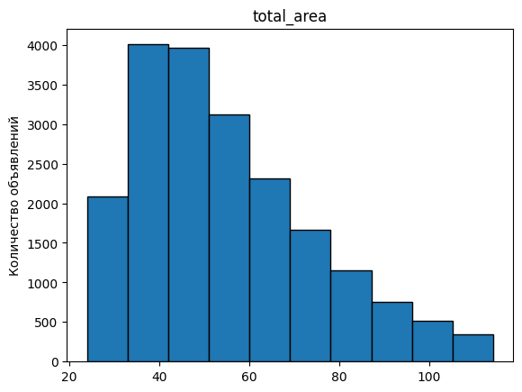
    


**Распределение по данному параметру похоже на нормальное со смещением влево. Экстремума на уровне 38-40 $м^2$.  
Около 60 процентов объявлений с общей площадью от 38 до 62 $м^2$.**

#### Жилая площадь (`living_area`)


```python
# построение гистограммы
print_hist(df, 'living_area', 10)
```


    
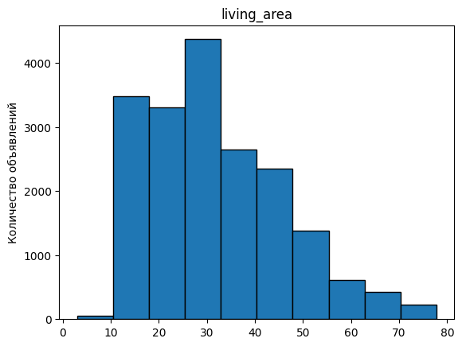
    


**Чуть больше половины объявлений - это квартиры с жилой площадью от 10 $м^2$ до 30-32 $м^2$. Квартиры с жилой площадью более 55 $м^2$ встречаются довольно редко, их меньше 2 тысяч на весь датафрейм.**

#### Площадь кухни (`kitchen_area`)


```python
# построение гистограммы
print_hist(df, 'kitchen_area', 10)
```


    
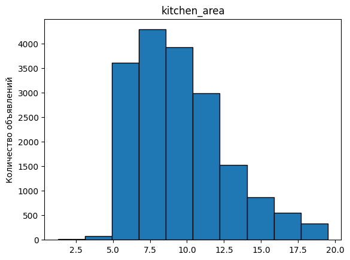
    


**Как правило, стандартная кухня от 5,5 до 12,0 $м^2$. Таких обяъвлений больше 10 тысяч в выборке. Кухни от 12,5 $м^2$ большая редкость, но они встречаются.**

#### Цена объекта (`last_price`)


```python
# построение гистограммы
print_hist(df, 'last_price', 20)
```


    
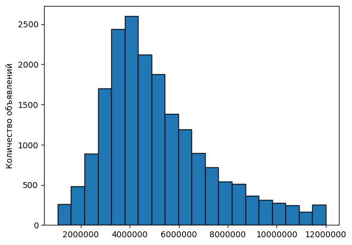
    


**Даже похоже на нормальное распределение со смещением влево.  
Подавляющее большинство квартир продаются в ценовом промежутке от 2,5 до 6 млн. рублей.  
Всего лишь порядка 1200 продавцов хотят за свою недвижимость больше 10 млн. рублей.** 

#### Количество комнат (`rooms`)


```python
# построение гистограммы
print_hist(df, 'rooms', 6)
```


    
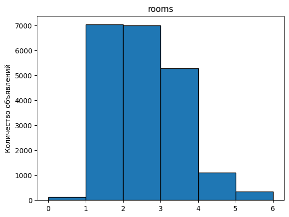
    


**Две трети объявлений - это квартиры с 1-2 комнатами, чуть больше пятой части - 3-х комнатные квартиры, меньше процента - скорее всего студии с нулем комнат, остальное приходится на квартиры с 4 и более комнатами.**

#### Высота потолков (`ceiling_height`)


```python
# построение гистограммы
print_hist(df, 'ceiling_height', 7)
```


    
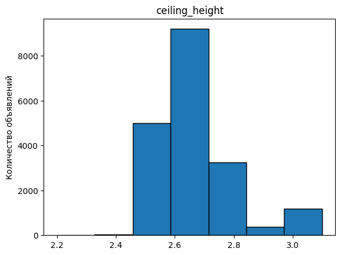
    


**Самая часто встречающаяся в архиве высота потолков - 2.6 м (чуть больше трети объявлений). В целом стандартные значения от 2.45 до 2.80 м.**

#### Этаж квартиры (`floor`)


```python
# построение гистограммы
print_hist(df, 'floor', 17)
```


    
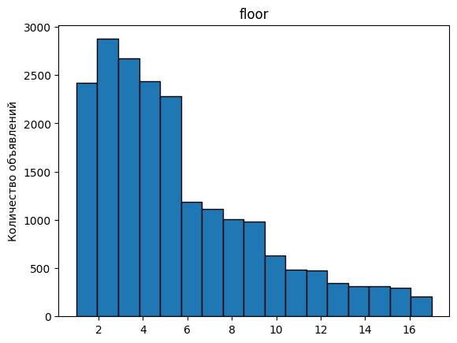
    


**В основном в датафрейме присутствуют объявления с продажей квартир с первого по 16 этаж. Львиная доля приходится на квартиры на первых 5 этажах (треть). С 6 их доля значительно падает, и чем выше квартира, тем реже встречается она в архиве.** 

#### Тип этажа квартиры (`floor_type`)


```python
# построение гистограммы
print_hist(df, 'floor_type', 3)
```


    
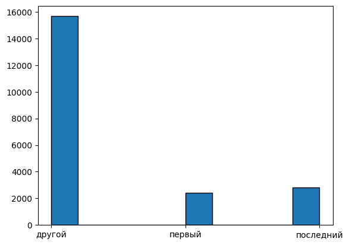
    


**Порядка 75 процентов квартир продается не на первом и не на последнем этажах. На первом, в свою очередь, - около 11 процентов, на последнем - около 14 процентов.** 

#### Общее количество этажей в доме (`floors_total`)


```python
# построение гистограммы
print_hist(df, 'floors_total', 31)
```


    
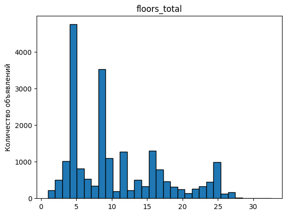
    


**Чаще всего встречаются 4-х и 8-и этажки. Ничего удивительного, это довольно стандартное количество этажей в современной архитектуре. Учитывая специфику высотности Питера, скорее всего 4-х этажек больше ближе к центру, а 8-и этажек ближе к окраинам. Всего на долю этих двух значений приходится порядка 40 процентов.**

#### Расстояние до центра города в метрах (`cityCenters_nearest`)


```python
# построение гистограммы
print_hist(df, 'cityCenters_nearest', 10)
```


    
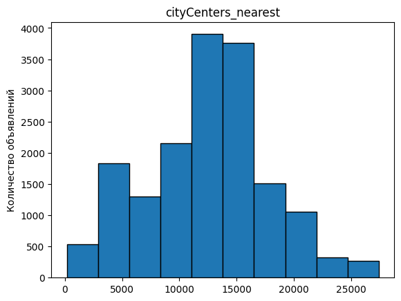
    


**Бо́льшая часть продающихся квартир находится на расстоянии от 12 до 17 км от центра города (чуть больше трети).**

#### Расстояние до ближайшего аэропорта (`airports_nearest`)


```python
# построение гистограммы
print_hist(df, 'airports_nearest', 10)
```


    
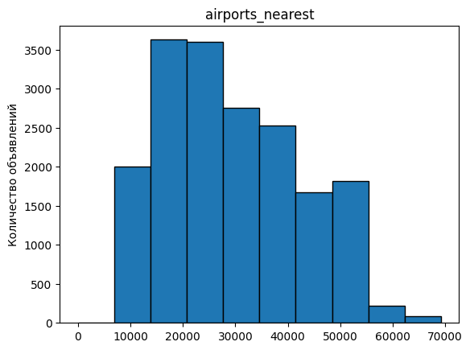
    


**Стоит отметить, что в радиусе 5км от аэропорта не так много объявлений: всего около 180-200. В среднем квартиры продаются на расстоянии от 10 до 55 км. После 25 км - чуть меньше, но все еще есть из чего выбирать.**

#### Расстояние до ближайшего парка (`parks_nearest`)


```python
print(len(df[df['parks_nearest'] > 0]))
```

    7808
    


```python
# построение гистограммы
print_hist(df, 'parks_nearest', 10)
```


    

    


**Как отмечалось ранее, в этой графе в принципе практически нет значений больше 3км. Это наталкивает на мысль, что искались парки в заранее заданном радиусе. 
Из тех данных, что имеем (8 тысяч объявлений с проставленным расстоянием до парков) практически у всех квартирах в пешей доступности находится парк (до 1км).** 

### Анализ того, как быстро продавались квартиры


```python
df['days_exposition'].describe()
```


    count   18103.00
    mean      182.54
    std       221.68
    min         1.00
    25%        45.00
    50%        97.00
    75%       233.00
    max      1580.00
    Name: days_exposition, dtype: float64


Удивительно. Неужели есть объявления, которые "провисели" больше 4 лет? Все может быть, но более вероятен сценарий, когда их просто забыли снять (и как им за 4 года телефон не разорвали с такой то инфляцией в стране). 


```python
print_hist(df, 'days_exposition', 100)
```


    
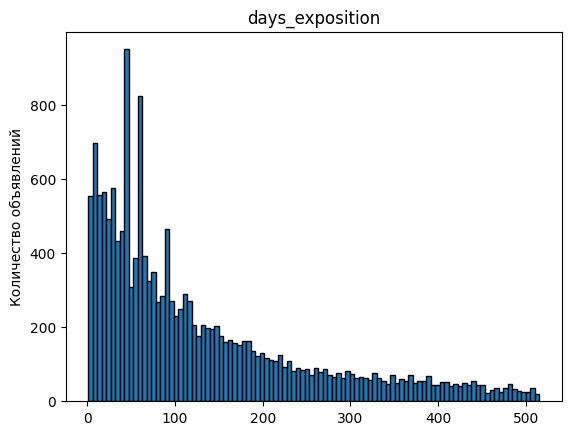
    


```python
# еще раз рассчитаем среднее время продажи, хотя его видно через метод describe()
print('Среднее количество дней для продажи квартиры: ' + str(int(df['days_exposition'].mean()))) 
```

    Среднее количество дней для продажи квартиры: 182
    


```python
# аналогично с медианой
print('Медианное время продажи квартиры: ' + str(int(df['days_exposition'].median())))
```

    Медианное время продажи квартиры: 97
    

**На гистограмме выделяются три пика в диапазоне 30 - 60 дней. Посмотрим на них детальнее.**


```python
df.query('20 < days_exposition < 65')['days_exposition'].hist(bins=44, grid=False, edgecolor='black')
plt.show()
```


    
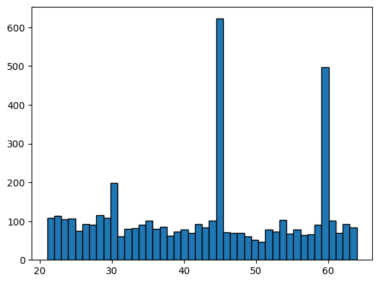
    


На 30 день количество продаж подскакивает, а на 40 и 60 дни вообще увеличивается в 5-6 раз? С трудом верится, что это какие-то специальные счастливые дни. Вполне возможно, что на 30, 45 и 60 дни происходит автоматическая чистка "неактивных" объявлений по каким-то признакам. Тройного цикла удалений вполне достаточно, чтобы оставить в базе только актуальные объявления.  


```python
# посмотрим на гистограмму без этих дней
df.query('days_exposition != 30 and days_exposition != 45 and days_exposition != 60')['days_exposition'].hist(bins=100, 
                                                                                                              grid=False, 
                                                                                                              edgecolor='black')
plt.show()
```


    
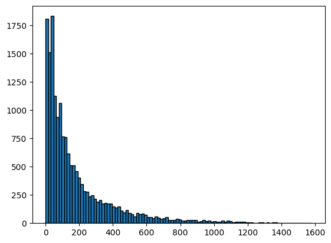
    


```python
print('Среднее арифметическое: ' + str(round(df.query('days_exposition != 30 and days_exposition != 45 and days_exposition != 60')['days_exposition'].mean() ,0)))
print('Медиана: ' + str(round(df.query('days_exposition != 30 and days_exposition != 45 and days_exposition != 60')['days_exposition'].median(), 0)))
```

    Среднее арифметическое: 188.0
    Медиана: 104.0
    

**Из-за удаления 30-го, 35-го и 60-го дней из гистограммы немного подросли и наши среднее и медиана. Однако, 100 дней для продажи квартивы выглядит как довольно неплохой срок. В общем и целом 200 дней практически всем хватает, чтобы найти покупателя своей мечты. Хоть и объявления с более длительным временем публикации существуют, их доля с каждый днем стремительно уменьшается.** 

### Какие факторы больше всего влияют на общую (полную) стоимость объекта?

Изучим, зависит ли цена от:
- общей площади;
- жилой площади;
- площади кухни;
- количества комнат;
- этажа, на котором расположена квартира (первый, последний, другой);
- даты размещения (день недели, месяц, год)


```python
plt.figure(figsize=(15, 15))
sns.heatmap(df.corr(), annot=True, cmap='Greens', fmt='.2f')
plt.show()
```


    
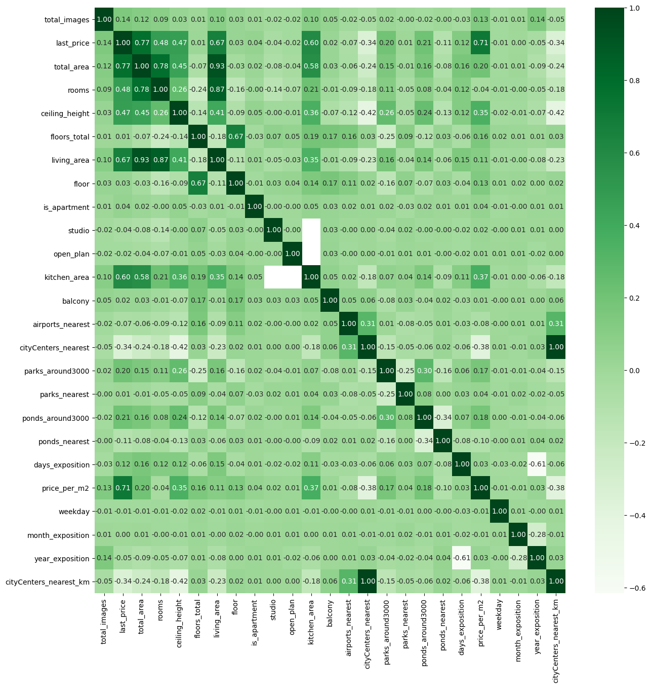
    


```python
# нас интересует только влияние на стоимость квартиры
plt.figure(figsize=(1,8))
sns.heatmap(df.corr()[['last_price']].sort_values(by='last_price', ascending=False), cmap="Greens", 
            annot=True)
plt.show()
```


    
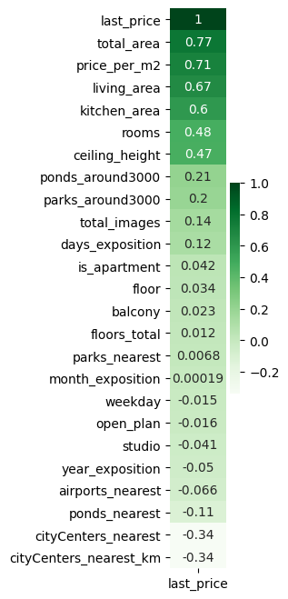
    


```python
print_scatter(df, 'last_price', 'total_area')
```


    
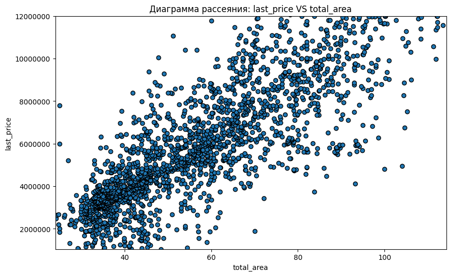
    


```python
print_scatter(df, 'last_price', 'living_area')
```


    
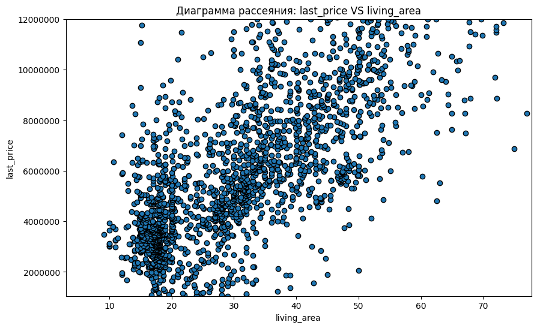
    


```python
print_scatter(df, 'last_price', 'kitchen_area')
```


    
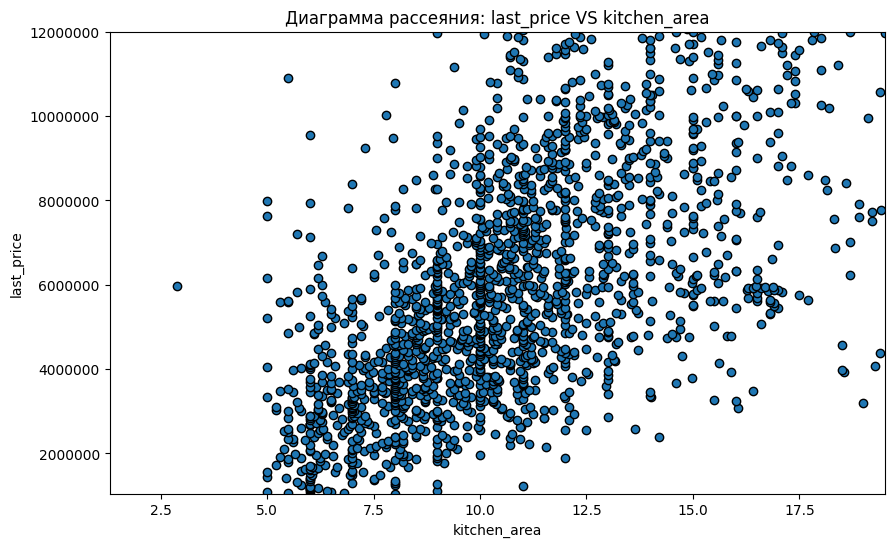
    


```python
print_bar(df, 'last_price', 'rooms')
```


    
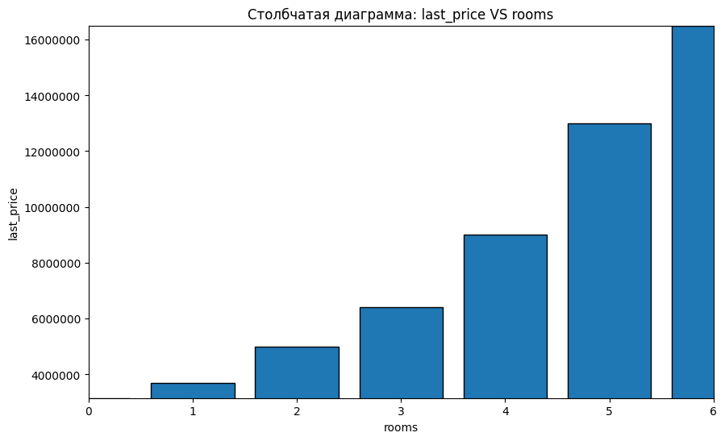
    


```python
df_filtered_by_floor_type = df.groupby('floor_type')['last_price'].median().reset_index().sort_values(by='last_price')
plot = df_filtered_by_floor_type.plot(x='floor_type', y="last_price", kind='bar', ec='black', 
                            title='Зависимость цены квартиры от этажа', legend=None, 
                            fontsize=12, figsize=(9,4))
plt.ticklabel_format(style='plain', axis='y')
plt.xticks(rotation=0)
plt.show()
```


    
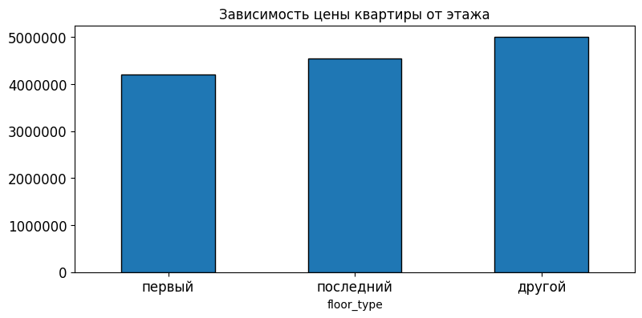
    


```python
df_pivot_table_weekday_weekday_word_last_price = (df
                                                  .pivot_table(index=['weekday', 'weekday_word'], values='last_price', aggfunc='median')
                                                  .reset_index())
plot = df_pivot_table_weekday_weekday_word_last_price.plot(x='weekday_word', y="last_price", kind='bar', ec='black', 
                            title='Зависимость цены квартиры от дня недели размещения объявления', legend=None, 
                            fontsize=12, figsize=(9,4))
plt.ticklabel_format(style='plain', axis='y')
plt.xticks(rotation=0)
plt.show()
```


    
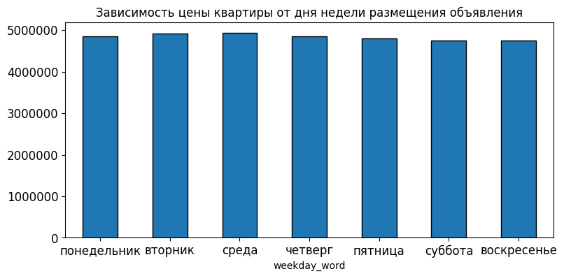
    


```python
df_filtered_by_month_exposition = df.groupby('month_exposition')['last_price'].median().reset_index().sort_values(by='month_exposition')
df_filtered_by_month_exposition
plot = df_filtered_by_month_exposition.plot(x='month_exposition', y="last_price", kind='bar', ec='black', 
                            title='Зависимость цены квартиры от месяца размещения объявления', legend=None, 
                            fontsize=12, figsize=(9,4))
plt.ticklabel_format(style='plain', axis='y')
plt.xticks(rotation=0)
plt.show()
```


    
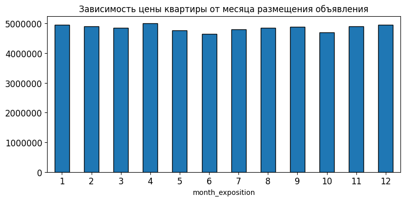
    


```python
df_filtered_by_year_exposition = df.groupby('year_exposition')['last_price'].median().reset_index().sort_values(by='year_exposition')
df_filtered_by_year_exposition
plot = df_filtered_by_year_exposition.plot(x='year_exposition', y="last_price", kind='bar', ec='black', 
                            title='Зависимость цены квартиры от года размещения объявления', legend=None, 
                            fontsize=12, figsize=(9,4))
plt.ticklabel_format(style='plain', axis='y')
plt.xticks(rotation=0)
plt.show()
```


    
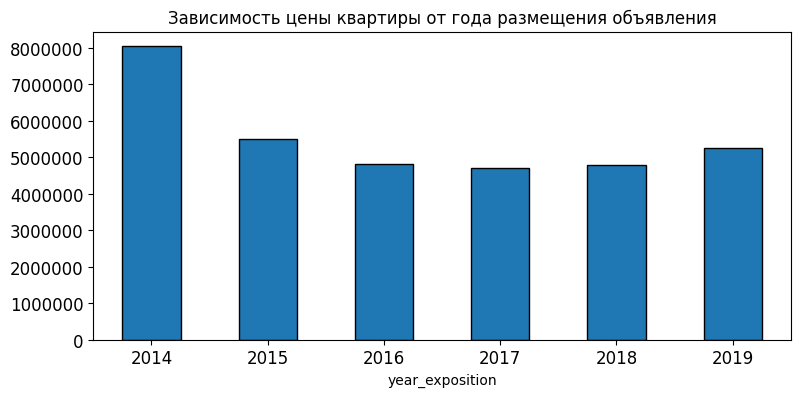
    


**Как мы можем видеть по коэффициенту корреляции Пирсона, цена квартиры:**  
**1) Больше всего зависит от площади, будь то общаяя (наибольшая корреляция), жилая или кухонная: чем больше площади, тем больше и цена на квартиру.**  
**2) Чуть в меньшей степени зависит от количества комнат (но количество комнат очень сильно коррелирует с общей площадью): чем больше комнат, тем выше цена квартиры.**  
**3) Никак не связана ни с месяцем, ни с днем размещения объявления. Что тоже вполне логично. Безусловно колебания цен на этом рынке есть, возможно, они носят и сезонный характер, но они больше связаны с обстановкой в мире, чем привязаны к конкретным датам.  
Однако, можно заметить, что после 2014 года квартиры сильно просели в цене. Вполне вероятно, это связано с кризисом 2014 года: падение цен на нефть и, как следствие, падение рубля, антироссийские экономические санкции, введение контрсанкций. На все это рынок недвижимости отреагировал сокращением спроса, снижением темпов строительства, уменьшением рублевых цен, которые с учетом падения уровня жизни фактически выросли для большинства покупателей.**  
**4) Зависит от того, на каком этаже продается квартира: квартиры не на первом и не на последнем этаже, как правило, самые дорогие; самые дешевые - на первом этаже.**  
**5) Слабо связана с инфраструктурой: удаленностью от центра и аэропорта, наличием парков и водоемов в округе. По мне, очень удивительно. Да, удаленность от центра негативно сказывается на цена квартиры для продавца, а наличие парков и водоемов поблизости - положительно, но эти изменения совсем незначительные.**   

### Определим среднюю цену одного квадратного метра в 10 населенных пунктах с наибольшим числом объявлений


```python
# найдем эти самые 10 населенных пунктов
df_top_10 = df.groupby('locality_name')['last_price'].count().sort_values(ascending = False).head(10)
print(df_top_10)
list_locality_name = df_top_10.index.tolist() # перепишем названия в список
mean_list = []
for name in list_locality_name:
    mean_list.append(round(df[df['locality_name'] == name]['price_per_m2'].mean(), 2))
df_top10_per_price_m2 = (pd.DataFrame({'Название населенного пункта': list_locality_name, 'Средняя стоимость кв.м, руб.': mean_list})
                         .sort_values(by='Средняя стоимость кв.м, руб.', ascending=False)
                         .reset_index(drop=True))
df_top10_per_price_m2
```

    locality_name
    Санкт-Петербург    15303
    Мурино               566
    Шушары               434
    Пушкин               363
    Колпино              336
    Парголово            326
    Всеволожск           268
    Петергоф             201
    Кудрово              190
    Сестрорецк           182
    Name: last_price, dtype: int64
    


<div>
<style scoped>
    .dataframe tbody tr th:only-of-type {
        vertical-align: middle;
    }

    .dataframe tbody tr th {
        vertical-align: top;
    }

    .dataframe thead th {
        text-align: right;
    }
</style>
<table border="1" class="dataframe">
  <thead>
    <tr style="text-align: right;">
      <th></th>
      <th>Название населенного пункта</th>
      <th>Средняя стоимость кв.м, руб.</th>
    </tr>
  </thead>
  <tbody>
    <tr>
      <th>0</th>
      <td>Санкт-Петербург</td>
      <td>112252.44</td>
    </tr>
    <tr>
      <th>1</th>
      <td>Пушкин</td>
      <td>102454.12</td>
    </tr>
    <tr>
      <th>2</th>
      <td>Сестрорецк</td>
      <td>101404.95</td>
    </tr>
    <tr>
      <th>3</th>
      <td>Кудрово</td>
      <td>95844.13</td>
    </tr>
    <tr>
      <th>4</th>
      <td>Парголово</td>
      <td>90332.26</td>
    </tr>
    <tr>
      <th>5</th>
      <td>Мурино</td>
      <td>85692.99</td>
    </tr>
    <tr>
      <th>6</th>
      <td>Петергоф</td>
      <td>84757.56</td>
    </tr>
    <tr>
      <th>7</th>
      <td>Шушары</td>
      <td>78227.73</td>
    </tr>
    <tr>
      <th>8</th>
      <td>Колпино</td>
      <td>75239.59</td>
    </tr>
    <tr>
      <th>9</th>
      <td>Всеволожск</td>
      <td>67229.53</td>
    </tr>
  </tbody>
</table>
</div>


**Как и ожидалось, самый дорогой квадратный метр в самой северной столице. Практически в два раза дешевле стоит квадратный метр в Всеволожске.**  
Не знаток районов Питера и цен на недвижимость там. По [Карте](https://yandex.ru/maps/?um=constructor%3A5352020a31646e5293ffd2249e32eedb62041e731c81393239b399e6bf9e312c&source=constructorLink) не скажешь, что цена уменьшается от удаленности от центра. Скорее всего зависит от "престижности" того или иного района.


```python
#Комментарий ревьювера
df.groupby('locality_name').agg({'last_price':'count',
                                 'price_per_m2':'mean'}) \
    .sort_values('last_price', ascending=False).head(10) \
    .sort_values('price_per_m2', ascending=False).reset_index() \
    .rename(columns={'locality_name':'Название населенного пункта',
                     'last_price':'Кол-во объявлений',
                     'price_per_m2':'Средняя стоимость кв.м, руб.'})
```


<div>
<style scoped>
    .dataframe tbody tr th:only-of-type {
        vertical-align: middle;
    }

    .dataframe tbody tr th {
        vertical-align: top;
    }

    .dataframe thead th {
        text-align: right;
    }
</style>
<table border="1" class="dataframe">
  <thead>
    <tr style="text-align: right;">
      <th></th>
      <th>Название населенного пункта</th>
      <th>Кол-во объявлений</th>
      <th>Средняя стоимость кв.м, руб.</th>
    </tr>
  </thead>
  <tbody>
    <tr>
      <th>0</th>
      <td>Санкт-Петербург</td>
      <td>15303</td>
      <td>112252.44</td>
    </tr>
    <tr>
      <th>1</th>
      <td>Пушкин</td>
      <td>363</td>
      <td>102454.12</td>
    </tr>
    <tr>
      <th>2</th>
      <td>Сестрорецк</td>
      <td>182</td>
      <td>101404.95</td>
    </tr>
    <tr>
      <th>3</th>
      <td>Кудрово</td>
      <td>190</td>
      <td>95844.13</td>
    </tr>
    <tr>
      <th>4</th>
      <td>Парголово</td>
      <td>326</td>
      <td>90332.26</td>
    </tr>
    <tr>
      <th>5</th>
      <td>Мурино</td>
      <td>566</td>
      <td>85692.99</td>
    </tr>
    <tr>
      <th>6</th>
      <td>Петергоф</td>
      <td>201</td>
      <td>84757.56</td>
    </tr>
    <tr>
      <th>7</th>
      <td>Шушары</td>
      <td>434</td>
      <td>78227.73</td>
    </tr>
    <tr>
      <th>8</th>
      <td>Колпино</td>
      <td>336</td>
      <td>75239.59</td>
    </tr>
    <tr>
      <th>9</th>
      <td>Всеволожск</td>
      <td>268</td>
      <td>67229.53</td>
    </tr>
  </tbody>
</table>
</div>


### Определим среднюю цену каждого километра Санкт-Петербурга


```python
df_filtered_by_cityCenters_nearest_km = (df[df['locality_name'] == 'Санкт-Петербург']
                                         .groupby('cityCenters_nearest_km')['last_price']
                                         .mean().reset_index()
                                         .sort_values(by='cityCenters_nearest_km'))
df_filtered_by_cityCenters_nearest_km
plot = df_filtered_by_cityCenters_nearest_km.plot(x='cityCenters_nearest_km', y="last_price", kind='bar', ec='black', 
                            title='Средняя цена каждого километра в Санкт-Петербурге', legend=None, 
                            fontsize=12, figsize=(9,4))
plt.ticklabel_format(style='plain', axis='y')
plt.xticks(rotation=90)
plt.show()
```


    
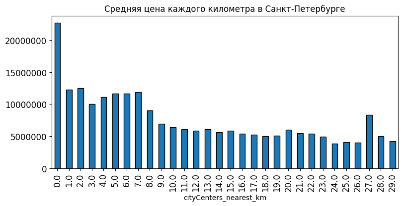
    


Как-то вышло, что Санкт-Петербург у нас вышел за границы 15 км, как мы обозначили ранее, что странно. 
Условно, расстояние от центра до Мурино - около 15 км. И для Мурино есть отдельное обозначение в столбце `locality_name`. 
Каким образом кто-то проставил "Питер" на расстоянии 20+ км, я не очень понимаю. Возможно, там есть местные аналоги Зеленограда.

Будем придерживаться нашей первоначальной разбивки, поэтому ограничим график 15 км.


```python
df_filtered_by_cityCenters_nearest_km = (df[(df['locality_name'] == 'Санкт-Петербург') &
                                           (df['cityCenters_nearest_km'] <= 15)]
                                         .groupby('cityCenters_nearest_km')['last_price']
                                         .mean().reset_index()
                                         .sort_values(by='cityCenters_nearest_km'))
df_filtered_by_cityCenters_nearest_km
plot = df_filtered_by_cityCenters_nearest_km.plot(x='cityCenters_nearest_km', y="last_price", kind='bar', ec='black', 
                            title='Средняя цена каждого километра в Санкт-Петербурге', legend=None, 
                            fontsize=12, figsize=(9,4))
plt.ticklabel_format(style='plain', axis='y')
plt.xticks(rotation=90)
plt.show()
```


    
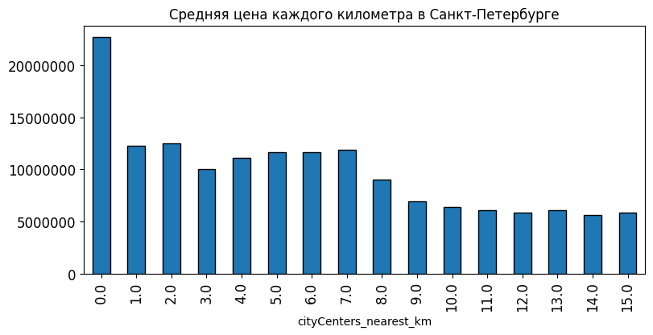
    


**В самом центре Питера средняя стоимость квартир устремляется к отметке 30 млн. рублей. По мере удаления от центра стоимоть километра значительно падает: так, например, уже в 3 км от центра квартиры стоят в 3 раза меньше - около 10 млн. После 9-го километра цены практически не меняются и остаются на отметке около 6,5-7,0 млн. рублей. Однако, на графике наблюдается увеличение стоимость с 4 по 6 км. Опять же, не знаток Питера, возможно, на этом расстоянии находится какой-то "элитный" район с высокими ценами, коорый смещает среднее арифметическое.**   

## Общий вывод

**Исследование было проведено по архивным данным сервиса "Яндекс Недвижимость" за 2014 - 2019 года с целью выявления особенностей и зависимостей на рынке недвижимости. 
В ходе работы была изучена база данных из 23 тысяч объявлений в Санкт-Петербурге и соседних населённых пунктах.
По результатам предобработки предоставленной выборки было выявлено и заменено там, где это возможно, множество пропусков, скорректированы редкие и выбивающиеся значений.
По результатам исследования можно сделать следующие выводы:**

**1) Около 2/3 всех продающихся квартир имеют площадь в диапазоне от 38 до 60 $м^2$.
2) Чем больше площадь квартиры, тем выше ее цена.  
3) Как правило, продавались квартиры от 1 до 3 комнат (около 90%), объявления о продаже 4-х и более комнатной квартиры крейне редки.  
4) Около трети объявлений касались квартиры на первых пяти этажах. При этом, как правило, общее число этажей в домах, в которых продавались квартиры - 8-9.  
5) Квартиры на первом этаже дешевле всего, затем идут квартиры на последнем этаже, дальше - все остальные. Разница цен на квартиры на первом или последнем этаже и на остальные практически в 4 раза.   
6) Самые дорогие квартиры в центре Питера, чем дальше - тем дешевле.  
7) В 2014 году квартиры стоили на 2-2.5 млн. рублей дороже. Скорее всего это связано с кризисом 2014 года, обрушением рубля и потерей покупательской способности народа.** 

<a id='link_3'></a>**Удаление выбивающихся строк из датафрейма**


```python
len(df)
```


    20893


```python
df_new = df.query('last_price >= 12190.0 and last_price <= 11900000.0 and total_area >= 12.0 and total_area <= 114.5 and rooms <= 6 and ceiling_height >= 2.2 and ceiling_height <= 3.0999999999999996')
df_new
# уже от датафрейма осталось 75%
```


<div>
<style scoped>
    .dataframe tbody tr th:only-of-type {
        vertical-align: middle;
    }

    .dataframe tbody tr th {
        vertical-align: top;
    }

    .dataframe thead th {
        text-align: right;
    }
</style>
<table border="1" class="dataframe">
  <thead>
    <tr style="text-align: right;">
      <th></th>
      <th>total_images</th>
      <th>last_price</th>
      <th>total_area</th>
      <th>first_day_exposition</th>
      <th>rooms</th>
      <th>ceiling_height</th>
      <th>floors_total</th>
      <th>living_area</th>
      <th>floor</th>
      <th>is_apartment</th>
      <th>studio</th>
      <th>open_plan</th>
      <th>kitchen_area</th>
      <th>balcony</th>
      <th>locality_name</th>
      <th>airports_nearest</th>
      <th>cityCenters_nearest</th>
      <th>parks_around3000</th>
      <th>parks_nearest</th>
      <th>ponds_around3000</th>
      <th>ponds_nearest</th>
      <th>days_exposition</th>
      <th>distance_from_centers</th>
      <th>price_per_m2</th>
      <th>weekday</th>
      <th>weekday_word</th>
      <th>month_exposition</th>
      <th>year_exposition</th>
      <th>floor_type</th>
      <th>cityCenters_nearest_km</th>
    </tr>
  </thead>
  <tbody>
    <tr>
      <th>1</th>
      <td>7</td>
      <td>3350000.00</td>
      <td>40.40</td>
      <td>2018-12-04</td>
      <td>1</td>
      <td>2.60</td>
      <td>11</td>
      <td>18.60</td>
      <td>1</td>
      <td>False</td>
      <td>False</td>
      <td>False</td>
      <td>11.00</td>
      <td>2</td>
      <td>Шушары</td>
      <td>12817.00</td>
      <td>18603.00</td>
      <td>0</td>
      <td>NaN</td>
      <td>0</td>
      <td>NaN</td>
      <td>81.00</td>
      <td>ПГТ</td>
      <td>82920.79</td>
      <td>1</td>
      <td>вторник</td>
      <td>12</td>
      <td>2018</td>
      <td>первый</td>
      <td>19.00</td>
    </tr>
    <tr>
      <th>2</th>
      <td>10</td>
      <td>5196000.00</td>
      <td>56.00</td>
      <td>2015-08-20</td>
      <td>2</td>
      <td>2.60</td>
      <td>5</td>
      <td>34.30</td>
      <td>4</td>
      <td>False</td>
      <td>False</td>
      <td>False</td>
      <td>8.30</td>
      <td>0</td>
      <td>Санкт-Петербург</td>
      <td>21741.00</td>
      <td>13933.00</td>
      <td>1</td>
      <td>90.00</td>
      <td>2</td>
      <td>574.00</td>
      <td>558.00</td>
      <td>окраина города</td>
      <td>92785.71</td>
      <td>3</td>
      <td>четверг</td>
      <td>8</td>
      <td>2015</td>
      <td>другой</td>
      <td>14.00</td>
    </tr>
    <tr>
      <th>4</th>
      <td>2</td>
      <td>10000000.00</td>
      <td>100.00</td>
      <td>2018-06-19</td>
      <td>2</td>
      <td>3.03</td>
      <td>14</td>
      <td>32.00</td>
      <td>13</td>
      <td>False</td>
      <td>False</td>
      <td>False</td>
      <td>41.00</td>
      <td>0</td>
      <td>Санкт-Петербург</td>
      <td>31856.00</td>
      <td>8098.00</td>
      <td>2</td>
      <td>112.00</td>
      <td>1</td>
      <td>48.00</td>
      <td>121.00</td>
      <td>город</td>
      <td>100000.00</td>
      <td>1</td>
      <td>вторник</td>
      <td>6</td>
      <td>2018</td>
      <td>другой</td>
      <td>8.00</td>
    </tr>
    <tr>
      <th>6</th>
      <td>6</td>
      <td>3700000.00</td>
      <td>37.30</td>
      <td>2017-11-02</td>
      <td>1</td>
      <td>2.60</td>
      <td>26</td>
      <td>10.60</td>
      <td>6</td>
      <td>False</td>
      <td>False</td>
      <td>False</td>
      <td>14.40</td>
      <td>1</td>
      <td>Парголово</td>
      <td>52996.00</td>
      <td>19143.00</td>
      <td>0</td>
      <td>NaN</td>
      <td>0</td>
      <td>NaN</td>
      <td>155.00</td>
      <td>ПГТ</td>
      <td>99195.71</td>
      <td>3</td>
      <td>четверг</td>
      <td>11</td>
      <td>2017</td>
      <td>другой</td>
      <td>19.00</td>
    </tr>
    <tr>
      <th>7</th>
      <td>5</td>
      <td>7915000.00</td>
      <td>71.60</td>
      <td>2019-04-18</td>
      <td>2</td>
      <td>2.60</td>
      <td>24</td>
      <td>NaN</td>
      <td>22</td>
      <td>False</td>
      <td>False</td>
      <td>False</td>
      <td>18.90</td>
      <td>2</td>
      <td>Санкт-Петербург</td>
      <td>23982.00</td>
      <td>11634.00</td>
      <td>0</td>
      <td>NaN</td>
      <td>0</td>
      <td>NaN</td>
      <td>NaN</td>
      <td>окраина города</td>
      <td>110544.69</td>
      <td>3</td>
      <td>четверг</td>
      <td>4</td>
      <td>2019</td>
      <td>другой</td>
      <td>12.00</td>
    </tr>
    <tr>
      <th>...</th>
      <td>...</td>
      <td>...</td>
      <td>...</td>
      <td>...</td>
      <td>...</td>
      <td>...</td>
      <td>...</td>
      <td>...</td>
      <td>...</td>
      <td>...</td>
      <td>...</td>
      <td>...</td>
      <td>...</td>
      <td>...</td>
      <td>...</td>
      <td>...</td>
      <td>...</td>
      <td>...</td>
      <td>...</td>
      <td>...</td>
      <td>...</td>
      <td>...</td>
      <td>...</td>
      <td>...</td>
      <td>...</td>
      <td>...</td>
      <td>...</td>
      <td>...</td>
      <td>...</td>
      <td>...</td>
    </tr>
    <tr>
      <th>23690</th>
      <td>3</td>
      <td>5500000.00</td>
      <td>52.00</td>
      <td>2018-07-19</td>
      <td>2</td>
      <td>2.80</td>
      <td>5</td>
      <td>31.00</td>
      <td>2</td>
      <td>False</td>
      <td>False</td>
      <td>False</td>
      <td>6.00</td>
      <td>0</td>
      <td>Санкт-Петербург</td>
      <td>20151.00</td>
      <td>6263.00</td>
      <td>1</td>
      <td>300.00</td>
      <td>0</td>
      <td>NaN</td>
      <td>15.00</td>
      <td>город</td>
      <td>105769.23</td>
      <td>3</td>
      <td>четверг</td>
      <td>7</td>
      <td>2018</td>
      <td>другой</td>
      <td>6.00</td>
    </tr>
    <tr>
      <th>23691</th>
      <td>11</td>
      <td>9470000.00</td>
      <td>72.90</td>
      <td>2016-10-13</td>
      <td>2</td>
      <td>2.75</td>
      <td>25</td>
      <td>40.30</td>
      <td>7</td>
      <td>False</td>
      <td>False</td>
      <td>False</td>
      <td>10.60</td>
      <td>1</td>
      <td>Санкт-Петербург</td>
      <td>19424.00</td>
      <td>4489.00</td>
      <td>0</td>
      <td>NaN</td>
      <td>1</td>
      <td>806.00</td>
      <td>519.00</td>
      <td>центр</td>
      <td>129903.98</td>
      <td>3</td>
      <td>четверг</td>
      <td>10</td>
      <td>2016</td>
      <td>другой</td>
      <td>4.00</td>
    </tr>
    <tr>
      <th>23693</th>
      <td>9</td>
      <td>4600000.00</td>
      <td>62.40</td>
      <td>2016-08-05</td>
      <td>3</td>
      <td>2.60</td>
      <td>9</td>
      <td>40.00</td>
      <td>8</td>
      <td>False</td>
      <td>False</td>
      <td>False</td>
      <td>8.00</td>
      <td>0</td>
      <td>Петергоф</td>
      <td>45602.00</td>
      <td>34104.00</td>
      <td>1</td>
      <td>352.00</td>
      <td>1</td>
      <td>675.00</td>
      <td>239.00</td>
      <td>ПГТ</td>
      <td>73717.95</td>
      <td>4</td>
      <td>пятница</td>
      <td>8</td>
      <td>2016</td>
      <td>другой</td>
      <td>34.00</td>
    </tr>
    <tr>
      <th>23697</th>
      <td>13</td>
      <td>11475000.00</td>
      <td>76.75</td>
      <td>2017-03-28</td>
      <td>2</td>
      <td>3.00</td>
      <td>17</td>
      <td>NaN</td>
      <td>12</td>
      <td>False</td>
      <td>False</td>
      <td>False</td>
      <td>23.30</td>
      <td>2</td>
      <td>Санкт-Петербург</td>
      <td>39140.00</td>
      <td>10364.00</td>
      <td>2</td>
      <td>173.00</td>
      <td>3</td>
      <td>196.00</td>
      <td>602.00</td>
      <td>окраина города</td>
      <td>149511.40</td>
      <td>1</td>
      <td>вторник</td>
      <td>3</td>
      <td>2017</td>
      <td>другой</td>
      <td>10.00</td>
    </tr>
    <tr>
      <th>23698</th>
      <td>4</td>
      <td>1350000.00</td>
      <td>32.30</td>
      <td>2017-07-21</td>
      <td>1</td>
      <td>2.50</td>
      <td>5</td>
      <td>12.30</td>
      <td>1</td>
      <td>False</td>
      <td>False</td>
      <td>False</td>
      <td>9.00</td>
      <td>0</td>
      <td>Новый Учхоз</td>
      <td>NaN</td>
      <td>NaN</td>
      <td>&lt;NA&gt;</td>
      <td>NaN</td>
      <td>&lt;NA&gt;</td>
      <td>NaN</td>
      <td>NaN</td>
      <td>None</td>
      <td>41795.67</td>
      <td>4</td>
      <td>пятница</td>
      <td>7</td>
      <td>2017</td>
      <td>первый</td>
      <td>NaN</td>
    </tr>
  </tbody>
</table>
<p>17796 rows × 30 columns</p>
</div>


